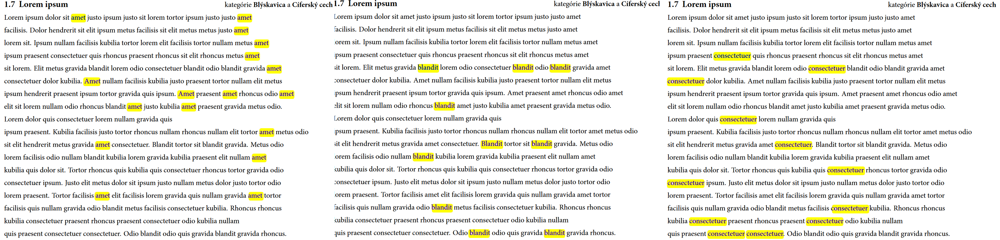

Autor: Michal S.

Text šifry je úplne nezmyselný, preto jednou z prvých vecí, ktorá nám môže napadnúť, je niečo spočítať.
Keď spočítame počty slov vo vetách a prevedieme na písmená, dostaneme POZORUJTESLOVOH.
To nám môže napovedať, že by sme sa mali zamerať na jednotlivé slová a pozorovať, kde sa vyskytujú.

V texte sa na každé písmeno abecedy od A do T nachádza práve jedno unikátne slovo (ktoré sa viackrát opakuje),
na ostatné písmená slová nemáme. Keď pozorujeme, na ktorých pozíciách sa ktoré slová nachádzajú,
vykreslia nám polohy slov graficky písmená. Postupujeme podľa začiatočných písmen slov.

Najprv si teda vyznačíme všetky `amet`-y a graficky sa nám vyobrazí písmeno `H`,
potom všetky `blandit`-y, vyobrazí sa `E` a tak ďalej pre všetky písmená abecedy.
Ukážku môžete vidieť na obrázkoch:

{style="width:45mm}

Nadbytočné H v medzitajničke nemá žiaden význam, len počet slov potreboval byť o niečo väčší.
Niekoho to mohlo zmiasť smerom k heslu `hendrerit`, čo nebolo správne a ani to nie je slovenské slovo.

Celkovo dostávame tajničku `HESLOJEZAKONODARCA`, čiže správna odpoveď je **ZÁKONODARCA**.
