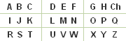
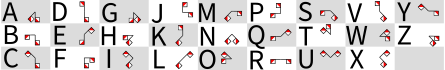

Autor: Miloš

Video je plnohodnotným receptom na suši. Je to normálny postup,
podľa ktorého si viete pripraviť veľmi chutné suši.
V samotnom recepte nie je skrytá žiadna časť šifry.
Všetky písmená z riešenia sú buď ukryté v tom,
ako sú ingrediencie, s ktorými pracujem, uložené na stole,
alebo v slovách, ktoré nemajú v recepte na suši čo hľadať.

1:40 -- Šesť pohárov na linke označuje šesť bodov braillovho písmena.
Ryžu som nasypal do dvoch pravých spodných pohárov, čo značí,
že tieto body braillovho písmena sú plné (čierne).
Takémuto usporiadaniu zodpovedá písmeno **P**.

2:30 -- Môžeme si všimnúť veľmi precízne ukladanie uhorkových
pásikov na okraj krájacej dosky. Týchto päť pásikov reprezentuje
binárnu číselnú sústavu. Pásik, ktorý trčí mimo dosku reprezentuje
jednotku, a ten, ktorý netrčí reprezentuje nulu. Po prevedení čísla,
ktoré uhorky vyznačujú, do desiatkovej sústavy dostaneme poradové
číslo písmena v abecede. Päť pásikov potrebujeme preto,
lebo ak chceme binárkou reprezentovať všetky písmená abecedy,
potrebujeme vyskladať čísla od 1 po 26, na čo potrebujeme aspoň
5 "bitov". V tomto prípade uhorky vyznačujú číslo 01111 -> 15 -> písmeno **O**.

3:10 -- Hrachoviny sú fakt odveci, a nemajú v recepte na suši čo hľadať.
Malo by to znieť podozrivo, a mali by sme chcieť toto slovo nejak využiť.
Najjednoduchšia (a správna) vec, čo vieme spraviť je zobrať si prvé písmeno slova - **H**.

3:20 -- Počas krájania ryby je veľmi nápadne na doske uložená paprika.
V paprike je zašifrované písmeno z poľského kríža.

{style="width:50mm}

Konkrétne dva paprikové pásiky určujú ľavý horný roh,
a papriková bodka určuje ľavé písmeno daného rohu - **A**.

6:02 -- Na ľavom tanieri je nezvyčajne uložené suši,
ktoré reprezentuje písmeno vyskladané zo semaforových vlajok.
Keď sa pozrieme na šifrovacie pomôcky, takémuto uloženiu zodpovedá písmeno **R**.
{style="width:30mm}

Keď dôjdeme na koniec videa, máme dokopy riešenie **POHAR** a veľmi dobré, chutné suši.
