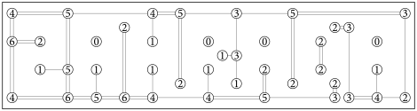

Autor: Kika

Zadanie šifry je hlavolam aj s pravidlami, ako ho riešiť. Tak najprv vyriešime tento hlavolam.
Najľahšie je asi začať veľkými číslami, z ktorých musia ísť dvojité mosty každým smerom.
Tiež je fajn si škrtať už vyriešené ostrovy, teda ostrovy, ktoré už majú všetky svoje mosty.

{style="width:47mm}

Teraz sa skúsime na šifru pozrieť a rozhodneme sa, čo chceme poriadnejšie skúmať.
Ostrovy, teda krúžky s číslami, sme už využili a nevyzerajú nijak podozrivo.
Tým myslím, že v nich nevidíme nijakú štruktúru. Podobne mosty, ktoré sme nakreslili.
Ešte tam máme prázdny priestor, resp. vodu medzi ostrovami a mostami.
Keď sa na ňu pozrieme poriadne, zbadáme písmenká.
Prvé písmeno je Z a je jedno z najlepšie viditeľných.
Aj druhé písmeno A je dobre viditeľné. Niektoré písmená sú možno zložitejšie
na zbadanie, ale už máme niektoré písmená a tak vieme,
že to je dobrá cesta a chceme tam čítať tie písmenká.
Riešením je slovo **ZAHRADA**.
