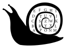
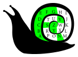

Autor: Mišo M.

Čo má slimák také, čo by sa dalo využiť v šifre? Zvlášť takej s hromadou písmeniek?

Pri pohľade na písmená si všimneme, že v každom "slove" sa nachádza každé písmeno najviac raz.
Navyše sú zoradené abecedne, takže poradie asi nenesie žiadnu informáciu.
Dá sa však zamerať na to, ktoré písmená sa v slovách vyskytujú.

Ďalej sa môžeme zamerať na fakt, že šifra neobsahuje Q. Ak máme k dispozícii len $25$ písmen,
núka sa to nejak využiť. Ajhľa, slimákova ulita má tvar špirály a uprostred je široká $5$.
Na výšku to tiež vyzerá na $5$, žeby štvorec $5 \times 5$? Vpísať do nej písmená pekne v abecednom poradí
(bez Q) vyzerá ako čím ďalej, tým lepší nápad. Poradie sa zvolí v smere špirály v ulite,
pekne zvonka dnu. Tým by sme zvládli využiť aj fakt, že v šifre je slimák.

{style="width:50mm}

Písmená máme vpísané v ulite, môžeme sa teda vrátiť k slimákovým slovám.
Ako sme spozorovali už skôr, chceme sa zamerať na to, či jednotlivé písmená sú alebo nie sú v danom slove.
Vyznačme si teda v ulite tie písmená, ktoré sú v prvom slove. Vyznačený útvar môže byť obrázkom,
alebo môže napísať nejaké písmeno alebo symbol.

{style="width:50mm}

Skúšame zopakovať postup pre všetky slová, postupne dostávame písmená **R**, **I**, **E**, **S**, ...
takže sme si zrejme zvolili správny smer.
Nakoniec prečítame RIESENIE JE TRUHLA a odovzdáme **TRUHLA**.
