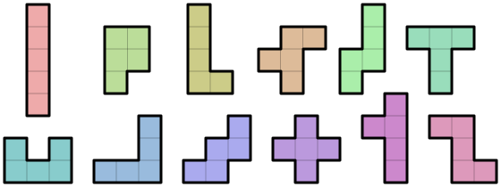

Autor: Danko

V šifre vidíme tabuľku s písmenami a stenami a ešte zopár čísel navyše.
Zo začiatku nie je vôbec jasné, čo by sa s číslami dalo robiť,
mohli by sme sa teda pokúsiť nájsť slová v osemsmerovke alebo vyriešiť bludisko.
Vieme nájsť iba niečo, čo sa podobá na útržky slov, no po vyriešení bludiska sa nám objasní ich význam.
Dokážeme prečítať tajničku z prejdených písmenok, ktorá hovorí **To čo tu prečítaš ti fakt vôbec nepomôže**.

Je zaujímavé, že väčšina písmeniek je zbytočná. Pomôcť nám teda ešte môžu tie zvyšné,
a samotné rozloženie alebo trasa bludiska. A naozaj, po prečítaní zvyšných písmeniek po riadkoch dostávame
**Podeľ celý obdĺžnik na pätice**.

Vďaka tomu máme jasnú inštrukciu, bude to vychádzať, keďže tabuľka má $10 \cdot 6 = 60$ políčok,
teda budeme mať $12$ pätíc.

Problémom je, že obdĺžnik sa dá na pätice rozdeliť množstvom rôznych spôsobov.
Potrebujeme teda použiť niečo, čo nám jasne určí, ako to spraviť. Keďže písmenká sú už použité na tajničky,
jediné, čo by sa s nimi dalo je vyberať ich do hesla, napríklad ešte pomocou číseliek na spodu,
ktoré pri delení tiež nevyzerajú nápomocne. Okrem toho nám ostáva už len trasa, ktorú sme prešli,
ktorá má náhodných $33$ políčok, alebo steny, ktoré ju vymedzujú. Možno by nebol zlý nápad tieto steny pri delení zachovať,
a iba skúsiť nejaké podopĺňať. Nemalo by byť náročné prísť k jedinému riešeniu, čo napovedá o správnosti tohto postupu.
Napríklad môžeme postupovať po ceste riešenia bludiska, a k políčkam priamo na ceste pridať vždy tie,
ktoré musia byť spolu, aby nezostali odseknuté. Napríklad v pätici s prvým T musí byť aj L pod ním,
aby neostalo samo, potom k nim do pätice pridáme O napravo, čím izolujeme horné O a T a tým vytvoríme kompletnú päticu.
Na konci dostávame takéto rozdelenie:

{style="width:75mm}

Niektorí si už počas rozdeľovania všimnú veľkú rozmanitosť vzniknutých útvarov. Je ich, ako bolo spomenuté,
12 a každý je iného tvaru. Zaujímavé je tiež to, že každým útvarom práve raz prechádza cesta bludiskom.
Pri poslednom kroku nám može pomôcť si všimnúť rozsah číseliek pod tabuľkou, alebo bližšie preskúmať tvar pätíc.
Existuje totiž práve $12$ rôznych tvarov, ktoré vieme z $5$ políčok poskladať, a všetky sú zastúpené v našom rozdelení,
tak ako je aj $12$ navyššie číslo v šifre. Tieto útvary sa nazývajú pentominá a každé z nich sa správne otočené
s trochou predstavivosti podobá na písmenko. Po chvíli googlenia sa môžeme dostať k takejto notácii,
ktorá sa pri pomenovávaní pentomín používa:

{style="width:55mm}

Písmenká teda vyberáme z názvov pentomín, a poradie určíme číslami pod tabuľkou. Naskytuje sa viacero možností,
no asi najrozumnejšia je zoradiť pentominá tak, ako nimi prechádzame cestou cez bludisko.
1. pentomino -  P, 10. pentomino - L, 3. pentomino - U, 7. pentomino - T, 12. pentomino - V, 5. pentomino - Y. Dostávame riešenie **PLUTVY**.

