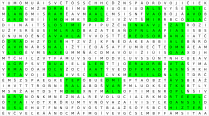
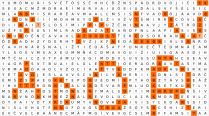

Autor: Michal S.

Najťažšia spoločná šifra kategórií Agát a Blýskavica je
viacúrovňová -- vyžaduje postupné vykonanie viacerých krokov,
kde každý krok vedie na ďalší.

Máme pred sebou veľkú tabuľku písmen, ktorá vyzerá ako osemsmerovka,
môžeme sa teda pozrieť, čo v nej nájdeme. Vieme nájsť dvanásť dvojslovných spojení,
ktoré sú medzi slovami prerušené zdanlivo nesúvisiacimi písmenami.
Z každého by sme chceli získať jedno písmeno do (medzi)tajničky.
Každé z týchto slovných spojení sa viaže (aspoň približne) na iný mesiac v roku.
Slovné spojenia si teda usporiadame
v takomto poradí a prečítame nesúvisiace písmená v ich stredoch (medzi slovami):

- Traja**M**králi
- priestupný**E**rok
- deň**N**žien
- Veľká**Á**noc
- traja**V**zmrznutí
- Medardova**Š**kvapka
- Cyril**P**Metod
- národné**I**povstanie
- pád**R**dvojičiek
- Česko**Á**slovensko
- Nežná**L**revolúcia
- Štedrý**E**deň

Dostali sme _mená v špirále_, ďalším krokom bude teda hľadanie nejakých mien zatočených do špirály.
V tabuľke sa dá nájsť $25$ deväťpísmenných slovenských krstných mien
umiestnených v štvorcoch $3 \times 3$ do rôznych špirál
(s rôznymi začiatkami, smermi dnu/von a v smere/proti smeru hodinových ručičiek).
Útržky mien si môžeme všimnúť voľne pri prechádzaní tabuľkou a potom dohľadáme celú špirálu.
Tieto štvorce zapadajú do istej mriežky -- celú tabuľku vieme rozdeliť na
$2 \times 5$ častí oddelených voľnými riadkami/stĺpcami,
kde každá časť je zložená z $3 \times 2$ takýchto štvorcov.
To už navádza na Brailla -- pozrieme sa, ktoré štvorce $3 \times 3$ obsahujú mená a získavame `KRAJSKEECV`.

{style="width:60mm}

Krajské EČV (evidenčné čísla vozidiel) na Slovensku sú `BA`, `BL`, `TT`, `NR`, `TN`, `ZA`, `BB`, `KE` a `PO`.
Najnovšie k nim patrí aj `BT`, pričom jeho započítanie/nezapočítanie
nemá významný vplyv na riešenie šifry.
(Ide o prvé dve písmená na značkách áut registrovaných v krajských mestách.)
Tieto dvojice vyhľadáme v tabuľke (ako v klasickej osemsmerovke), vyznačíme všetky ich výskyty
a graficky nám vykreslia riešenie **SALVÁDOR**.

{style="width:60mm}
