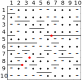

Autor: Danko

Šifra sa podobá na nejakú krížovku príliš na to, aby sme neskúsili zadané slová dopĺňať do tabuľky.
Je však vylúčené, že by sa dala vyplniť desaťpísmennými slovami tak,
aby každé zodpovedalo zadanému významu, a ešte sa aj na každom políčku prekrývalo s kolmým slovom.
Ďalšou zaujímavosťou je, že stĺpce máme čiarkami rozdelené na časti,
a v riadkoch máme zasa doplniť dve slová. Z oboch týchto vecí treba vyťažiť maximum
a zistiť, na čo by mohli byť dobré.

Niektoré nápovedy vieme celkom jasne pomenovať - pomerne jednoduché
je sa dostať do stavu, že máme pomenované nasledovné nápovedy: tretím, Agáta, ???, sada, nepiť, ???, Anton, ???, ???, mača.
Tu si vieme všimnúť, že počet písmen v týchto slovách je rovnaký,
ako počet úsekov v danom stĺpci. Teda by sme chceli do jedného úseku písať jedno písmeno.
Vieme si tiež všimnúť, že napríklad písmeno A sa vždy dáva do dvoch políčok.
Nie je to však len A, sú to aj iné písmená, napríklad M alebo N.
Do jedného políčka idú písmená E a T. Pri takomto rozdelení by nám hneď mala napadnúť morzeovka,
ktorá presne toto spĺňa (niekomu to mohlo napadnúť už z dĺžok 1-4),
a ľahko overíme, že vieme do každého políčka doplniť bodku alebo čiarku tak,
aby nám sedelo rozdelenie slov na písmená. Teda každé slovo má v morzeovke dĺžku 10 znakov bez medzier.

Alternatívne na to, aby sme doplnili neznáme slová, môžeme použiť výrazy.
Ak ešte princíp nepoznáme, môžeme si na nich všimnúť,
že viaceré z nich majú začiatok a/alebo koniec rovnaký.
Ide o slová Da(niť/da), r(ep/ig)a, ž(iti/el)e, (vtá/šma)k.
To by vedelo pomôcť, keby sme chceli rovnakým spôsobom vedieť doplniť aj jedno,
aj druhé slovo. Pozrieme si zmenené písmenká a zamyslíme sa, ako by sa dali pokladať za rovnaké. Napríklad pri vt a šm vidno v morzeovke podobnosť, na začiatku tromi bodkami.
Ak už princíp poznáme, je jasné že tieto slová budú také, aby boli v morzeovke zapísané rovnako,
len s inou pozíciou oddeľovačov, čo je dôvod, prečo v riadkoch nie sú.

Keď vyplníme tabuľku tak, ako vidíme na obrázku,
prečítame po uhlopriečke heslo (písmená sú oddelené veľkými bodkami): `-././.-./...-` = **NERV**.

{style="width:80mm}
