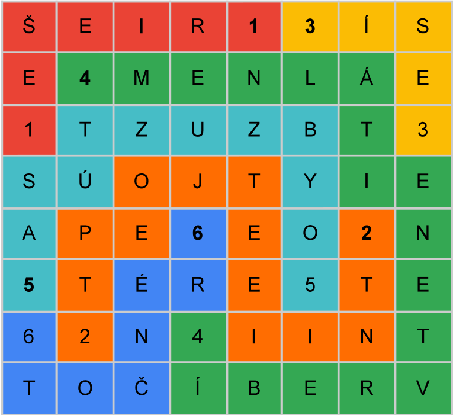

Autor: Kika

Zadanie tvorí tabuľka, v ktorej každé políčko obsahuje buď písmeno alebo číslo.
Môžeme si všimnúť, že čísla sú od 1 po 6 a každé máme v tabuľke práve dvakrát.
Tiež si môžeme všimnúť, že keď čítame postupne písmená naľavo od čísla 1 v prvom riadku, vidíme `RIEŠ`.
Pod `Š` je `E` a teda medzi jednotkami vieme prečítať `RIEŠE`.

Aj dvojice rovnakých čísiel, aj `RIEŠE` medzi jednotkami nám napovedá,
že chceme pospájať rovnaké čísla. Bolo by fajn. keby tie cesty medzi
číslami boli jednoznačné a teda by sme snáď mohli prečítať písmenká na cestách a získať riešenie. Preto ideme hľadať medzi číslami také cesty,
ktoré sa neprekrižujú a cez každé políčko vedie nejaká cesta.

Najjednoduchšie je asi najprv spojiť jednotky a trojky.
Potom nájsť kúsok cesty od šestky, ktorá je v predposlednom riadku a prvom stĺpci.
Pomerne jednoduché je aj určiť začiatok cesty od štvorky v druhom riadku.
V tomto hlavolame existuje naozaj práve jedna možnosť ako pospájať dvojice čísel
tak, aby sa cesty neprekrižovali a cez každé políčko nejaká viedla.
Toto je riešenie hlavolamu:

{style="width:50mm}

Medzi jednotkami máme `RIEŠE`. Ďalšie tri písmená by mohli byť
`NIE` a tak by sme získali slovo riešenie.
Po prejdení cesty medzi jednotkami pokračujeme cestou medzi dvojkami.
Pri jednotkách sme šli/čítali od jednotky,
ktorá je tučným písmom, k jednotke, ktorá je obyčajným písmom,
tak aj v prípade dvojok poďme od tučnej dvojky k obyčajnej dvojke.
Chceme prečítať `NIE` a potom asi nejaké sloveso ako napríklad `JE` alebo `ZNIE`.
Medzi dvojkami máme tieto písmená: `TNIIEETJOEPT`. Keď zoberieme každé druhé, dostaneme `NIEJET`.
Dokopy s písmenami medzi jednotkami teda už máme `RIEŠENIE JE T`.

Pokračujme cestou medzi trojkami. Medzi dvojkami sme brali každé druhé písmeno,
tak tu skúsme každé tretie. Následne medzi štvorkami každé štvrté,
päťkami piate a šestkami šieste. Keď zoberieme všetky tieto písmenká, dostaneme `RIEŠENIE JE TELEVÍZOR`. Odovzdáme **televízor**.

Ešte spomeňme takú drobnosť. Ak by sme prečítali zvyšné písmenká
postupne po cestách tak by ste prečítali:
`TIETO PÍSMENÁ TI NETREBA, SÚ TU ZBYTOČNÉ`.
