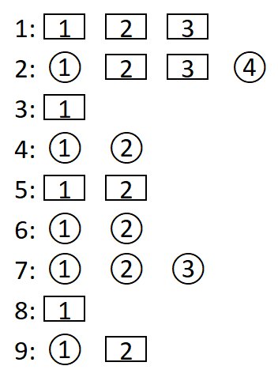

Autor: Michal S.

Máme pred sebou bludisko s ôsmimi vchodmi označenými číslami
v krúžkoch a obdĺžnikoch a so siedmimi políčkami s domčekom.
Domčeky majú na sebe čísla od $1$ do $9$, každé práve raz,
takže zrejme každému domčeku budeme chcieť priradiť jedno písmeno, ktoré sa dostane
do hesla na pozíciu určenú číslom na domčeku.

Políčka s domčekmi sú teda naše ciele, a tak sa pozrieme, od ktorých vchodov sa dá
ku ktorému domčeku dostať:

{style="width:80mm}

Môžeme si všimnúť, že pri každom domčeku máme rôzne čísla vchodov
a je to vždy postupnosť začínajúca $1$, takže vchody vieme zoradiť
podľa týchto čísel.

Tvary pri vchodoch sú dvoch druhov a pripomínajú morzeovkové symboly, resp. ich obrysy
(kruh je bodka, obdĺžnik čiarka).
Navyše ku každému domčeku vedie cesta z $1$ až $4$ vchodov, čo je počet symbolov potrebných na zápis písmena v morzeovke.
Keď prevedieme pomocou morzeovky
jednotlivé riadky (zoznamy vchodov, z ktorých sú dosiahnuteľné domčeky)
na písmená, dostaneme heslo **optimista**:

```
1: ---  O
2: .--. P
3: -    T
4: ..   I
5: --   M
6: ..   I
7: ...  S
8: -    T
9: .-   A
```
