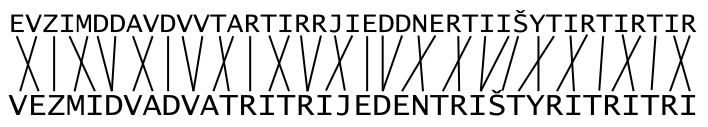

Autor: Michal S.

Zadaním je riadok textu, ktorý na prvý pohľad nedáva zmysel,
avšak po lepšej analýze si môžeme všimnúť, že vznikol zo zmysluplného textu,
akurát sú v ňom niektoré písmená poprehadzované, niektoré zdvojené a medzery sú vynechané.

S trochou úsilia sa nám podarí obnoviť pôvodný text:

**VEZMI DVA DVA TRI TRI JEDEN TRI ŠTYRI TRI TRI¸**

Dostali sme síce odpoveď na otázku v názve, ale zatiaľ nevieme, čoho máme vziať tieto počty.

Ešte sme nevyužili to, akým spôsobom sú písmená poprehadzované a zdvojené. Je to niečo, v čom pravdepodobne bude ukrytá nejaká informácia.
Predsa len, veľa inej informácie už v šifre nie je.

Zmeny v písmenách si vieme zakresliť tak, že si napíšeme dekódovaný text pod text šifry
a spojíme písmená, ktoré si zodpovedajú. To síce nie je úplne jednoznačné,
ale robíme to tak, aby zmeny boli čo najmenšie na čo najmenšom priestore
(teda nespojíme `I` v dekódovanom texte niekde vľavo s `I` v texte šifry ďaleko vpravo).
Každé písmeno textu šifry napojíme na jedno písmeno dekódovaného textu,
ale jedno písmeno dekódovaného textu môže byť napojené na viac písmen šifry,
pretože niektoré písmená sú v šifre zdvojené.

{style="width:25mm}

Spojnice zodpovedajúcich písmen graficky vytvárajú rímske číslice.
Vieme ich rozdeliť na skupiny, kde je buď jedna neprekrížená spojnica (I),
dve spojnice vychádzajúce z jedného písmena -- zdvojenie (V),
alebo dve navzájom prekrížené spojnice (X).

Dostaneme tak reťazec rímskych číslic `XIXVXIVXIXVXIVXXVIXXIXIX`.
Teraz už vieme využiť čísla z textu. Podľa nich nasekáme reťazec na časti daných dĺžok
a každú prevedieme na písmeno s rovnakou číselnou hodnotou.

||||
|:-|-:|-|
| XI   | 11 | K |
| XV   | 15 | O |
| XIV  | 14 | N |
| XIX  | 19 | S |
| V    | 5  | E |
| XIV  | 14 | N |
| XXVI | 26 | Z |
| XXI  | 21 | U |
| XIX  | 19 | S |

Heslo je **konsenzus**.
