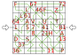

Autor: Danko

Prvé pozorovania nás môžu viesť k viacerým zaujímavým faktom o číslach v tabuľke.
Tie nenáhodné a relevatné k riešeniu sú viaceré.
Pri šípkach sú oproti sebe čísla 1 a 81, pričom tabuľka má 81 políčok,
a podobne veľké čísla sú často pri sebe
(5,7,8 a 36,37 vedľa seba, 11,13,21 a 61,64,67 blízko).
Toto spolu s čiarami vchádzajúcimi do 1 a 81 nám už dosť napovedá,
že asi bude treba do každého políčka doplniť nejaké číslo tak,
aby boli po sebe idúce vedľa seba (samozrejme, ráta sa aj uhlopriečne,
ako naznačujú napríklad 36 a 37). Skúseným riešiteľom logických úloh to môže pripomínať hlavolam hidoku.

Môžeme sa teda rovno pokúsiť takýto hlavolam riešiť - skúsime nájsť miesta,
kde je jednoznačné, ako musia čísla byť, aby boli splnené podmienky.
Napríklad pri číslach, medzi ktorými existuje len jedna priama cesta,
čiže 8, 11 a 13 alebo 64 a 67. Potom môžeme vidieť viaceré ďalšie miesta,
kde má nejaké prázdne políčko len dve nespojené susedné políčka,
a teda to budú čísla jemu susedné, aj keď nevieme aké.
Môžeme sa takto dostať do čiastočne vyriešeného stavu,
pri ktorom vyzerá, že na to ideme dobre, a veci aj celkom sedia,
ale bude jasné že zatiaľ má úloha viac riešení.

Potrebovali by sme teda viac informácií o tom, ako máme čísla do tabuľky umiestniť.
Do úvahy prichádza nejaké ďalšie pravidlo, ktoré by nám obmedzilo možnosti,
no ešte sme nepoužili ani písmenká v tabuľke. Často sú na políčkach,
kde nevieme, ako bude cesta viesť, no potom sú tam napríklad L-ká vľavo hore,
ktoré sú vedľa seba a cesta cez obe vedie rovno.
Po týchto pozorovaniach dostaneme nápad, že písmenká by mohli určovať smery,
ktorými cesta vedie, každé písmenko určuje inú dvojicu smerov.
Smerov máme dokopy 8, a dva smery z ôsmich už určite poznáme.

Nachádzajú sa v šifrovacej pomôcke, konkrétne je to semafor,
kde máme pozície vlajočiek v 8 rôznych smeroch. A naozaj,
keď premeníme písmenká v tabuľke na smery, dostávame niečo,
čo perfektne zapadá a dá sa na základe toho hlavolam doriešiť.

Proces samotného riešenia, ktorým sa dá bez tipovania dostať výslednú trasu, je možné vidieť v Jožovom Let's solve
(link bude doplnený čoskoro).

{style="width:70mm}

Hlavolam je úspešne doriešený, môžeme ísť spokojne domov.
Ale počkať, nemáme heslo! Skoro by sme na to zabudli,
veď sme použili všetko, čo je v šifre zadané. Máme tu len zbytočné šípky,
ktoré ukazujú do stredného riadku. Tam sa síce žiadne písmenká nenachádzajú,
ale vlastne ich tam môžeme doplniť. Každé políčko na základe dvoch
smerov vie mať písmenko (až na výnimky, ak takým smerom žiadne písmenko nepatrí),
a keď doplníme písmenká do stredného riadku, dostávame heslo **SEDATIVUM**.
