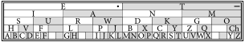

Autor: Marianka

Prvá časť šifry, ktorú si môžeme všimnúť, je,
že nám písmená medzi šípkami hovoria "doplň chýbajúce písmenká".
To nás núti zamyslieť sa, aké písmenká máme doplniť, a kde?
Šípky medzi písmenami medzitajničky by mohli naznačovať nejaké presuny
(napr. z D sa posunieme šikmo doľava dole a potom šikmo doprava dole).

Po chvíli rozmýšľania a pozerania sa na šifrovaciu pomôcku si môžeme všimnúť,
že pomôcka na Morseovu abecedu vyzerá tak, že keď si vyberieme písmeno,
tak z neho vieme ísť šikmo doprava dole, šikmo doľava dole alebo hore
a dostaneme sa na iné písmeno. Takto teda skúsime prejsť z každého písmena medzitajničky podľa šípok na iné miesto.

Tu však nastal malý problém. Keď skončíme našu cestu podľa šípok,
tak vždy skončíme o jedno písmeno mimo tabuľky s Morseovou abecedou.
Tu prichádza na rad medzitajnička -- doplň chýbajúce písmenká.
Chceme ich doplniť na miesta, kam nás vyvedú šípky von z tabuľky Morseovej abecedy.
Ostáva už iba otázka, aké písmenká?

Keď sa pozrieme na spodné poschodie tabuľky Morseovej abecedy,
všimneme si, že v ňom je 13 písmen a teda existuje 26 rôznych možností,
ako ísť z týchto písmen šikmo doprava dole alebo doľava dole.
Každé písmeno má 2 možnosti, ako z neho ísť šikmo dole,
čiže $13 \cdot 2 = 26$. Čoho je 26? Predsa písmen v abecede!
Doplníme ich teda nasledovne:

{style="width:31mm}

Keď prejdeme po šípkach a prídeme na doplnené písmenká,
vyjde nám tajnička: NAPIS RIESENIE KLESANIE. Odovzdáme teda riešenie **KLESANIE**.

