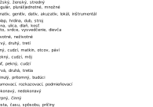

Autor: Danko

V tejto šifre sa toho deje celkom veľa, preto si najprv skúsme zhrnúť nejaké základné pozorovania. Šifra má dve časti. Prvá obsahuje obrázky v šiestich riadkoch. Obrázkov je 26 a nevyzerajú úplne náhodne, niektoré sú si v niektorých veciach podobné. Význam týchto obrázkov by mohol byť to, čo treba pochopiť.

V druhej časti vidíme políčka rôzne oddelené čiarkami, na ktorých sú čísla od 1 do 59, každé práve raz. Tieto by nám mohli napovedať, že do nich budeme dopĺňať nejaké slová a na základe čísel vyberieme písmenká do tajničky. Nie je však veľmi čo dopĺňať, teda na to asi budeme potrebovať prvú časť šifry.

Skúsme sa bližšie pozrieť na obrázky. Keď si ich skúsime pomenovať alebo rozdeliť podľa toho, ktoré sú podobné, začnú sa črtať nejaké skupiny. Najjasnejšie je ľudové umenie na konci prvých štyroch riadkov, potom tiež nejaké rodové symboly alebo čísla v prvých štyroch riadkoch. Náročnejšie na všimnutie, ale o to užitočnejšie sú dvojica symbolu stupňa a stupeň víťazov, a tiež tudorovská ruža a erb habsburgovcov, ktoré tiež reprezentujú rody. Začína sa nám aspoň čiastočne črtať pravidlo (ak nie, pomôže nám malá nápoveda), že pri prvých štyroch riadkoch máme prvý obrázok nejaké rody, druhý nejaké čísla, tretí vieme asociovať na "pád" (napr. rímskej ríše, vzorec pre voľný pád). Ak nám ešte nedochádza, o čo ide, nájdeme rozumné jednoslovné pomenovanie pre ľudové opakujúce sa kresby -- vzor.

Asociácia na rod, číslo, pád, vzor už nie je náročná, jedná sa o gramatické kategórie (a vzor, ktorý nie je gramatická kategória, ale pre čitateľnosť tohto textu ho ďalej tiež budeme zahŕňať do označenia "gramatická kategória"), podľa slovných druhov označené číslami od 1 po 6.

Ostatnými kategóriami sú životnosť pri mužskom rode, osoba, čas, (na čínsky) spôsob, vid pri slovesách, a druh (druhové meno obyčajný) pri príslovkách.

Keď sme už vylúštili vrchnú časť šifry a nevyzerá, že by nám tam niečo ostávalo, môžeme sa pustiť do vypĺňania druhej, a už aj tušíme ako. Chceli by sme tam nejako dopísať vylúštené gramatické kategórie, no na to je tam príliš veľa slov. Každá kategória má ale viac “stavov”, práve od toho kategórie sú, aby sa v nich slová odlišovali. Skúsime teda vpisovať tie, pekne postupne tak, ako sa s nimi stretávame v obrázkoch. Kategórie, ktoré sú rovnaké pre viaceré slovné druhy (napr. číslo), vypíšeme len raz, a tie, ktoré sú pri rôznych slovných druhoch rôzne (napr. rod), vypíšeme osobitne. Nejasnosti v poradí slov alebo pomenovaniach by mali poväčšine byť určené počtom políčok:

{style="width:140mm}

Z tajničky na číslach 1 až 59 potom dostávame nasledovné slová:
**koľko, koľkým, je, bude, hore, vyššie, kresieb, žien, lišia sa, líšili sa, ktoré, ktorým**.
V slovách je očividná snaha o to, aby v sebe niesli aj nejaký význam. Je pomerne vyrozumiteľný aj len tak z prečítania, no jasnejší je po prečítaní prvého z každej dvojice podobných slov: **Koľko je hore kresieb? Líšia sa ktoré?**

Odkazuje nás to na ešte nepoužitý fakt, že obrázkov je 26. Znie to ako sľubný spôsob, ktorým sa vieme dostať k heslu, očíslujeme si ich postupne po riadkoch. To, ktoré chceme vybrať a premeniť na písmenká, nám poradí druhá otázka a zvyšok slov. Otázka sa pýta, ktoré sa líšia, a môžeme si všimnúť že slová po dvojiciach sú veľmi podobné, líšia sa vždy iba jednou gramatickou kategóriou:

- koľko/koľkým -- zámeno, pád -- 13 = M
- je/bude -- sloveso, čas -- 21 = U
- hore/vyššie -- príslovka, stupeň -- 26 = Z
- kresieb/žien -- podstatné meno, životnosť -- 5 = E^[životnosť sa väčšinou v ženskom neurčuje, avšak je to podľa definície možné, a tvary sa v ničom inom nelíšia]
- líšia sa/líšili sa -- sloveso, čas -- 21 = U
- ktoré/ktorým -- zámeno, pád -- 13 = M

Tieto kategórie si podľa čísel od 1 do 26 priradených po riadkoch premeníme na písmenká a získame tak heslo **MÚZEUM**.
