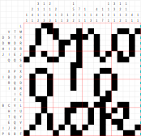

Autori: Miloš, Danko

Na začiatok veľmi divne vyzerajúce zadanie vieme dať do lepšieho tvaru využitím informácie,
že ho máme rozdelené na dve časti -- zvislú a vodorovnú.
Taktiež je to asi najjednoznačnejšia informácia v texte.
Na pomoc sa tiež ponúkajú čísla a písmená zo začiatku riadkov,
ktoré sa podobajú na názvy riadkov a stĺpcov v rôznych tabuľkových programoch.

Ako ďalší krok by sme chceli zistiť, čo dané čísla a písmená v riadkoch a stĺpcoch znamenajú.
Na tento nie úplne jednoznačný krok nás navádza viacero
faktov -- písmená sú v riadku vždy najviac štyri a rozmery krížovky sú po rozpísaní do riadkov a stĺpcov $20 \times 20$.
To necháva na každé písmeno 5 políčok. Taktiež ako to zvykom býva -- posledná úloha série je predsa krížovka.
Budeme teda niečo vypĺňať do tabuľky.

Rozmeniť jedno písmeno na 5 políčok nám pomôže binárka.
Takto získame to, že všetky riadky so štyrmi písmenami sú jednoznačne
určené -- v každom políčku budeme mať buď jednotku alebo nulu.
Takéto binárne rozdelenie políčok nám ponúka možnosť ich farebne odlíšiť a spolu s faktom,
že je to krížovka by nám malo napadnúť, že existuje niečo ako maľovaná krížovka.

Ak už vieme, že riešime maľovanú krížovku tak ju stačí celú vyplniť a máme hotovo.
Po vyplnení všetkých jednoznačných riadkov vieme využiť niektoré stĺpce na to,
aby sme ich doplnili nulami. To nám zase pomôže podopĺňať riadky,
ktoré majú menej ako 4 písmená. V tomto prípade to funguje tak,
že písmená nemusia ísť za sebou, ale kdekoľvek medzi päticami
reprezentujúcimi písmená môže byť medzera z prázdnych políčok.
Takto postupným dopĺňaním informácii striedavo z riadkov
a stĺpcov sa vieme dostať k jednoznačnému riešeniu maľovanej krížovky,
aké vidíme na obrázku. Heslo je teda **SPOLOK**.

{style="width:160mm}
