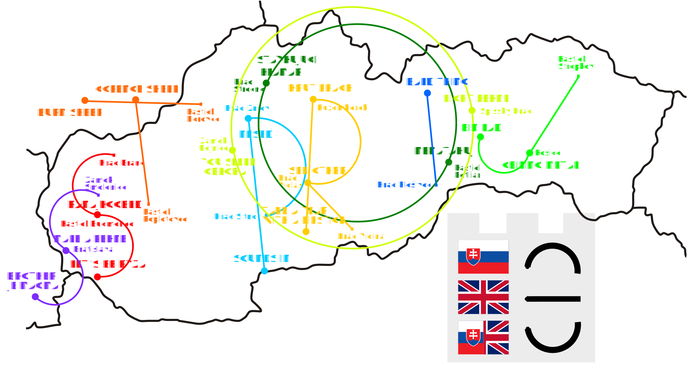

Autor: Viki

Z legendy vpravo dole a nápisov môžeme vidieť, že sa nejako budeme hrať so slovenčinou a angličtinou.
Skúsme nápisy prepísať do opačného jazyku ako je ten, v ktorom sú,
Napríklad zo stávkujúceho klamára dostaneme slová bet a liar,
z malého a pekného máme small & nice, Let’s be ryža -- buďme rice.
Vidíme, že tieto preklady nám asociujú nejaké Slovenské mestá pričom
mnohé sú známe práve vďaka nejakej budove -- či už kaštieľu,
hradu alebo zrúcanine. Keď názvy dešifrujeme, zistíme kde na
mape sa dané mesto nachádza a podľa legendy pospájame s bodkou na mape.
Keď máme pospájané, môžeme vidieť písmenká a už stačí len po farbách dúhy prečítať heslo -- **STROJOPIS**.

{style="width:80mm}
