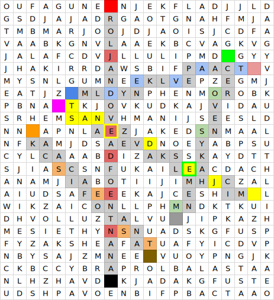

Autor: Ivona

Legenda osemsmerovky v sebe obsahuje obrázky, ktoré sa spájajú so slovenskými pamiatkami.
Keď začneme do vyhľadávača zadávať kľúčové slová, postupne zistíme,
že ku každej z pamiatok sa viaže povesť, ktorú obrázky opisujú.
Jeden obrázok však opisuje len jednu časť povesti, musíme k nemu nájsť dvojicu.

Na internete si vyhľadáme texty povestí a zistíme,
že obrázok rytiera a fontány hovorí o Rolandovej (Maximiliánovej)
fontáne a v príbehu povesti sa rytier na Silvestra otočí a pokloní
sa smerom k Zelenej ulici. Prvá dvojica je teda rytier a fontána a zelená ulica.

V ďalšej povesti vystupuje vodník a keď si prečítame niektoré z nich zistíme,
že jedna rozpráva príbeh Kačacej fontány. Vodník podľa nej naháňal chlapcov,
pastierov kačíc, ktorí si z neho uťahovali a postupne každého z nich premenil na kameň.
Ďalšia dvojica sú teda vodník a chlapci s kačicami.

Na treťom obrázku je veža a hodinové ručičky, ktoré majú pri sebe otáznik.
Povesť o chýbajúcich hodinových ručičkách sa viaže k Michalskej veži.
V minulosti na jej západnej strane ručičky kvôli nezhodám pri zaplatení opravy hodín chýbali.
Dvojica je teda veža a ručičky a západ.

Ďalší obrázok je červený kameň, vrch a kukla. Dostaneme sa k povesti o hrade Červený kameň a o príhode,
ktorá sa stala počas jeho výstavby. Základy hradu boli v noci presunuté z jedného vrchu,
z vrchu Kukla, na druhý, Bobrí vrch. Štvrtá dvojica je tak červený kameň, vrch a kukla a kameň, vrch a bobor.

Na poslednom obrázku je líška a obrázok hlavy/tváre.
Spája sa s povesťou o Mlyne Klepáči o zaľúbencoch,
ktorí boli kvôli svojej láske kliatbou zmenení na líšku s ľudskou tvárou a zajaca,
ktorého má líška až do oslobodenia naháňať. Posledná dvojica je tak líška s ľudskou tvárou a zajac pri mlyne.

Keďže máme všetky dvojice a v každej povesti je reč o smere nejakého pohybu alebo o bode,
ku ktorému je niečo/niekto orientované, dvojice tak pospájame.
Pohybovať sa budeme po písmenách, ktoré vyskladajú názov pamiatky,
ku ktorej sa povesť viaže, cesty sú aj kľukaté. Medzi písmenami si však všimneme aj také,
ktoré do názvu nepatria. Takto vyzerajú správne pospájané dvojice.
Písmenká, ktoré nepatria do názvu sú vyznačené farbami.

{style="width:100mm}

Vidíme, že z písmeniek, ktoré nepatrili do názvu vyšli čísla.
Vráťme sa opäť k názvom pamiatok a zoberme z nich vždy to písmeno,
o ktorom hovorí číslo. Keď usporiadame štvorčeky,
ktoré boli priradené k prvej časti povesti, podľa dúhy a tým usporiadame aj písmená,
ktoré sme zobrali z názvov, vychádza nám riešenie **RIEKA**.
