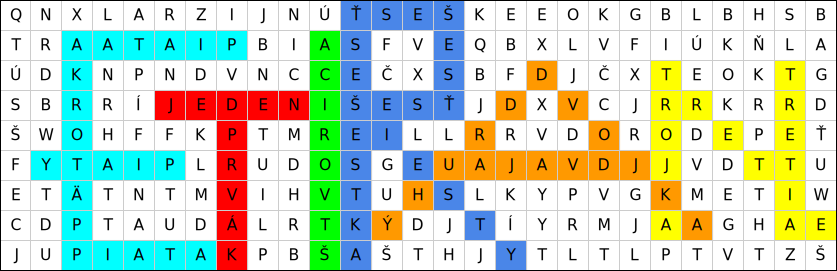

Autori: MisQo, Kika

### Ako začať?

Šifra vyzerá ako osemsmerovka, volá sa Osemsmerovka, a na prvý pohľad nevyzerá
byť ničím zaujímavá. Neostáva nám teda nič iné, ako začať hľadať slová. Po
chvíli hľadania nájdeme prvé slová.

### Všimneme si niečo netypické

Už po nájdení zopár slov si všimnene, že všetky sú číslovky alebo sa dajú jednoznačne
priradiť k číslovke. To v osemsmerovkách nebýva bežné, začíname teda tušiť, že to asi bude
dôležité pre vyriešenie šifry.

Hľadáme slová ďalej a môžeme si všimnúť, že slová asociujúce sa s tou istou číslovkou sú
spravidla pri sebe. To asi tiež nebude náhoda. Tento poznatok vieme využiť nielen na rýchlejšie
hľadanie slov, ale aj pri ďalšom riešení.

### Písmená

Ak si pri riešení osemsmerovky značíme slová, ktoré sme našli, napr. preškrtnutím alebo zakrúžkovaním,
môžeme si všimnúť že naše čiary začali vytvárať písmená. Občas sa však akoby prekrývajú alebo nie sú
úplne jasné. Po chvíľke analyzovania si však všimneme, že jedna číslovka nám celkom jasne dáva
jedno písmeno (to preto sme slová s rovnakou číslovkou nachádzali pri sebe).

{style="width:52mm}

### Ako ich zoradiť?

Máme teda písmená, ale sú zdanlivo v náhodnom poradí, nevieme, ako ich zoradiť, aby sme dostali heslo.
Jedna vec, ktorú sme zatiaľ nevyužili, je, z ktorej číslovky je dané písmeno. To, že vieme zoradiť písmená
podľa tejto vlastnosti, nám napovedá aj to, že číslovky sú od jedna po šesť.
A naozaj, keď písmená takto zoradíme, dostaneme heslo **TANIER**.
