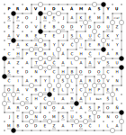
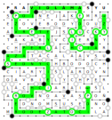
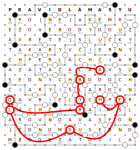

Autori: Havoš, Marek S., Skaloš

Prvá vec, ktorú v šifre vidíme, je mriežka, perly, a text.
Keď text prečítame po riadkoch, a vynecháme políčka _štart_ a _cieľ_,
dozvieme sa pravidlá riešenia masyu.

Vyriešime teda masyu. Z týchto niekoľkých pravidiel si buď odvodíme zložitejšie,
alebo si na internete prečítame návody, ako na riešenie ísť.
Keď sa pokúsime hlavolam v šifre vyriešiť, ignorujúc text vnútri políčok,
dostaneme jediné riešenie:

{style="width:80mm}

Všimneme si, že políčka označené _štart_ a _cieľ_ sú obe vnútri ohradeného priestoru.
Riešenie hlavolamu sa teda správa trochu ako bludisko.
Ak sa pokúsime čítať písmenká po ceste, ktorú prejdeme od začiatku po koniec,
vyjdú nám nezmysly. Šifra však obsahuje niečo, čo sme ešte nevyužili -- podčiarknuté písmená.
Všimnime si, že podčiarknuté písmená môžeme zaradiť do troch skupín.
Buď sú mimo bludiska, alebo sú v slepých uličkách,
alebo sa ich dá navštíviť cestou od začiatku po koniec bez opakovaného vstúpenia na niektoré políčko.

Ak sa zameriame na tie písmená, ktoré sa dajú pozbierať od začiatku po koniec,
existuje iba jedno poradie, v ktorom ich môžeme nájsť (možností, ako bludisko prejsť,
je viac, ale každá nám dá rovnakú postupnosť písmen).
Jedna z možností ako bludisko prejsť, je táto:

{style="width:80mm}

Prečítame pozbierané písmená a máme: POZRISLEPÉULIČKY.
Nasledujeme inštrukcie a zameriame sa na zvyšné podčiarknuté písmená vnútri bludiska -- tie,
ktoré sa na ceste od začiatku po koniec pozbierať nedali.
Slepé uličky navštívime v poradí, v ktorom sa oddeľujú od hlavnej cesty,
a ak slepá ulička obsahuje viac písmen, čítame ich v poradí,
v ktorom ich v slepej uličke nájdeme. Vyjde nám:

{style="width:80mm}

Čítame HESLORYBA, z čoho samozrejme odovzdáme iba **RYBA**.
