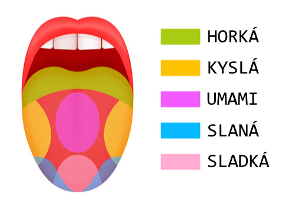

\section*{SuŠi kuchárska kniha}
\renewcommand\contentsname{}
\begingroup
\let\clearpage\relax
\vspace{-2cm}
\tableofcontents
\endgroup

\newpage

# Zložky a suroviny

Každý správny kuchár musí vedieť, čo jeho suroviny obsahujú. Či už sú to rôzne chute,
vitamíny, minerály, alergény, prípadne prídavné látky v jedle, tvz. Éčka.
Nie všetky suroviny sú si totiž rovné a na prípravu kvalitného jedla treba
vybrať spomedzi surovín tie najkvalitnejšie, s najčistejším alebo najobohacujúcejším zložením.

### Alergény

Veľmi dôležité je poznať alergény. Do tejto skupiny patria tie potraviny alebo látky,
na ktoré sa často vyskytuje alergia, a teda každý dobrý kuchár by mal
vedieť upozorniť na obsah týchto surovín, a ideálne sa im aj v prípade potreby vyhnúť.
Suroviny, ktoré obsahujú alergény sa označujú číslami 1-14:

1. [Obilniny obsahujúce glutén (lepok)](https://en.wikipedia.org/wiki/Gluten)
Lepok je zmes bielkovín vyskytujúca sa v semenách niektorých obilnín.
Konkrétne nimi sú: pšenica obyčajná, raž, jačmeň, ovos, pšenica špalda,
cirok alebo ich hybridné odrody, a výrobky z nich okrem:
1. glukózových sirupov na báze pšenice vrátane dextrózy
2. maltodextrínov na báze pšenice
3. glukózových sirupov na báze raže
4. obilnín použitých pri výrobe alkoholických destilátov vrátane etylalkoholu poľnohospodárskeho pôvodu

2. [Kôrovce a výrobky z kôrovcov](https://en.wikipedia.org/wiki/Crustacean)
Kôrovce patria v kulinárstve do kategórie morských plodov.
Najčastejšie sú to článkonožce ako raky, kraby alebo krevety.

3. [Vajcia a výrobky z vajec](https://en.wikipedia.org/wiki/Egg)
Najčastejšie sa stretávame s alergiou na slepačie vajce,
no môže ísť aj o alergiu na všetky druhy vajec, či už samotné varené,
alebo ako zložka rôznych omáčok (napr. majonéza) alebo iných jedál.

4. [Ryby a výrobky z rýb](https://en.wikipedia.org/wiki/Fish)
Do tejto kategórie sa zahrňujú všetky druhy slano aj sladkovodných rýb.
Reakciu môžu spôsobiť aj výrobky z nich, okrem rybacej želatíny.

5. [Arašidy a výrobky z arašidov](https://en.wikipedia.org/wiki/Peanut)
Arašidy, alebo oficiálne podzemnica olejná, sú jeden z najčastejších alergénov vôbec.
Pridávajú sa do mnohých jedál a cukroviniek, napríklad v podobe arašidového masla.
Alergická reakcia už na malé množstvo môže byť veľmi závažná, a preto si na ne treba dávať pozor.

6. [Sójové bôby a výrobky zo sójových bôbov ](https://en.wikipedia.org/wiki/Soybean)
Sójové bôby sú strukovina najčastejšie sa vyskytujúca v sójovom oleji,
sójovej múke a v náhradách mäsa. Tento alegén neobsahujú: úplne rafinovaný sójový olej a tuk,
rastlinné oleje vyrobených z fytosterolov zo sójových bôbov a niektoré zmesi prírodných tokoferolov (E306).

7. [Mlieko a mliečne výrobky ](https://en.wikipedia.org/wiki/Milk)
Za alergén mlieko sa považujú všetky druhy zvieracieho mlieka,
aj keď najčastejšou alergiou je alergia na kravské mlieko.
Mlieko je veľmi univerzálne používaná surovina do veľkého množstva produktov.
Za obsahujúce alergény sú považované aj kysnuté mliečne výrobky
(napr. tradičná slovenské bryndza či talianske mascarpone), ale aj mliečny cukor laktóza.

8. [Orechy](https://en.wikipedia.org/wiki/Nut_(fruit))
Existuje veľa rôznych druhov orechov, pri alergénoch ide najmä o
mandle (Amygdalus communis L.), lieskové oriešky (Corylus avellana),
vlašské orechy (Juglans regia), kešu oriešky (Anacardium occidentale),
pekanové orechy (Carya illinoinensis), brazílske orechy (Bertholletia excelsa),
pistáciové oriešky (Pistacia vera), makadamové orechy a queenslandské orechy (Macadamia ternifolia) a výrobky z nich.

9. [Zeler a výrobky zo zeleru](https://en.wikipedia.org/wiki/Celery)
Zeler voňavý je zelenina pestovaná pre svoje listy aj koreň. Často sa využíva jeho vňať a tiež sa z neho vyrába korenie.
V jedle sa tiež môže vyskytovať vo forme oleja z jeho semien.

10. [Horčica a výrobky z horčice](https://en.wikipedia.org/wiki/Mustard_plant)
Horčica biela je pôvodne rastlina, po ktorej je pomenovaný hlavný výrobok z nej,
omáčka horčica. Tá sa vyrába z jej semien a podáva sa ku veľkému množstvu rozličných jedál,
najmä k mäsu, zelenine alebo syrom, a taktiež sa využíva ako prísada do ďalších omáčok.

11. [Sezamové semeno a výrobky zo sezamových semien](https://en.wikipedia.org/wiki/Sesame)
Sezamové semená pochádzajú zo strukov rastliny Sezamu indického.
Najčastejším výrobkom z nich je sezamový olej, ktorého majú v sebe veľmi vysokú koncentráciu.
Alergická reakcia na sezam môže byť veľmi náhla a nebezpečná.

12. [Oxid siričitý a siričitany](https://en.wikipedia.org/wiki/Sulfur_dioxide)
Oxid siričitý je plyn ktorý sa využíva ako konzervant a antioxidant.
Ako alergén sa uvádza spolu s niektorými inými siričitanmi v prípade,
že je obsiahnutý vo výrobkoch určených na priamu konzumáciu v koncentráciách vyšších ako 10 mg/kg.
Vo veľkých množstvách presahujúcich normy môže byť dráždivý aj pre nealergikov.
Nájsť ho môžeme hlavne v suchých obilninách alebo v konzervovanom sušenom ovocí a zemiakových výrobkoch.

13. [Vlčí bôb a výrobky z vlčieho bôbu](https://en.wikipedia.org/wiki/Lupin_bean)
Vlčí bôb alebo vedecky Lupina biela je strukovina pochádzajúca zo severnej Ameriky.
Surová rastlina je vysoko jedovatá, a pred konzumáciou sa musí poriadne odmočiť vo vode a tepelne upraviť.

14. [Mäkkýše a výrobky z mäkkýšov](https://en.wikipedia.org/wiki/List_of_edible_molluscs)
Medzi najčastejšie konzumované mäkkýše patria morské plody ako mušle,
lastúry alebo ustrice, taktiež chobotnice alebo slimáky.

### Éčka a iné chemikálie

V chemickom zložení potravín sa môžu nachádzať viaceré špecificky významné zlúčeniny.
Umelo pridávané chemické látky sa označujú pomocou kódov zvyčajne pozostávajúcich z písmena E a trojčíslia,
sú to takzvané Éčka. Je dobré sa vyznať v ich [zozname](https://en.wikipedia.org/wiki/E_number).
Pri prirodzene sa vyskytujúcich látkach by mali každého kuchára zaujímať zdraviu prospešné látky
ako [aminokyseliny](https://en.wikipedia.org/wiki/Amino_acid),
nevyhnutné na základnú stavbu tkanív v tele. Niektoré z nich telo nevie získať iným spôsobom ako potravou,
tieto sa nazývajú esenciálne.

Ďalšou dôležitou kategóriou sú antioxidanty, ktoré telu pomáhajú zvládať nepriaznivé
procesy a často sú samy nevyhnutné na fungovanie vitálnych procesov.
Patria medzi ne rôzne minerály a tiež [vitamíny](https://en.wikipedia.org/wiki/Vitamin).

\newpage

# Jedlá a recepty

Každý správny kuchár by mal takisto poznať zopár receptov.
O tom je práve táto kapitola.

## Polievky

### Slepačí vývar

Suroviny:

\begin{multicols}{3}
\begin{itemize}
\item celá sliepka
\item cibuľa
\item kaleráb
\item mrkva
\item petržlen
\item rezance
\item vegeta
\item voda
\end{itemize}
\end{multicols}

Postup:

1. Sliepku dôkladne opláchneme a podľa potreby očistíme a naporcujeme.
Zalejeme dostatkom vody a varíme ju na miernom stupni aspoň 1 hodinu.
2. Očistíme zeleninu, necháme ju v celých kusoch a po hodine ju všetku okrem mrkvy pridáme k sliepke.
Tiež môžeme ochutiť vegetou.
3. Po ďalšej polhodine pridáme mrkvu a varíme aspoň ďalších 30 minút.
4. Zohrejeme vodu na rezance a potom rezance zalejeme horúcou vodou.
5. Sliepku vytiahneme z vody, oberieme mäso. Mäso dáme do misky spolu s rezancami a zalejeme vývarom.

### Fazuľová polievka

Suroviny:

\begin{multicols}{3}
\begin{itemize}
\item fazuľa
\item klobása
\item mrkva
\item zemiaky
\item cibuľa
\item masť
\end{itemize}
\end{multicols}

Postup:

1. Fazuľu namočíme na pár hodín napučať. Fazuľu potom vložíme do hrnca a zalejeme vodou.
2. Varíme do polomäkka. Dolejem vodu. Prevaríme a pridáme na menšie kúsky nakrájanú mrkvu.
Varíme 10 minút. Medzitým si na masti opražíme nadrobno nakrájanú cibuľu,
pridáme nakrájanú klobásu a orestujeme.
3. Pridáme klobásu do polievky spolu s na kocky nakrájanými zemiakmi. Varíme ešte 15-20 minút.
4. Polievku podávame s lyžicou kyslej smotany.

\newpage

### Boršč

Suroviny:

\begin{multicols}{3}
\begin{itemize}
\item cesnak
\item zemiaky
\item cibuľa
\item mrkva
\item kapusta
\item paradajkový pretlak
\item červená repa
\item hovädzie s kosťou
\end{itemize}
\end{multicols}

Postup:

1. Hovädzie s kosťou dôkladne umyjeme, vložíme do hrnca,
zalejeme studenou vodou a necháme variť.
Na miernom ohni varíme asi 1,5 hodinu.
2. Mäso rozoberieme na 2-3 cm dlhé vlákna a vrátime späť do vývaru.
3. Nakrájame zemiaky na kocky a pridáme do vývaru.
4. Nakrájame kapustu na rezance a pridáme do vývaru.
5. Pripravíme si zvyšnú zeleninu. Cibuľu nakrájame na menšie kocky,
mrkvu a červenú repu očistíme a nastrúhame.
6. Cibuľu osmažíme na panvici do zlata a potom pridáme mrkvu.
Necháme trochu smažiť a následne pridáme repu.
7. Z vývaru zoberieme asi 2 naberačky vody a pridáme ich na panvicu.
Pridáme paradajkový pretlak. Všetko premiešame a necháme dusiť do mäkka.
8. Po zmäknutí pridáme túto zmes do vývaru a necháme chvíľu variť.
9. Boršč podávame so smotanou.

## Hlavné jedlá

### Bryndzové halušky

Suroviny:

\begin{multicols}{3}
\begin{itemize}
\item bryndza
\item masť
\item slanina
\item smotana
\item syrokrém
\item zemiaky
\end{itemize}
\end{multicols}

Postup:

1. Zo zemiakov si spravíme zemiakové cesto a to pretlačíme cez cedník na halušky do vriacej vody.
Halušky varíme približne 10 minút.
2. Hotové halušky precedíme.
3. Slaninu nakrájame na kocky a na panvici opražíme.
4. Bryndzu zmiešame so syrokrémom, smotanou a masťou. Všetky halušky zmiešame s touto zmesou.
5. Halušky podávame spolu s opraženou slaninou.

\newpage

### Sviečková

Suroviny:

\begin{multicols}{3}
\begin{itemize}
\item brusnice
\item cibuľa
\item hovädzie mäso
\item knedľa
\item mrkva
\item smotana
\item zeler
\item petržlen
\end{itemize}
\end{multicols}

Postup:

1. Mäso umyjeme, odblaníme, osušíme
2. Mrkvu, petržlen, zeler očistíme, umyjeme a nakrájame na kolieska.
Cibuľu ošúpeme, umyjeme a nakrájame na kocky.
3. V hrnci opražíme cibuľu. Mäso chvíľu opečieme zo všetkých strán a potom vyberieme.
Pridáme nakrájanú zeleninu, brusnice, pridáme mäso, zalejeme vriacou vodou a necháme dusiť asi 3 hodiny.
4. Keď je mäso mäkké, tak ho vytiahneme z hrnca. Ponorným mixérom pomixuje zeleninu.
Pridáme smotane a poriadne zamiešame. Mäso nakrájame na plátky.
5. Knedľu zohrejeme na vodnej pare. Mäso podávame poliate omáčkou s knedľou.

### Francúzske zemiaky

Suroviny:

\begin{multicols}{3}
\begin{itemize}
\item zemiaky
\item maslo
\item kyslá smotana
\item vajcia
\item mlieko
\item klobása, prípadne šunka alebo slanina
\item tvrdý syr
\item cibuľa, prípadne iná zelenina podľa chuti
\item horčica
\item soľ
\item mletá paprika
\item mleté čierne korenie
\end{itemize}
\end{multicols}

Postup:

1. Zemiaky uvaríme a ošúpeme
2. Všetku zeleninu a mäso nakrájame na kúsky, pár vajec uvaríme na tvrdo a nakrájame. Syr nastrúhame.
3. Vymastíme plech maslom a poukladáme na neho vrstvu zemiakov na spodok a na okraje
4. Na zemiaky poukladáme vrstvu mäsa, vajec a zeleniny
5. Posypeme trochou syra, soľou a paprikou
6. Naukladáme ďalšiu vrstvu zemiakov, na to ďalšie mäso, vajcia a zeleninu
7. Napokon pokryjeme poslednou vrstvou zemiakov, posypeme korením a syrom
8. Do misky pripravíme vymiešanú zmes mlieka, kyslej smotany, vajec, horčice a čierneho korenia
9. Polejeme obsah plechu zmesou a dáme piecť na 45 minút, kým všetká zelenina nezmäkne

### Špenátový prívarok s vajcom

Suroviny:

\begin{multicols}{3}
\begin{itemize}
\item olej
\item smotana
\item špenát
\item vajíčko na tvrdo
\item zemiaky
\end{itemize}
\end{multicols}

Postup:

1. Špenát zohrejeme na oleji a troche vody.
2. Keď sa špenát rozpustí, tak pridáme smotanu a zmiešame.
3. Očistíme a nakrájame zemiaky na kocky. Zemiaky dáme variť.
4. Špenát podávame so zemiakmi a vajíčkom uvareným na tvrdo.

### Ryžový nákyp

Suroviny:

\begin{multicols}{3}
\begin{itemize}
\item cukor
\item hrozienka
\item mlieko
\item kompót
\item ryža
\end{itemize}
\end{multicols}

Postup:

1. Ryžu prepláchneme vodou a uvaríme v mlieku, ktoré sme mierne osladili cukrom.
2. Uvarenú ryžu vyklopíme do misy.
3. Polovicu ryže vložíme do vymasteného pekáča, na to položíme vrstvu ovocia z kompótu,
za hrsť hrozienok a to prikryjeme zvyškom ryže.
4. Pečieme približne 1 hodinu.

### Viedeňský rezeň

Suroviny:

\begin{multicols}{3}
\begin{itemize}
\item teľacie mäso
\item múka
\item vajcia
\item strúhanka
\item masť
\end{itemize}
\end{multicols}

Postup:

1. Mäso umyjeme, odblaníme a nakrájame na tenké plátky.
2. Plátky vyklepeme.
3. Plátky obalíme v múke, rozšľahaných vajciach a strúhanke.
4. Mäso krátko opražíme na vyššej teplote. Približne 1-2 minúty na každej strane.
5. Rezne môžeme podávať napríklad so zemiakovým šalátom alebo zemiakovou kašou.

### Pizza

Suroviny:

\begin{multicols}{3}
\begin{itemize}
\item pizzové cesto
\item olivový olej
\item paradajkový pretlak
\item šunka, prípadne slanina, saláma, mäso...
\item kukurica, cibuľa, šampiňóny, olivy alebo iná zelenina
\item cesnak
\item strúhaný tvrdý syr
\end{itemize}
\end{multicols}

Postup:

1. Pizzové cesto si vyvaľkáme do kruhového tvaru.
2. Pridáme paradajkový pretlak. Zvyšné suroviny nanášame vo vrstvách.
Na koniec to posypeme syrom, nech sa nám všetky vrstvy spoja.
3. Vložíme do trúby a pečieme 10-15 minút.
4. Cesto vytiahneme z trúby, okraje potrieme zmesou olivového oleja a cesnaku.
Nakrájame na osminy a môžeme podávať.

### Hovädzí guláš

Suroviny:

\begin{multicols}{3}
\begin{itemize}
\item hovädzie mäso
\item cibuľa
\item sladká mletá paprika
\item paradajkový pretlak
\item knedľa
\end{itemize}
\end{multicols}

Postup:

1. Cibuľu ošúpeme, nakrájame na drobno a v hrnci orestujeme do hneda.
2. Do cibule pridáme papriku a dobre premiešame. Potom pridáme kúsky mäsa,
zo všetkých strán opečieme a dobre miešame.
3. Pridáme paradajkový pretlak, dobre premiešame a zalejeme malým množstvom vody.
Necháme dusiť na čo najnižšej teplote.
4. Po približne hodine a pol je mäso hotové.
5. Knedľu zohrejeme na vodnej pare.
6. Mäso podávame s omáčkou a knedľou.

### Špagety carbonara

Suroviny:

\begin{multicols}{3}
\begin{itemize}
\item čierne korenie
\item slanina
\item smotana
\item syr
\item špagety
\item šunka
\item vajce
\end{itemize}
\end{multicols}

Postup:

1. Špagety uvaríme a scedíme.
2. Na panvici opražíme na kocky nakrájanú slaninu a odložíme ju nabok.
3. Do panvice nalejeme smotanu, pridáme žĺtko a polovicu nastrúhaného syra. Po chvíli pridáme špagety a premiešame.
4. Celú zmes dáme na tanier a posypeme slaninou a čiernym korením.

### Vepřo knedlo zelo

Suroviny:

\begin{multicols}{3}
\begin{itemize}
\item bravčová krkovička
\item cibuľa
\item slanina
\item kyslá kapusta
\item knedľa
\end{itemize}
\end{multicols}

Postup:

1. Krkovičku umyjeme, osolíme, okoreníme a z oboch strán potrieme cesnakom.
Mäso dáme na pekáč spolu s kockami cibule. Pečieme asi 3 hodiny.
2. Na panvici opražte slaninu a cibuľu. Primiešame kapustu,
zalejeme vodou a privedieme k varu. Varíme 15 minút.
3. Knedľu zohrejeme na vodnej pare.
4. Vytiahneme mäso z trúby a necháme ho chvíľu odpočinúť.
Odpočinuté mäso nakrájame na plátky.
5. Mäso podávame spolu s kapustou a knedľou.

### Suši

Suroviny:

\begin{multicols}{3}
\begin{itemize}
\item losos
\item riasy
\item ryža
\item sójová omáčka
\item treska
\item uhorka
\item zázvor
\end{itemize}
\end{multicols}

Postup:

1. Ryžu prepláchneme, scedíme a dáme do hrnca. Zalejeme vodou a necháme hodinu odstáť. Potom ryžu uvaríme.
2. Ryžu ochutíme sójovou omáčkou a zázvorom.
3. Nakrájame uhorku, lososa a tresku.
4. Na rolovaciu podložku položíme riasu, pokryjeme ju rovnomernou vrstvou ryže a pridáme kúsok uhorky,
lososa alebo tresky a zrolujeme.
5. Jednotlivé rolky nakrájame na kolieska a môžeme servírovať.

## Dezerty

### Bábovka

Suroviny:

\begin{multicols}{3}
\begin{itemize}
\item cukor
\item kakao
\item polohrubá múka
\item mlieko
\item olej
\item prášok do pečiva
\item vajíčka
\end{itemize}
\end{multicols}

Postup:

1. Zmiešame cukor s vajíčko, pridáme olej, múku, mlieko, prášok do pečiva a poriadne premiešame.
2. Cesto rozdelíme do dvoch misiek. Do jednej pridáme trochu kakaa podľa chuti do druhú necháme tak.
3. Cesto nalejeme do vymastenej formy a pečieme približne 1 hodinu.
4. Po upečení bábovku vyklopíme z formy na tanier.

### Palacinky

Suroviny:

\begin{multicols}{3}
\begin{itemize}
\item vajcia
\item mlieko
\item múka
\end{itemize}
\end{multicols}

Postup:

1. Múku rozmixujeme spolu s mliekom a vajcami, až kým nevznikme stredne hustá zmes.
2. Na rozohriatu panvicu s olejom nalejeme približne jednu naberačku zmesi a smažíme z oboch strán.
3. Palacinky môžeme podávať natreté džemom, nutelou alebo hocičím, čo nám napadne.

\newpage

# Chute

Ako isto viete, poznáme štyri klasické, základné chute: sladkú, slanú, kyslú a horkú.
Trochu menej známou chuťou je korenistá umami -- chuť nachádzajúca sa napríklad
vo varenom mäse, rybách, paradajkách, hubách, kvasinkách, syroch, sójovej omáčke...

Tieto chute vnímame špeciálnymi bunkami známymi ako chuťové poháriky,
ktoré sú rozmiestnené na jazyku. Určite ste už videli takýto diagram ich rozmiestnenia:

{style="width:70mm}

Vedeli ste ale, že toto rozmiestnenie nie úplne zodpovedá realite?
Napriek jeho ikonickosti je vraj skutočnosť taká, že všetky chuťové
poháriky sú na jazyku rozmiestnené rovnomerne...
