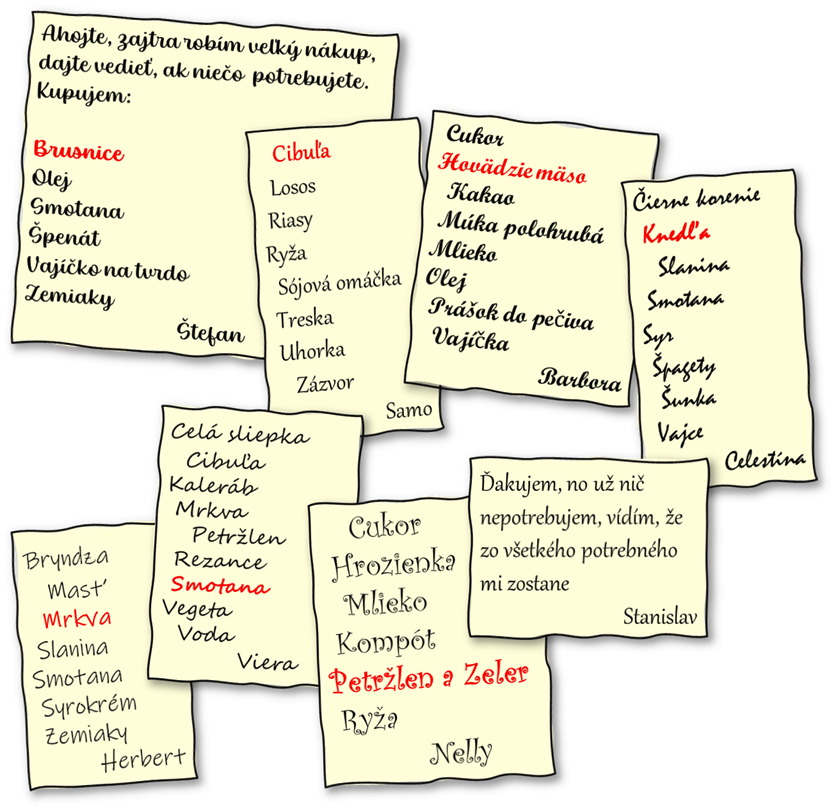

Autor: ???

Každý si do nákupného zoznamu napísal suroviny na nejaký pokrm.
Suroviny sú zoradené abecedne, a vždy jedna z nich očividne nepatrí medzi ostatné.

Z ostatných sa dá pripraviť nejaký pokrm. Názov pokrmu sa začína na rovnaké písmeno,
ako meno človeka, ktorý ho chystá, a má aj rovnaký počet písmen.
To nám pomôže skontrolovať, že sme identifikovali správne pokrmy
(špenát, suši, bábovka, carbonara, halušky, vývar, nákyp).

Ale čo so surovinami, ktoré sa doteraz nepoužili? Stanislav napísal,
že ich využije. Spolu tvoria recept na sviečkovú. Tá aj súvisí s menom Stanislav rovnakým spôsobom,
ako ostatné mená a zoznamy. Riešenie teda znie **SVIEČKOVÁ**.

{style="width:115mm}
