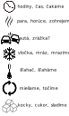

Autor:

Keď sa pozrieme na šifru, nachádza sa pred nami akási schéma.
Hneď môžeme pozorovať základné vlastnosti, ako napríklad:

1. Pozostáva z podčiarkovníkov (pravdepodobne slov), šípok a obrázkov.
2. Do každého slova vedie jedna šípka, ku každej šípke patrí jeden obrázok.
3. Do stredového slova nevedie šípka, a práve jednou cestou sa vieme po šípkach dostať kamkoľvek.

Na niektorých podčiarkovníkoch sú čísla, konkrétne všetky od 1 po 26.

26 je písmen abecedy, avšak nedajme sa zmiasť, čo by tam robilo každé písmenko práve raz, vrátane W či Q?

Pravdepodobnejšie je, že za ne doplníme 26 písmeniek výslednej tajničky.
Na to by sme teda chceli povypĺňať slová v šifre, no kde začať?
Ako aj názov hovorí, asi pôjde o nejaký proces, ktorý schéma popisuje.
Niečo vychádzajúce zo spoločného základu a vetviace sa.

Môžeme sa skúsiť pozrieť na jedinú poriadnu informáciu, ktorá nám zostala,
a teda čo môžu symbolizovať obrázky pri šípkach.
Pravdepodobne nejak popisujú čo sa deje medzi jedným a druhým štádiom procesu:

{style="width:80mm}

Samozrejme, začať treba od tých najočividnejších.
Niečo čo môžeme chladiť alebo mraziť, niečo čo šľaháme.

Mohli by to byť napríklad vajcia, no pri nich nemáme toľko možností.
Nádejnejšie vyzerá mlieko, z ktorého vieme dostať množstvo produktov.
Mlieko by sme aj vedeli doplniť do stredu schémy, vychádza nám to na počet podčiarkovníkov,
už len zistiť, aké procesy s ním robíme a čo vznikne.

Veľmi často sú tam hodiny, ktoré budú symbolizovať prejdený čas.
Keď mliečne produkty necháme dlhší čas, buď sa pokazia, alebo v lepšom prípade budú kysnúť.
Takto nám napríklad môže vzniknúť kefír.

Symbol pary nám tiež môže sedieť, môžeme zohriať mlieko a odpariť z neho vodu.
Produkt, ktorý vznikne podľa schémy, môžeme takto spracovať ešte raz,
teda pôjde o medzištádium, zahustené mlieko, a potom konečný produkt sušené mlieko.

V kontexte mlieka vieme pochopiť aj obrázok autohavárie, ide o zrážku,
a keď necháme mlieko zraziť, dostávame syr.
Toto je jeden z procesov, kde vidíme, že môžu vzniknúť aj dva produkty,
v tomto prípade máme aj srvátku.

Ako asi tušíme, šľahať by sme chceli smotanu na šľahačku, a smotana vzniká cez symbol šípok do kruhu.
Tie majú symbolizovať odstreďovanie, teda spôsob, ako oddeliť tuk od mlieka a získať smotanu.

Kocky naozaj budú symbolizovať cukor, čím zo zahusteného mlieka dostaneme salko.

Celá schéma bude po vyplnení vyzerať takto:

{style="width:60mm}

Potom už len vyberieme tajničku, ktorá má písmená z miest,
ktoré sú označené číslami 1 -- 26.

Dostávame: _heslo je taliansky syr na pizzu_.
Odpoveď je teda **MOZZARELLA**.

