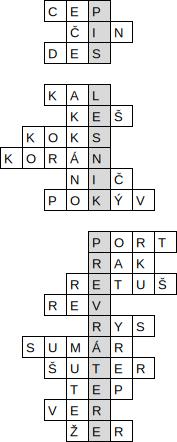

Autori: Viktor, Havoš, Janči

Šifra na prvý pohľad vyzerá veľmi jednoducho.
Máme tajničku,
a množstvo nápovied.
Skúsme si napísať správne slovíčka,
na ktoré nápovedy narážajú.
Niečo nám ale nevychádza...
Ich dĺžky majú síce ako-tak správnu dĺžku,
aby niekam do tajničky sedeli,
ale nie vždy do najbližšieho riadku.
Ako teda zistíme,
do ktorého riadka slovíčka napísať?
A čo ak s nimi okrem preusporiadania treba spraviť ešte niečo?
Šifra nám hovorí,
že posledným písmenom hesla je H.
Táto informácia skrýva viac,
ako sa zdá na prvý pohľad,
a môže nám k odpovedi napovedať.
H totiž nie je posledným,
ale prvým písmenom slova "heslo".
Inšpirovaní touto skutočnosťou môžeme všetky slovíčka napísať odzadu.
Zistíme,
že všetky z nich sú stále zmysluplnými slovami.
To je síce pekné,
a pomôže nám to uhádnuť,
ak sme niektoré nevedeli,
ale ako ich usporiadať?
Podobne ako pred prevrátením boli všetky slovíčka usporiadané abecedne,
usporiadame teraz aj ich prevrátené verzie.
Tie už môžeme napísať do tajničky a čítať:
"píš lesník prevrátene".
Aké slovo končiace sa na H je zároveň lesníkom odzadu?
Lesník je horár,
a horár odzadu je rároh.
Heslom je teda **RÁROH**.

{style="width:120mm}
