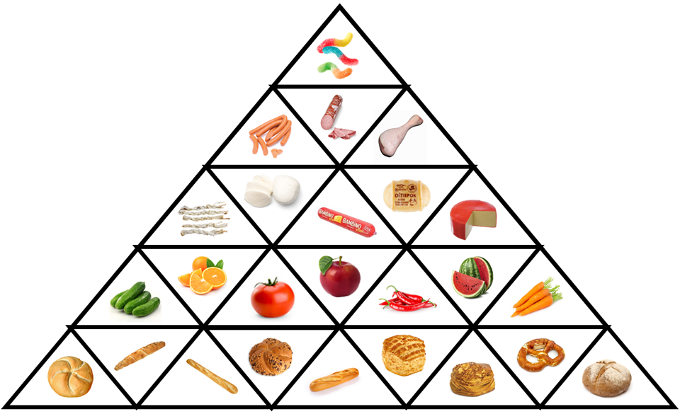
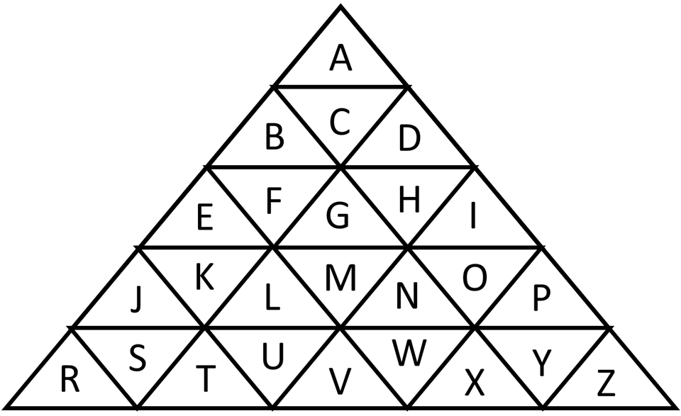

Autori: Janči, Viktor

Šifra sa tvári ako bludisko, tak si ho skúsme ako prvé vyriešiť.
Dostaneme jednu správnu cestu a šesť nerozvetvených slepých uličiek.
Keď sa na ne pozrieme, môžeme si všimnúť, že slepé uličky sú takmer bez medzier,
zatiaľ čo na správnej ceste je ich plno.
Cesta je zároveň delená na postupnosti potravín dlhé jeden až štyri kusy.

Keď sa zameriame na jednotlivé obrázky, môže nás upútať
napríklad pečivo - v bludisku sa nachádzajú dlhé bagety a rožky, a tiež okrúhle žemle a pagáče.
Vlastne všetky potraviny majú jeden z dvoch tvarov - buď sú dlhé, alebo okrúhle.
To nám spolu s dĺžkami úsekov prezradí, že ide o morzeovku.
Prečítame ju teda zo správnej cesty a dostaneme medzitajničku PYRAMIDA BEZ Q.

Čo by to tak mohlo znamenať? Pyramída v šifre plnej potravín môže byť potravinová pyramída.
Q je písmeno abecedy, ktoré zjavne v pyramíde nemá byť, takže v nej asi budú ostatné písmená.
To sa nám potvrdí, ak si zrátame, koľko je v šifre rozdielnych potravín - 25.

Ako postaviť takú pyramídu? Mala by mať 25 políčok.
Na vrchu bude určite jedno a v každom ďalšom poschodí o niečo viac.
Keby to bolo o jedno viac, boli by počty po poschodiach 1, 2, 3, 4, 5, 6, 7,
čo nám ale dáva dokopy 28, nie 25.
Keby to bolo o 2 viac na každom poschodí, dostaneme počty 1, 3, 5, 7, 9, ktoré majú súčet 25.

Samotnú pyramídu musíme nejako naplniť potravinami a písmenami. Keďže má ísť o potravinovú pyramídu,
nebude problém si všimnúť, že pre jednotlivé kategórie potravín sú ich počty rovné šírkam poschodí:

- sladkosti - 1
- mäsové výrobky - 3
- mliečne výrobky - 5
- ovocie a zelenina - 7
- pečivo - 9

Abecedu by bolo najlogickejšie zapisovať do pyramídy smerom od hora dole.
Keď sa zároveň pozrieme do prvého riadku, kde sa veľakrát opakujú kyslé hadíky,
táto úvaha sa nám potvrdí, pretože je veľká šanca, že budú reprezentovať písmeno A.

Ako ale v pyramíde zoradiť písmená a potraviny v jednotlivých riadkoch? Musíme sa trochu poobzerať
po šifre - kde máme nejaké jednoznačné zoradenie potravín?
Prekvapivo ho nájdeme úplne na začiatku - na ceste cez bludisko sa potraviny začnú opakovať až potom,
čo sa tam každá vyskytne práve raz. Prvej potravine v riadku teda priradíme prvé písmeno riadku,
a tak ďalej. Vznikne pyramída ako na obrázku:

{style="width:70mm}
{style="width:70mm}

Keď máme každej potravine priradené písmeno, môžeme pomocou nich prečítať slepé uličky, ktoré sme
doteraz nepoužili. Dostaneme postupne (v poradí, ako sa odpájajú od cesty) slová
OSTIEPOK, PARADAJKA, HADIKY, KURACIE MASO, MELON, ROZOK PIVEC.
Všetky tieto potraviny sú v pyramíde a majú svoje písmená, takže stačí zopakovať predošlý krok
a dostaneme heslo **HLADOS** (hladoš).
