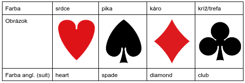
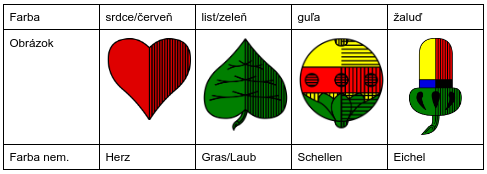
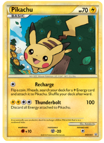
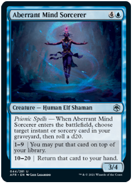
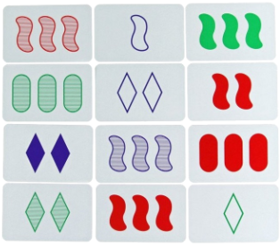
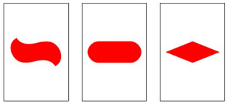

\tableofcontents

\newpage

# Tradičné balíčky kariet

Mnohé kartové hry nevyžadujú žiadne špeciálne karty,
vystačia si so sadami, ktoré sú v súčastnosti najrozšírenejšie.
Medzi najpoužívanejšie balíčky u nás patria francúzske a nemecké karty.
Svoje verzie však má napríklad i južná Európa.

### Francúzske karty

Nazývané tiež žolíkové karty. Základný balíček obsahuje $52$ kariet.
Každá zo štyroch farieb obsahuje trinásť kariet
s hodnotami $A$ (eso), $2$, $3$, $4$, $5$, $6$, $7$, $8$, $9$, $10$, $J$ (dolník/chlapec),
$Q$ (kráľovná/dáma), $K$ (kráľ). Niekedy sa používajú s dvoma čiernymi a dvoma červenými žolíkmi.

{style="width:50mm}

### Nemecké karty

Nazývané tiež sedmové karty. Základný balíček obsahuje $32$ kariet.
Každá zo štyroch farieb obsahuje $8$ kariet s hodnotami $VII$, $VIII$, $IX$, $X$, dolník, horník, kráľ, eso.

{style="width:50mm}

### Tarotové karty

Aj keď sú známe skôr v súvislosti s veštením, použiť sa dajú aj na hranie hier.
Rozdelené sú na malú a veľkú arkánu. Malá arkána obsahuje $56$ kariet rozdelených na $4$ farby,
používané tiež v latinských kartách. Každej farbe tiež prislúcha jeden živel: palice -- oheň,
poháre -- voda, meče -- vzduch, mince -- zem. Veľká arkána obsahuje $22$ kariet
označených rímskymi číslami $I$ -- $XXI$  a jednu kartu bez čísla, niekedy tiež označovanú $0$.
Ich označenia majú pôvod v stredovekej a renesančnej symbolike.

|  číslo  |         názov        |  číslo  |      názov      |
|:-------:|:--------------------:|:-------:|:---------------:|
|   $0$   |     Blázon (Šašo)    |   $XI$  |       Sila      |
|   $I$   |    Mág (Kaukliar)    |  $XII$  |     Obesenec    |
|   $II$  |  Veľkňažka (Pápežka) |  $XIII$ |       Smrť      |
|  $III$  | Kráľovná (Cisárovná) |  $XIV$  |   Umiernenosť   |
|   $IV$  |     Kráľ (Cisár)     |   $XV$  |      Diabol     |
|   $V$   |    Veľkňaz (Pápež)   |  $XVI$  | Veža (Dom Boží) |
|   $VI$  |    Láska (Milenci)   |  $XVII$ |     Hviezda     |
|  $VII$  |     Voz (Vozataj)    | $XVIII$ |      Mesiac     |
|  $VIII$ |     Spravodlivosť    |  $XIX$  |      Slnko      |
|   $IX$  |       Pustovník      |   $XX$  |       Súd       |
|   $X$   |    Koleso šťastia    |  $XXI$  |       Svet      |

## História

### Prvopočiatky

História kariet sa začína v Číne v deviatom storočí,
kedy doboví autori spomínajú istú hru hranú s "listami".
História však zaznamenáva prvú "kartovú" hru až v roku $1294$,
aj keď karty v nejakej podobe existovali isto už skôr.
Najstaršou hrou, ktorej pravidlá poznáme je _madiao_,
o ktorej sa dochovali zmienky z 15. storočia.

Hra sa hrala s balíčkom $38$ kariet zobrazujúcich peniaze.
Už tu sa objavuje rozdelenie na $4$ farby: $9$ kariet mincí,
$9$ kariet šnúr mincí, $9$ kariet myriád (znamená $10\,000$),
a $11$ kariet desiatok myriád. Karty posledných dvoch farieb
mali na sebe vyobrazené postavy z čínskeho románu _Príbeh jazerného mesta_,
namiesto svojich farieb. Zaujímavosťou je,
že farba mincí mala prehodené poradie -- $9$ mincí malo najnižšiu hodnotu, $1$ minca najvyššiu.

### Rozšírenie do sveta

Z Číny sa hracie karty rozšírili už okolo $11$. storočia najprv do Perzie a arabského sveta.
Balíčky z tohoto obdobia a územia ukazujú rôznorodé vzory,
no pomerne jednotnú štruktúru. Každá farba obsahuje $12$ kariet -- $10$ číslovaných,
udávajúcich počty obrázkov, spolu s kartou kráľa a kartou vezíra.

Najstaršie karty, ktoré sa zachovali do súčasnosti pochádzajú z $12$. a $13$. storočia a sú pôvodom z Egypta.
V roku $1939$ bol nájdený takmer úplný balíček tzv. _Mameluckých_ kariet.
Ten pôvodne pozostával z $52$ kariet. Farbami boli pólové palice, mince,
meče a poháre. Tie sa budú vyskytovať aj v neskorších obdobiach.
Popri $10$ číslovaných kartách, obsahovala každá farba ešte kráľa,
delegovaného kráľa a "poddelegáta".

### V Európe až po súčasnosť

Hracie karty sa dostali do Európy prostredníctvom Arabov v Španielsku,
alebo vracajúcich sa križiakov. Najstarší vzor kariet v Európe sú tzv.
Španielske karty. Tie sa delili, podobne ako Mamelucké karty,
na palice (občas kyje), mince, meče a poháre.
Len s grafickými zmenami sa tieto farby uchytili aj v okolitých krajinách ako Taliansko,
Portugalsko, či Francúzsko. V niektorých krajinách stále môžeme nájsť aj toto rozdelenie farieb.
Podľa regiónu hovoríme o balíčku _latinských kariet_.

S rozšírením kariet do nemecky hovoriacich kariet prišlo aj k zmenám vo farbách.
Palice boli nahradené žaluďmi, mince guľami, meče listami a poháre srdcami.
_Nemecké karty_, tiež nazývané sedmové, prežili až do súčasnosti,
keď listy poznáme ako zelene a srdcia ako červene.
Ani v nemecky hovoriacich krajinách však nemožno hovoriť o jednotnosti,
nakoľko _švajčiarske karty_ používali miesto listov štíty a miesto srdcí ruže.

Kombináciou latinského a nemeckého balíčka vznikli _francúzske karty_.
Trefy boli odvodené zo žaluďov, srdcia prešli bez zmeny,
kým piky pochádzajú pravdepodobne z listov. Treba však podotkúť,
že anglický názov pre piky (spades) a trefy (clubs) pochádza
pravdepodobne z označení latinských kariet (tal. spade znamená meče, angl. club znamená kyj).

## Pravidlá hier

### Big two

#### Hodnoty a kombinácie kariet

Karty sa hrajú samostatne alebo v skupinách po $2$, $3$, alebo $5$ kariet,
ktoré tvoria kombinácie podobné ako v pokri. Karty,
ktoré boli vyložené ako prvé, udávajú počet kariet,
ktorý sa bude hrať vrámci daného _triku_ (kola) -- všetky
nasledujúce vyloženia musia obsahovať rovnaký počet kariet.

Najvyššia hodnota jednej karty je $2$, potom nasledujú esá, $K$, $Q$, $J$, a tak ďalej,
až po najnižšiu hodnotu, ktorou je $3$. V prípade rovnosti rozhoduje farba karty.
Tu platí $\spadesuit > \heartsuit > \clubsuit > \diamondsuit$. Kombinácie viacerých kariet sú nasledujúce:

* $2$ karty: pár rovnakej hodnoty (napr. $7\clubsuit$ a $7\heartsuit$).
Páry sú zoradené podľa tejto hodnoty, v prípade rovnosti rozhoduje najvyššia farba.
* $3$ karty: trojica rovnakej hodnoty (napr. $K\diamondsuit$, $K\clubsuit$, $K\spadesuit$).
Trojice sú zoradené podľa tejto hodnoty.
* $5$ kariet (zoradené od najnižšej po najvyššiu):
1. _postupka_: ľubovoľných $5$ kariet po sebe idúcich hodnôt (nie v jednej farbe), poradie je určené najvyššou rôznou hodnotou karty, farby sa použijú len v prípade rovnosti,
2. _flush_: ľubovoľných $5$ kariet rovnakej farby (nie v postupke), poradie je určené  najvyššou rôznou hodnotou karty, farby sa použijú len v prípade rovnosti,
3. _full house_ (v Číne tiež _tekvica_): kombinácia trojice a dvojice, poradie je určené hodnotou trojice,
4. _štvorica + iná karta_ (prezývané _King-kong_, _tiki_, alebo _bomba_): štvorica s ľubovoľnou inou kartou (samotná štvorica sa nedá vyložiť), poradie určuje hodnota štvorice,
5. _postupka vo farbe_: kombinácia postupky a flush, poradie je určené rovnako ako pri postupke (t. j.  najvyššia rôzna hodnota karty), farba sa použije len v prípade rovnosti.

#### Priebeh hry

Díler (ktorý môže byť vylosovaný) zamieša balíček a začne rozdávať hráčom karty po jednej.
Začne od hráča po svojej pravici a pokračuje proti smeru hodinových ručičiek tak,
aby každý hráč dostal rovnaký počet kariet. Ak zvýšia karty, dajú sa hráčovi,
ktorý dostal $\diamondsuit 3$. Ak žiaden z hráčov túto kartu nemá,
dostane karty hráč s najnižšou zatiaľ rozdanou kartou.

Na začiatku hry hráč s $3\diamondsuit$ zahrá túto kartu buď samostatne
alebo ako súčasť niektorej kombinácie, čím započne prvý trik.
Hra pokračuje proti smeru hodinových ručičiek.
Každý hráč musí zahrať vyššiu kombináciu, než bola zahraná naposledy,
s rovnakým počtom kariet. Hráči tiež môžu svoj ťah preskočiť,
v prípade, že hrať nechcú, alebo im to ich karty neumožňujú.
Preskočenie ťahu nijak neovplyvňuje schopnosť hráča hrať neskôr v hre.

Ak všetci hráči okrem jedného v rade svoj ťah preskočili, trik sa končí a zahrané karty sa zozbierajú. Nový trik započne hráč, ktorý ťahal naposledy.

Považuje sa za zdvorilé, aby hráč upozornil, že je len jednu kombináciu od výhry. Cieľom ostatných je, aby sa zbavili čo najväčšieho počtu kariet bez toho, aby dotyčný vyhral. Napríklad, ak hráčovi zostala posledná karta, ostatní sa snažia hrať dvojice, trojice, či pätice, aby dotyčný hru neukončil.

Hra končí, keď sa niektorému hráčovi minú karty.

#### Bodovanie

Bodovanie sa v rôznych verziách líši. Najčastejšie si hráči spočítajú koľko kariet im zostalo na konci na ruke. Ak im na ruke zostali všetky karty, ráta sa každá za $3$ body, ak im zostalo $10$ a viac kariet, každá je za $2$ body, inak je každá karta za $1$ bod. Všetky body sa následne vyplatia hráčovi, ktorý vyhral.

Príklad: Hráč A vyhral, hráčom B, C, D ostalo postupne $3$, $11$, $8$ kariet. Hráč B má $-3$ body, hráč C $-22$ bodov, hráč D $-8$ bodov, hráč A získal $+33$ bodov.

Body sa tiež zdvojnásobujú v prípade, že hráčovi zostala na ruke dvojka, štvorica, alebo postupka vo farbe.

### Blackjack

#### Priebeh hry

Hráč hrá proti krupiérovi a snaží sa dosiahnuť väčší súčet bodov, ako krupiér, nesmie však prekročiť $21$. Každá karta má priradenú hodnotu. Hodnota figúr sa rovná $10$, hodnota kariet s číslami sa rovná číslu na karte, eso sa môže rátať ako $1$ alebo $11$.

Hra začína rozdaním kariet zľava doprava jednotlivým hráčom a krupiérovi lícom nahor. Potom dostane každý hráč ďalšiu kartu. Hráč sa po obdržaní druhej karty môže rozhodnúť, či berie ďalšiu a ďalšiu kartu, alebo si už ďalšiu kartu nepraje. Ak prekročí $21$, jeho vklad prepadá krupiérovi. Najvyššia možná kombinácia je _Blackjack_ tvorená Esom a ľubovoľnou kartou s hodnotou desať. Vtedy sa vypláca $1$,$5$-násobok výhry, ale iba v prípade, že Blackjack nemá aj krupiér.

Keď už hráči majú všetky svoje karty, ťahá svoje karty krupiér, musí ťahať kým nemá súčet aspoň $16$, keď má súčet $17$ nesmie už ťahať. Kto má viac ako krupiér vyhráva toľko koľko vsadil. Ak krupiér prekročí $21$, vyhrávajú všetci hráči, ktorí zostali v hre. Ak má hráč rovnakú hodnotu, ako krupiér, jeho vklad zostáva do ďalšej hry.

### Bridž

Bridž je hra pre štyroch hráčov, ktorí hrajú v dvoch tímoch tak, že spoluhráči sedia oproti sebe. Pozostáva z kôl, v ktorých sa najprv licituje cieľ a potom sa snaží jeden tím svoj vylicitovaný cieľ naplniť počas trinástich zdvihov.

V hre Bridžu je najvyššou kartou eso, ostatné sú zoradené klasicky od $2$ po kráľa. Počas licitácie sú farby zoradené od najnižšej po najvyššiu takto: trefy $\clubsuit$ &lt; kára $\diamondsuit$ &lt; srdcia $\heartsuit$ &lt; piky $\spadesuit$ &lt; (bez tromfu)

#### Licitácia (dražba)

Počas licitácie sa jednotlivé tímy zaväzujú získať príslušný počet zdvihov, ak tromfovou farbou bude ponúknutá farba. Licitáciu otvára rozdávajúci hráč (dealer) ľubovoľným záväzkom - kombináciou čísla a farby. Tým sa zaväzuje získať $7$ plus povedané číslo zdvihov v hre, kde najsilnejšou (tromfovou) farbou je povedaná farba. Najvyššou "farbou" je farba "bez tromfu", kedy sa hrá tak, že žiadna farba neprebíja inú farby rovnakej hodnoty.

Ďalší hráči v poradí nasledujú, a môžu sa rozhodnúť buď zvýšiť záväzok, kontrovať resp. rekontrovať alebo sa zdržať ďalšej ponuky.

* Pre zvýšenie ponuky musí hráč buď zvýšiť číslo alebo farbu záväzku.
* Ak sa hráč rozhodne kontrovať alebo rekontrovať, rozhodne sa zdvojnásobiť alebo zoštvornásobiť odmenu ale aj penalizáciu za predošlý záväzok. Pokiaľ sa už žiaden hráč nerozhodne zvýšiť stávku, hrať sa bude podľa poslednej s násobnými bodmi. V opačnom prípade sa kontrovanie ignoruje a pokračuje sa v licitovaní.
* Ak sa hráč rozhodne nelicitovať, zdrží sa ďalšej ponuky. Ak sa toto stane trikrát za sebou, teda všetci hráči okrem jedného sa rozhodli nelicitovať, licitácia sa končí.

#### Zohrávka

Po ukončení licitácie sa vydražiteľ stáva hlavným hráčom. Vydražiteľom je ten hráč tímu, ktorý ponúkol konečný záväzok, ktorý vylicitovanú farbu ponúkol ako prvý. Jeho tím má za úlohu splniť cieľ, ku ktorému sa zaviazal, a získať čo najviac zdvihov navyše.

Hráči si najprv rozdelia karty rovnomerne tak, aby mal každý $13$ náhodných kariet. Do prvého zdvihu vynáša hráč po ľavici hlavného hráča a partner hlavného hráča vyloží svoje karty na stôl (všetci vidia aké karty má) a stáva sa tichým hráčom alebo tiež "stolíkom". Počas zohrávky počúva pokyny hlavného hráča a do jednotlivých zdvihov prikladá karty, ako si hlavný hráč želá. Tichý hráč je preto tichým hráčom, že počas celej zohrávky musí byť ticho, s výnimkou prípadov, ak ide o upozornenie hlavného hráča na porušenie pravidiel.

#### Zdvih

Vynášajúci hráč môže zo svojej ruky vyniesť ľubovoľnú kartu. Ostatní hráči, postupne v smere hodinových ručičiek od vynášajúceho hráča, musia zahrať kartu vo vynesenej farbe, ak takú majú. Ak nemajú, môžu zahrať kartu ľubovoľnej farby. Keď každý hráč zahrá jednu kartu, túto štvoricu kariet získa ten z nich, ktorý vyložil najvyššiu kartu vo vynesenej farbe alebo, ak niektorý z hráčov prebil tromfom, získa ju hráč, ktorý priložil najvyšší tromf. Takáto štvorica kariet je jedným zdvihom. Do ďalšieho zdvihu vynáša hráč, ktorý získal posledný zdvih. Keďže každý z hráčov má $13$ kariet, celkový počet zdvihov je $13$.

#### Bodovanie

Po odohraní $13$ zdvihov sa hra vyhodnotí podľa počtu získaných zdvihov a následne sa vynásobí podľa toho, či bol záväzok kontrovaný alebo rekontrovaný.

V prípade že sa tímu podarí splniť záväzok získaním dostatočného počtu zdvihov, získajú body podľa vylicitovanej tromfovej farby:

* Trefy a kára sa nazývajú lacné farby (minor suits) – každý zdvih v hre s týmito tromfovými farbami okrem prvých šiestich má hodnotu $20$ bodov.
* Srdcia a piky sa nazývajú drahé farby (major suits) – každý zdvih v hre s týmito tromfovými farbami okrem prvých šiestich má hodnotu $30$ bodov.
* V hre bez tromfa má siedmy zdvih hodnotu $40$ bodov a každý ďalší $30$ bodov.

Pokiaľ sa tímu nepodarí splniť záväzok, získajú -$50$ bodov za každý zdvih, ktorý im k splneniu cieľa chýbal. V prípade, že tento tím v predošlej hre splnil záväzok vyžadujúci získanie aspoň $100$ bodov, základná penalizácia sa zdvojnásobuje na -$100$ bodov.

V prípade že tím dosiahne "Malý slem" alebo "Veľký slem", teda získa $12$ alebo $13$ zdvihov, získajú bonusových $500$, alebo $1000$ bodov.

#### Koniec hry

Pokiaľ jeden tím vyhrá dve kolá po sebe bez toho, aby medzi tým ktorýkoľvek tím splnil záväzok za aspoň $100$ bodov, získavajú $500$ bonusových bodov a hra sa končí. Vyhráva tím s vyšším počtom bodov.

### Five hundred ($500$)

#### Príprava hry

Štandardne sa hra hrá len s $43$ kartami.
Do balíčka sa pridáva žolík a odoberú sa $2$-ky,
$3$-ky, a dve $4$-ky. $4$-ky sa odoberú buď obe čierne,
alebo piková s károvou. V druhom prípade sa srdcová $4$ka ráta ako tromf pre obe červené farby,
podobne sa trefová $4$-ka ráta ako tromf pre obe čierne farby.

Každému zo štyroch hráčov sa rozdá $10$ kariet a zvyšné $3$ sa položia na stôl rubom nahor.
Hráči hrajú v dvojiciach, zvyčajné usadení oproti sebe.

V netromfových farbách sú karty zoradené v poradí od najvyššej po najnižšiu:
$A$, $K$, $Q$, $J$, $10$, $9$, $8$, $7$, $6$, $5$, ($4$).
V tromfovej farbe je najvyššia karta žolík, nasleduje dolník tromfovej farby,
potom druhý dolník, ktorý je rovnako čierny/červený ako tromfová farba.
Až po ňom nasledujú ostatné karty tromfovej farby, t. j. $A$, $K$, $Q$, $10$, $9$, $8$, $7$, $6$, $5$, ($4$).

#### Licitovanie

Po rozdaní kariet hráči zaradom licitujú (stávkujú) alebo pass-ujú -- zdržia sa. Stávka vždy označuje koľko trikov licitujúci verí, že on a jeho spoluhráč získajú, a zároveň ktorá farba bude tromfová. Napríklad stávka "$7$ pík" ($7\spadesuit$) označuje, že hráč so svojim spoluhráčom získajú $7$ trikov, pričom tromfom bude pika. Stávka "$7$ bez tromfov" ($7BT$) označuje, že získajú $7$ trikov, pričom žiadna farba nie je tromfová. V takom prípade je jedinou tromfovou kartou žolík.

Licitácia prebieha v smere hodinových ručičiek, pričom každý hráč buď staví, alebo pass-uje. Ak niektorý hráč pass-uje, už nemôže v danom kole staviť. Hráč, ktorý stavil, môže staviť opäť, v prípade, že od jeho poslednej stávky stavil ešte niekto iný. Nová stávka musí vždy prebiť aktuálnu stávku. Musí zvýšiť počet získaných trikov alebo tromfovú farbu.

Poradie farieb od najvyššej po najnižšiu je srdce, káro, trefa, pika. Hráč, ktorý stavil napríklad $7\clubsuit$ môže byť prebitý len stávkami $7\diamondsuit$, $7\heartsuit$, nie však $7\spadesuit$. Stávky bez tromfu prebíjajú všetky stávky s farbou, ktoré majú rovnaké číslo. Licitácia končí, keď pass-nú všetci hráči okrem jedného.

#### Priebeh hry

Prvý trik začína hráč, ktorý vyhral licitáciu. Ostatní hráči musia vyložiť kartu rovnakej farby, ak takú majú. V prípade, že sa jedná o tromfovú farbu, rátajú sa sem aj žolík a druhý dolník. Ak hráč kartu danej farby nemá, vyloží ľubovoľnú kartu.

Najvyššia vyložená karta tromfovej farby vyhráva trik. Ak nebola zahraná žiadna tromfová karta, vyhráva najvyššia zahraná karta farby, ktorú zahral začínajúci hráč. Hráč, ktorý vyhral daný trik začína ďalší.

Akonáhle sa odohrali všetky triky, kolo sa vyhodnotí a oboduje. Karty sa zamiešajú a pokračuje sa novým kolom.

#### Bodovanie

Po skončení kola sa spočíta koľko trikov získala dvojica, ktorá vyhrala licitáciu. Ak splnili svoju stávku získajú body podľa tabuľky nižšie. Ak sa im to nepodarilo, naopak stratia rovnaký počet bodov. Na vyhodnotenie sa používa hodnota vyhratej stávky, nie počet získaných trikov.

|  počet trikov  |  pika  |  trefa  |  káro  |  srdce  |  bez tromfu  |
|:--------------:|:------:|:-------:|:------:|:-------:|:------------:|
|       $6$      |  $40$  |   $60$  |  $80$  |  $100$  |     $120$    |
|       $7$      |  $140$ |  $160$  |  $180$ |  $200$  |     $220$    |
|       $8$      |  $240$ |  $260$  |  $280$ |  $300$  |     $320$    |
|       $9$      |  $340$ |  $360$  |  $380$ |  $400$  |     $420$    |
|      $10$      |  $440$ |  $460$  |  $480$ |  $500$  |     $520$    |

### Kent

#### Priebeh hry

Pred hrou si každá dvojica dohodne nejaké tajné znamenia. Tie môžu byť ľubovoľného typu, či už slová, iné zvuky, nejaký pohyb, alebo čokoľvek iné, čo dokáže zbadať váš spoluhráč, ale nie váš súper.

Každý hráč má v ruke $4$ karty, ktoré vidí len on. Na začiatku kola sa na stôl vyložia lícom nahor štyri karty, ktoré hráči môžu ľubovoľne vymieňať za karty, ktoré majú v ruke. V prípade, že hráči počas hry nejavia záujem o vyložené karty, sú tieto karty nahradené novou štvoricou z balíčka. Pôvodné karty sa do hry už nevracajú.

Cieľom mať v ruke štyri karty rovnakej hodnoty (napr. $4$ sedmičky), ktorej sa tiež hovorí _kent_. Kolo končí, keď niektorý z hráčov povie jedno z hesiel:

* "Kent": Jeho spoluhráč odhalí karty. Ak má na ruke kent, získava dvojica bod. Ak nemá, dvojica bod stráca.
* "Doublekent": Hráč aj jeho spoluhráč odhalia karty. Ak majú obaja kent, získava dvojica dva body. Ak aspoň jeden z nich kent nemá, strácajú dva body.
* "Stopkent": Hráč pri tom určí aj hráča z inej dvojice, ktorý podľa neho kent má. Ten odhalí svoje karty a ak mal kent, bod získa dvojica, ktorej hráč povedal "stopkent". Ak kent daný hráč nemá, dvojica hovoriaceho hráča bod stráca.

Hra skončí po niekoľkých kolách. Víťazom sa stáva dvojica s najvyšším počtom bodov.

### Mao

Mao sa hrá ako prší, a o pravidlách hry Mao sa nerozpráva.

### Pasians (Klondike)

#### Pred hrou

Pasians hrá jeden hráč s balíčkom francúzskych kariet bez žolíkov.

Po zamiešaní sa karty rozdajú do $7$ roztiahnutých kôpok obsahujúcich postupne $1$ až $7$ kariet. Karta na vrchu každej kôpky je otočená lícom nahor. V niektorých variantoch sú takto otočené všetky karty, hráč tak vie, kde sa ktorá karta nachádza. Zostávajúce karty vytvoria doberací balíček, otočený rubom navrch, ktorý sa typicky nachádza v ľavom hornom rohu hracej plochy.

#### Priebeh hry

Cieľom hry je vytvoriť postupky od esa po kráľa v každej farbe. Na tie je vyhradené miesto typicky v pravom hornom rohu.

Na kôpkach v spodnej časti hracej plochy môžeme presúvať karty podľa nasledujúcich pravidiel:

* Kartu môžeme položiť len na kartu opačnej farby (čiernej/červenej), ktorá má hodnotu o $1$ vyššiu ako ukladaná karta. (Hodnoty sú postupne A, $2$, $3$, až po kráľa.)
* V prípade, že presunieme všetky karty z kôpky, môžeme na prázdne miesto uložiť ľubovoľného kráľa.
* Ak máme vytvorenú postupku striedajúcich sa farieb (čierna/červená), môžeme ju presunúť ako celok. Vhodné miesto určíme podľa karty naspodku.
* Kartu môžeme presunúť na miesto pre finálne postupky. V takom prípade kartu môžeme položiť len na kartu rovnakej farby s hodnotou o $1$ nižšou.

Okrem toho môžeme otočiť kartu z balíčka na "odhadzovaciu" kôpku. Na tejto kôpke máme vždy k dispozícii kartu na jej vrchu, ktorú môžeme presunúť podľa pravidiel vyššie. Do odhadzovacej kôpky karty nepresúvame.

Hráč hru vyhrá, ak zostaví všetky $4$ finálne postupky. Ak hráč nemá žiaden možný ťah, ktorý by viedol k tomuto cieľu, prehráva.

### Poker (Texas Hold ‘em)

#### Pozície

* _Díler_: Jeden z hráčov vystupuje v pozícií dílera (aj keď reálne karty môže rozdávať napr. pracovník kasína). Táto pozícia sa nazýva aj button a počas hry rotuje v smere hodinových ručičiek.
* _Small blind_ (SB) – _Malý blind_: Nazýva sa podľa povinnej stávky, ktorú musí do hry vložiť hráč, ktorý sedí naľavo od dílera. Výška povinnej stávky závisí od výšky limitu, aký hráči hrajú a je polovicou z povinnej stávky na veľkom blinde.
* _Big blind_ (BB) – _Veľký blind_: Nazýva sa podľa povinnej stávky, ktorú musí do hry vložiť hráč sediaci naľavo od malého blindu. Výška povinnej stávky závisí od výšky limitu, aký hráči hrajú.
* _Under the gun_ (UTG): Je prvou pozíciou v hre pred vyložením kariet.
* _Middle position_ (MP) – _Stredná pozícia_.
* _Cut-off_ (CO): Pozícia napravo od dílera.

#### Rozdanie

Každý hráč dostane dve karty, ktoré vidí iba on. Cieľom hry je skombinovať tieto karty s ďalšími piatimi postupne vykladanými kartami, ktoré sú spoločné pre všetkých hráčov pri stole. Hráč s najlepšou kombináciou kariet vyhráva bank.

#### Prvé kolo stávok

Prebieha ihneď po rozdaní. Malý a veľký blind sú povinné stávky, po nich nasledujú dobrovoľné stávky ostatných hráčov. Začína ten, kto sedí ako prvý za veľkým blindom na pozícii UTG. Má na výber $3$ možnosti:

1. _Dorovnať_ (call) – dorovná veľký blind.
2. _Zvýšiť_ (raise) – zvýši pôvodnú stávku (veľký blind).
3. _Zložiť_ (fold) – zahodí svoje karty a ďalej v hre už vystupovať nebude.

Ďalší hráč má rovnaké možnosti, ako predchádzajúci. V prípade, že hráč zvýšil, má tento možnosť znovu zvýšiť (re-raise). Takto to pokračuje až dovtedy, kým nie sú všetky stávky od hráčov v hre dorovnané.

#### Druhé kolo stávok

Po prvom stávkovom kole sa na stôl vyložia tri karty, ktoré sú pre všetkých hráčov v hre spoločné a nazývajú sa _flop_. Stávkové kolo začína prvým hráčom naľavo od dílera, čiže hráčom na pozícii malý blind (ak nezložil karty ešte v prvom stávkovom kole – ak zložil, pokračuje najbližší hráč naľavo od neho). Tento má nasledujúce možnosti: _staviť _(bet) alebo _zdržať sa akcie_ (check) a teda nestaviť, ale ani nezložiť karty. Ďalší hráči môžu taktiež staviť a zdržať sa akcie. Ak niektorý z hráčov stavil, ďalší hráči môžu dorovnať, zvýšiť jeho stavenie alebo svoje karty zložiť. Takto sa pokračuje až dovtedy, kým nie sú všetky stávky od hráčov v hre dorovnané.

#### Tretie kolo stávok

Po ukončení druhého kola stávok sa na stôl vyloží štvrtá karta nazývaná _turn_. Tretie kolo stávok sa uskutočňuje v takom istom poradí rovnakým spôsobom, ako kolo predchádzajúce.

#### Štvrté kolo stávok

Po ukončení tretieho kola stávok sa na stôl vyloží piata karta nazývaná _river_. Štvrté kolo stávok prebieha rovnako ako tie predchádzajúce. Po uskutočnení akcií hráči postupne ukazujú svoje karty. Ten s najlepšou kombináciou vyhráva celkový bank (pot). Ak majú viacerí hráči rovnakú kombináciu, bank je im rovnomerne rozdelený.

Hra sa nemusí vždy dohrať až do štvrtého kola stávok. Ak sa v predchádzajúcich kolách nenájdu hráči, ktorí by dorovnali najvyššiu stávku, hra sa končí a bank získava hráč, ktorý stavil najviac. Karty sa v tomto prípade nemusia ukázať.

#### Popis skupín kariet

1. _Royal Flush_ - A K Q J $10$ vo farbe.
2. _Jednofarebná postupka_ – všetkých päť kariet tej istej farby v rade za sebou podľa veľkosti. Pokiaľ má postupku viacero hráčov, vyhráva hráč s vyššou postupkou: $10$ $9$ $8$ $7$ $6$ je vyššia ako $9$ $8$ $7$ $6$ $5$. Najnižšia postupka je $5$ $4$ $3$ $2$ A.
3. _Štvorica_, či _Poker_ – štyri karty rovnakej veľkosti. Pokiaľ má štvoricu viac hráčov, vyhráva ten, ktorý má vyššie karty.
4. _Full House_ – trojica a dvojica (napr.: $3$ dámy a $2$ trojky). Pokiaľ má Full House viac hráčov, rozhoduje vyššia trojica. Ak sa trojice rovnajú rozhoduje vyššia dvojica.
5. _Jedna farba_ – všetkých $5$ kariet má rovnakú farbu. Ak má jednu farbu viac hráčov, rozhoduje pravidlo o najvyššej karte.
6. _Postupka_ – $5$ kariet v rade podľa veľkosti pričom aspoň jedna má inú farbu, ako ostatné. Ak má postupku viac hráčov, vyhráva vyššia postupka.
7. _Trojica_ – tri karty rovnakej veľkosti a dve karty, ktoré netvoria dvojicu.
8. _Dve dvojice_ – dve dvojice kariet rovnakej veľkosti (napr.: J, J, $7$, $7$ a akákoľvek piata karta). Pokiaľ má dve dvojice viac hráčov, vyhráva vyššia dvojica. Pokiaľ sú vyššie dvojice rovnaké, rozhoduje nižšia dvojica. Pokiaľ sú i tieto rovnaké, rozhoduje vyššia piata karta (_kicker_). Ak by aj táto bola rovnaká, buď sa bank delí, alebo ťahajú kartu, kým sa nerozhodne.
9. _Dvojica_ – dve karty rovnakej veľkosti.
10. _Najvyššia karta_ – akákoľvek skupina, ktorá nepatrí do niektorej z hore uvedených. Pokiaľ nemá nikto dvojicu alebo väčšiu, vyhráva najvyššia karta. Ak táto nerozhodne, vyhráva druhá najvyššia karta, atď.

### Sedma

#### Priebeh hry

Každý hráč dostane $4$ karty. Ostatné karty sa položia do stredu rubom nahor. Hráči tvoria dvojice. Tí, ktorí sedia oproti sebe, hrajú spolu (s výnimkou hry dvoch alebo troch hráčov, kde hrá každý samostatne). Nemôžu si však radiť, ani nič naznačovať.

Prvý hráč vyloží kartu ľubovoľnej hodnoty, a nasledujú ostatní hráči v poradí vyložením jednej karty. Úlohou súperov je získať zdvih tak, že vyložia kartu rovnakej hodnoty, akú má prvá karta v danom kole. Počas hry môžu nastať tieto situácie:

1. Nikto nemá na ruke kartu rovnakej hodnoty a zdvih vyhráva prvý hráč.
2. Protihráč vyloží na stôl kartu s takou istou hodnotou a tým prebije prvú kartu. Kto ako posledný vyloží kartu rovnakej hodnoty získava zdvih.
3. Protihráč vyloží na stôl sedmu, ktorá prebije ostatné karty. Berie na seba hodnotu akejkoľvek vyloženej karty. Opäť vyhráva ten, ktorý ako posledný v kole vyloží kartu rovnakej hodnoty (alebo sedmu).
4. Prvý hráč môže v situáciách $2$ a $3$ reagovať. Pokiaľ má na ruke kartu rovnakej hodnoty ako prvá karta zdvihu (alebo sedmu), môže otočiť kolo. Pokiaľ ju vyloží, získava zdvih a opäť každý z hráčov v poradí vyloží jednu kartu.
5. Spálená hra – ak hráč dostane na ruku $4$ karty rovnakej hodnoty, alebo položí počas zdvihu štvrtú kartu rovnakej hodnoty na seba, okamžite vyhráva.

Po každom kole si hráči doplnia karty z balíčka tak, aby mali na ruke vždy $4$ karty. Pokiaľ už toľko kariet nemajú k dispozícií, musia mať rovnaký počet kariet.

#### Koniec hry

Hráči si po každom zdvihu pripíšu body, ktoré budú na konci hry premenené na výherné body. Vyhráva hráč s najvyšším počtom výherných bodov.

Body:

* Ak hráč vyhrá zdvih a získa desiatku alebo eso – $10$ bodov.
* Ak hráč vyhrá posledný zdvih – $10$ bodov.

Výherné body

* Najvyšší počet bodov – pripíšete si $1$ výherný bod.
* Ak súperi nemajú žiadne body – víťaz si pripíše $2$ výherné body.
* Ak súperi nevyhrali žiadny zdvih – víťaz si pripíše $3$ výherné body.
* Spálená hra počas jedného zdvihu – $1$ výherný bod.
* Spálená hra z ruky – $4$ výherné body.

### Vojna

#### Priebeh hry

Hráči si medzi seba rozdelia balíček. Každý z nich má karty na kôpke obrátené rubom nahor.

V každom kole obaja hráči naraz otočia vrchnú kartu zo svojej kôpky. Hráč, ktorý otočil vyššiu hodnotu, si dá obe otočené karty na spodok svojej kôpky. Ak hráči vyložia rovnakú hodnotu, otočia ďalšie tri karty. Karty otáčajú po troch pokým jeden z nich práve neotočil vyššiu hodnotu ako jeho súper. Keď sa to niektorému hráčovi podarí vezme si všetky otočené karty a dá ich na spodok svojej kôpky.

Hra končí, keď sa niektorému hráčovi minú karty. Víťazom je hráč s kartami.

# Kartové hry s vlastným balíčkom

Okrem tradičných zaužívaných balíčkov, ako je žolíkový alebo sedmový, existujú aj mnohé kartové hry, ktoré sa hrajú s vlastnými, špecifickými balíčkami.

## Zbieranie kariet

Samostatnou kategóriou takýchto hier sú zberateľské hry. V týchto hrách sa nehráva stále s tým istým balíčkom, ale hráči si karty kupujú samostatne, zbierajú ich, a potom si z nich vedia vyskladať vlastný balíček. Často ide o stratégiu: každý z hráčov má nezávisle od seba vlastný balíček, a skladá si ho tak, aby mal karty, ktoré sa čo najviac navzájom podporujú a získal tak nad súperom čo najväčšiu výhodu. V takýchto hrách je možných kariet omnoho viac, ako v normálnych balíčkoch, preto môže nastať obrovské množstvo herných situácií a interakcií (aj keď stále sú na internete často dostupné databázy, ktoré obsahujú tieto karty všetky).

### Pokémon

Možno najznámejšími zberateľskými kartičkami sú Pokémoni. Okrem pokémonov samotných balíček môže pozostávať z rôznych akčných kartičiek, ktoré sa dajú zahrať a majú na hru rôzne instantné efekty, alebo Energy kariet, ktoré umožňujú pokémonom použiť ich útoky.

Hráči sa striedajú v ťahoch. Na ťahu môžu robiť akcie ako napríklad vyvíjať svojich pokémonov (väčšina pokémonov sa vyvíja z iných, slabších pokémonov), pripájať Energy karty ku svojim pokémonom (väčšina útokov potrebuje Energy karty špecifických typov, aby sa dali použiť), hrať akčné karty, alebo presúvať svojich pokémonov. Aktívny je vždy iba jeden pokémon, ktorého útok môže hráč na ťahu použiť.

Vyhrá buď hráč, ktorý životy všetkých protivníkových pokémonov zníži na nulu, alebo získa fixný počet Prize kariet od svojho protivníka.

{style="width:50mm}

### Magic

Najjednoduchším spôsobom, ako vyhrať hru Magic-u, je znížiť protivníkove životy z pôvodných $20$ na $0$. To sa dá dosiahnuť v prvom rade hraním rôznych príšeriek. Tie sú charakterizované hlavne dvoma číslami: útokom a životom. Prvé z nich určuje, koľko je v boji príšerka schopná životov ubrať, a druhé, koľko života má, a teda koľko útoku stačí na jej zničenie. Existuje množstvo komplikovanejších zaužívaných schopností, ktoré môžu príšerky mať, a efektov, ktoré môžu mať akčné karty.

{style="width:50mm}

## Pravidlá hier

### Čierny Peter

#### Balíček

Balíček hry Čierny Peter pozostáva z $33$ kariet. $32$ z nich tvorí $16$ párov, zvyšná $1$ karta je Čierny Peter.

#### Priebeh hry

Pred začiatkom hry si hráči rovnomerne rozdajú karty. Ak má hráč v ruke nejakú dvojicu prípadne viac dvojíc, vyloží tieto dvojice. Hru začína najvyšší hráč a hra prebieha po smere hodinových ručičiek.

Vo svojom ťahu si hráč vezme jednu kartu od predchádzajúceho hráča tak, aby nevidel, čo je na karte, ktorú si berie. Ak má hráč v ruke dve rovnaké karty, danú dvojicu vyloží. Potom pokračuje ďalší hráč. V prípade, že by si hráč mal brať kartu od hráča, ktorý žiadne karty nemá, vezme si kartu od predchádzajúceho hráča.

Hra končí, keď má už iba jeden hráč v ruke kartu -- Čierneho Petra. Hráč s Čiernym Petrom prehral.

### Dobble

#### Balíček

Balíček hry Dobble pozostáva z $55$ kariet, na každej sa nachádza $8$ z $56$ rôznych symbolov. Navyše každé dve karty majú spoločný práve jeden symbol.

#### Priebeh hry

Existuje viacero základných variantov hry dobble. Uvedieme pravidlá jedného z nich.

Každý hráč má svoju kôpku kariet, ktorá na začiatku obsahuje práve jednu kartu. Zvyšok balíčka sa otočí lícom nahor v momente začiatku hry. Hrajú všetci hráči naraz.

Počas hry môže hráč vykríknuť konkrétny symbol. Ak sa tento symbol nachádza na vrchnej karte jeho kôpky, aj na vrchnej karte balíčka, môže si danú kartu z balíčka vziať.

Hra končí v momente, keď si niektorý hráč vezme poslednú kartu z balíčka. Víťazom je hráč s najvyšším počtom kariet na kôpke.

### Hanabi

#### Balíček

Balíček hry Hanabi pozostáva z $50$ kariet zobrazujúcich ohňostroje. Každá karta má ohňostroje jednej z piatich farieb (biela, červená, modrá, zelená, žltá). Každej farby je desať kariet s hodnotami $1$, $1$, $1$, $2$, $2$, $3$, $3$, $4$, $4$, $5$.

Okrem kariet hra využíva ešte $8$ modrých a $3$ červené žetóny.

#### Priebeh hry

Pred začiatkom hry dostane každý hráč do ruky príslušný počet kariet. Pri dvoch a troch hráčoch je to $5$ kariet, pri viacerých hráčoch sú to $4$ karty. Hráči nesmú pred hrou ani počas hry vidieť karty vo svojej ruke, vždy však môžu vidieť karty ostatných hráčov. Hráči majú na začiatku k dispozícii $8$ modrých žetónov a žiaden červený.

Začína hráč s najfarebnejším oblečením, hra pokračuje v smere hodinových ručičiek.

Na svojom ťahu má hráč tri možnosti. Môže odhodiť $1$ ľubovoľnú kartu z ruky, alebo vyložiť $1$ ľubovoľnú kartu z ruky, alebo dať nápovedu.

#### Odhodenie karty

Keď hráč odhodí kartu z ruky, pribudne hráčom jeden modrý žetón, a hráč si doberie jednu kartu (tak aby ju nevidel). Zahodenú kartu vidia všetci hráči a už ju nie je možné v hre ďalej využiť.

Tento ťah hráč nemôže spraviť, ak majú hráči k dispozícií všetkých $8$ modrých žetónov.

#### Vyloženie karty

Pri vyložení karty je dôležité jej číslo a farba. Vyloženie je úspešné ak:

1. medzi vyloženými kartami danej farby sú všetky karty s nižšou hodnotou,
2. medzi vyloženými kartami sa takáto farba ešte nenachádza.

Ak vyloženie nebolo úspešné, hráčom pribudne červený žetón a daná karta sa zahodí. Ak vyloženie bolo úspešné a zároveň má práve vyložená karta hodnotu $5$, pribudne hráčom modrý žetón. Daná karta sa pridá medzi vyložené karty. Hráč si doberie jednu kartu (tak, aby ju nevidel).

#### Dávanie nápovedy

Hráčom ubudne jeden modrý žetón. Napovedajúci hráč si zvolí jedného iného hráča a konkrétnu farbu _alebo_ konkrétne číslo. Následne vysloví túto farbu, resp. číslo, a ukáže na všetky karty zvoleného hráča, ktoré majú túto vlastnosť.

Tento ťah hráč nemôže spraviť, ak nemajú hráči k dispozícií žiaden modrý žetón.

#### Koniec hry

Koniec hry nastane jedným z troch spôsobov:

* hráči majú k dispozícií všetky tri červené žetóny,
* hráči vyložili všetky karty s číslom $5$,
* niektorý hráč zobral poslednú kartu z balíčku. V takom prípade každý hráč zahrá ešte jeden ťah, po ktorom si kartu už nedoberá.

Cieľom hry je získať, čo najvyššie skóre. Skóre získajú hráči tak, že spočítajú, koľko kariet úspešne zahrali. Za víťazstvo sa považuje zisk maximálneho skóre a teda vyloženie $25$ kariet.

### Kvarteto

#### Balíček

Balíček hry Kvarteto je tvorený $32$ kartami, rozdelenými na štvorice -- kvartetá. Jednotlivé karty kvarteta sú rozlíšiteľné.

#### Priebeh hry

Pred začiatkom hry sa rozdajú karty tak, aby mali hráči pokiaľ možno rovnaký počet. Ak to nejde, niektorý hráč alebo hráči budú mať o kartu menej. Hru začína hráč s najdlhším nosom.

Na ťahu sa hráč spýta ľubovoľného iného hráča, či má konkrétnu kartu. Pýtať sa môže len na kartu z kvarteta, z ktorého má aspoň jednu kartu na ruke. Ak opýtaný hráč túto kartu má, dá ju hráčovi na ťahu. Ten sa opäť môže pýtať ľubovoľného hráča. Ak opýtaný danú kartu na ruke nemá, ťah hráča sa končí a pokračuje opýtaný hráč.

Ak hráč má v ktoromkoľvek momente hry na ruke všetky štyri karty z nejakého kvarteta, danú štvoricu vyloží.

Hra končí, keď boli vyložené všetky kvartetá. Víťazom je hráč s najvyšším počtom vyložených kvartet.

### Pexeso

#### Balíček

Balíček hry Pexeso obsahuje typicky $64$ kariet na ktorých nájdeme nejaký symbol alebo obrázok. Karty sú význačné tým, že tvoria páry, na ktorých je rovnaký symbol, resp. obrázok.

#### Priebeh hry

Pred začiatkom hry sa balíček kariet zamieša a rozloží rubom navrch tak, aby boli všetky karty viditeľné.

Hru začína najmladší hráč a hra pokračuje v smere hodinových ručičiek. Hráč môže na svojom ťahu otočiť dve karty lícom nahor tak, aby ich videli všetci hráči. Ak otočil dve karty s rovnakým symbolom, zoberie si ich na vlastnú kôpku a ťahá znovu. Ak otočil dve karty s rôznym symbolom, otočí ich naspäť rubom navrch a pokračuje ďalší hráč.

Hra končí, keď si niektorý hráč vezme dve posledné karty. Víťazom je hráč s najvyšším počtom nájdených párov.

### Sety

#### Balíček

Balíček hry sety pozostáva z $81$ kariet. Všetky karty sú rôzne a majú určené štyri vlastnosti -- _tvar_, _počet_, _výplň_ a _farbu_. Každá vlastnosť môže nadobúdať jednu z troch hodnôt:

Tvar -- _ovál_, _obdĺžnik_, alebo _vlnka_ (prípadne _kosoštvorec_).

Počet kusov daného tvaru -- _$1$_, _$2$_, alebo _$3$_.

Výplň tvaru -- _úplná_, _šrafovaná_, alebo _prázdna_ (len obrys).

Farba -- _červená_, _modrá_, alebo _zelená_.

{style="width:120mm}

#### Priebeh hry

Pred začiatkom hry sa doprostred stola rozloží $12$ kariet. Úlohou hráčov je nájsť medzi vyloženými kartami trojicu kariet tvoriacu _set_. Karty v sete musia mať pre každú zo štyroch vlastností spĺňať jednu z nasledujúcich možností:

* všetky tri karty majú danú vlastnosť rovnakú (napr. sú všetky modré),
* každá karta má danú vlastnosť inú (napr. jedna obsahuje ovály, druhá obdĺžniky a tretia vlnky).

{style="width:50mm}

Ak hráč objaví set, vykríkne "Set!" a ukáže, ktoré tri karty podľa neho tvoria set. Tieto karty si potom vezme na svoju kôpku.

V prípade, že hráči chvíľu neobjavili žiaden set, pridá sa k už vyloženým kartám nová karta z balíčku.

Hra sa končí, ak sa minul balíček a hráči medzi vyloženými kartami nenašli žiadny ďalší set. Víťazom je hráč s najvyšším počtom nájdených setov.

### Uno

#### Balíček

Balíček hry Uno pozostáva zo $108$ kariet. $8$ kariet je špeciálnych a zvyšných $100$ je rozdelených na $4$ farby (červená, modrá, zelená, žltá). Každá farba má dokopy $25$ kariet -- $19$ kariet s číslami ($0$-$9$), $2$ karty "preskočiť", $2$ karty "otočiť" a $2$ karty "ťahaj $2$". Špeciálne karty sú rozdelené na $4$ karty "ťahaj $4$" a $4$ "divoké karty".

#### Priebeh hry

Pred začiatkom hry sa každému hráčovi rozdá $7$ kariet. Zo zvyšku balíčka sa vyberie vrchná karta, ktorá sa otočí na odhadzovaciu kôpku. Ďalšie karty z balíčka slúžia na ťahanie kariet.

Hru začína hráč sediaci po ľavici rozdávajúceho. Hrá sa v smere hodinových ručičiek.

Ak má hráč na ruke rovnaké číslo alebo rovnakú farbu, ako má karta na vrchu odhadzovacej kôpky, hráč ju vyloží. Pokiaľ takúto kartu nemá, ťahá si jednu kartu z balíčka a pokračuje ďalší hráč. Význam špeciálnych kariet nájdete nižšie.

Cieľom hry, je zbaviť sa všetkých kariet. Pokiaľ má jeden z hráčov poslednú kartu na ruke, musí zavolať UNO. Pokiaľ tak neurobí pokým sa jeho predposledná karta dotkne kopy, môžu ho iný hráči prichytiť. Ak je hráč prichytený musí si ihneď potiahnuť $4$ karty z balíčka a hra pokračuje ďalej.

Hra končí, keď jeden z hráčov vyloží svoju poslednú kartu. Tento hráč sa stáva víťazom.

#### Špeciálne karty

Karta _preskočiť_ -- po zahraní karty nasledujúci hráč stráca svoj ťah.

Karta _otočiť_ -- obracia smer hry. Po hráčovi, ktorý zahral kartu otočiť nasleduje hráč, ktorý bol v poradí pred ním.

Karta _ťahaj $2$_ -- po zahraní karty si nasledujúci hráč namiesto normálneho ťahu potiahne dve karty z balíčka.

Karta _ťahaj $4$_ -- po zahraní karty si nasledujúci hráč namiesto normálneho ťahu potiahne štyri karty z balíčka. Túto kartu možno zahrať na ľubovoľnú kartu, hráč, ktorý ju zahral, môže určiť jej farbu (červená, modrá, zelená, žltá).

Karta _divoká karta_ -- kartu možno zahrať na ľubovoľnú kartu. Hráč, ktorý ju zahral, môže určiť jej farbu (červená, modrá, zelená, žltá).
