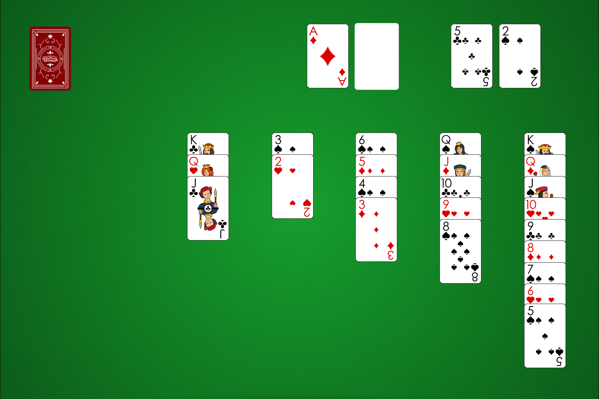

Autor:

Pozorovaním zadania šifry zistíme, že vyzerá ako hracia plocha hry *Pasians*,
tiež známej pod anglickým označením *Solitaire*.
Môžeme si všimnúť, že vidíme aj karty, ktoré sú v niektorých verziách zakryté.
Rozdelenie pripravených kôpok v pravom hornom rohu na čierne a červené je tiež netradičné.

Odrazíme sa najprv od tohoto rozdelenia.
V balíčku žolíkových kariet je $26$ červených a $26$ čiernych kariet.
Presne ako písmen v abecede. Môžeme teda kartám priradiť písmenká.
V Pasianse sa karty ukladajú od esa po kráľa,
poradie farieb určíme podľa poradia v dvojiciach -- kárové potom srdcové,
krížové potom pikové. $\diamondsuit A$ bude písmeno A, $\heartsuit K$ bude Z,
podobne pre čierne -- $\clubsuit A$ je A, $\spadesuit K$ je Z.

Otázkou zostáva, čo prečítať? O tom, že sme písmenká priradili dobre,
nás presvedčia karty na vrchoch kôpok. $\diamondsuit 8 = H$, $\diamondsuit 5 = E$,
$\heartsuit 6 = S$, $\diamondsuit Q = L$, $\heartsuit 2 = O$, $\clubsuit 10 = J$,
$\clubsuit 5 = E$. Vidíme, že `HESLO JE`, nikde však nevidíme, čo je dané heslo.
Nezostáva nám nič iné ako s plochou niečo urobiť.

Skúsime si hru zahrať. Ako prvé vidíme, že $\clubsuit 5$ vieme presunúť na $\heartsuit 6$,
a potom obe na práve odkrytú $\spadesuit 7$. Túto kôpku presunieme na $\diamondsuit 8$ naľavo,
čím odkryjeme $\heartsuit 9$, ktorú vieme presunúť na $\clubsuit 10$.
Takto v hre pokračujeme čo najďalej,
pričom sa snažíme v prvom rade posúvať karty na príslušné miesta na vrchu hracej plochy.
Pri hre si môžeme všimnúť, že občas máme na výber dve karty, ktoré vieme posunúť.
Pri opakovanom hraní prídeme na to, že nech si vyberieme ktorúkoľvek, dostaneme sa k rovnakému výsledku.

{style="width:110mm}

Odkiaľ teda prečítame heslo? Keďže poradie jednotlivých ťahov je nejednoznačné,
musíme si vystačiť s finálnou pozíciou. Na začiatku sme čítali karty na vrchu každej kôpky.
Keď to zopakujeme dostaneme $\clubsuit J = K$, $\heartsuit 2 = O$,
$\diamondsuit 3 = C$, $\spadesuit 8 = U$, $\spadesuit 5 = R$.
Odovzdáme heslo **KOCUR**.
