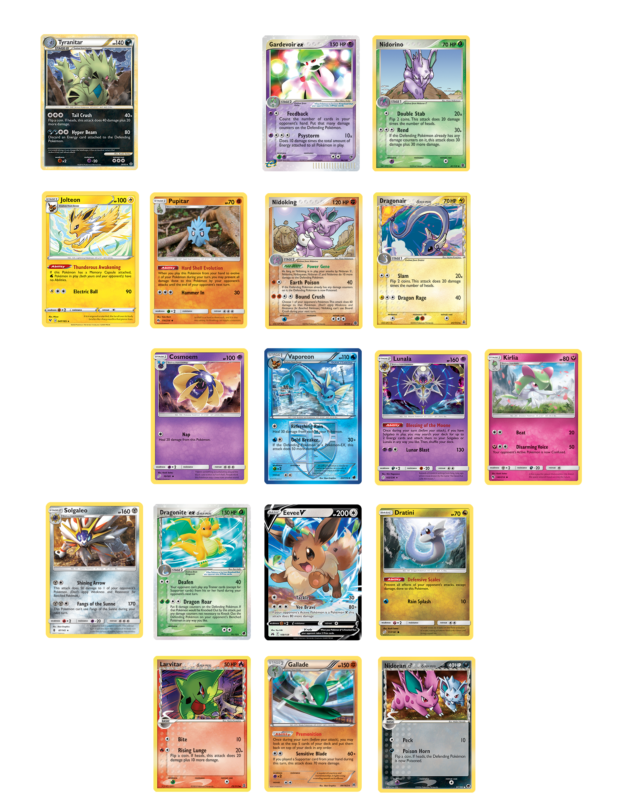
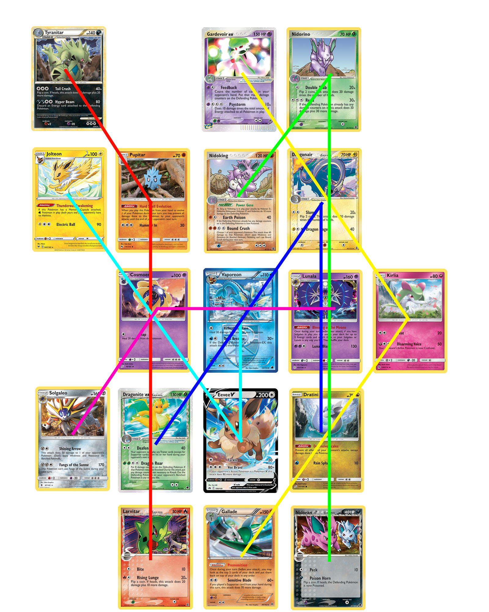

Autor: Viktor

Zadaním šifry je množstvo farebných štvorčekov.
Každý má na sebe číslo,
a rozmiestnených zopár farebných krúžkov,
ktoré nadobúdajú farby rovnaké,
ako štvorčeky samotné.
Pôjde asi o nejaké karty...
Možno o nejaké konkrétne?
Každá karta má jedno číslo,
niekoľko riadkov krúžkov v rôznych počtoch,
a dole tri skupiny krúžkov.
To nápadne pripomína najvýraznejšie črty istej slávnej skupiny kariet.
Ako aj názov (pika pika) napovedá,
zaujímajú nás pokémonové karty.

Ale čo s nimi?
Poďme zistiť,
akí pokémoni to sú v skutočnosti.
Využime informácie z obrázku:
číslo v štvorčeku udáva HP pokémona,
farba pozadia je jeho typ,
rady krúžkov a prípadné červené alebo zelené riadky sú jeho útoky a schopnosti,
a nakoniec tri skupinky úplne na spodku sú v poradí jeho
weakness,
resistance a
retreat cost.
Databázu nájdeme napríklad na [oficiálnej stránke](https://www.pokemon.com/us/pokemon-tcg/pokemon-cards/).
Tam dokážeme dohľadať každého z nich:
{style="width:115mm}

Čo s nimi teraz?
Ikonická vlastnosť pokémonov je,
že sa vyvýjajú.
Niektoré druhy pokémonov sa vyvýjajú z iného.
Spojme ich teda:
{style="width:115mm}

Dostávame šesť trojíc,
z ktorých každá nám usporiadaním ukazuje písmenko v semaforovej abecede.
Zoraďme najzákladnejších pokémonov každej línie podľa abecedy,
dostaneme z písmeniek heslo: **MATICA**.
