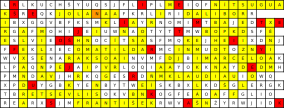

Autor: MisQo a Stanko

### Analýza tabuľky

Ako prvé si na tabuľke môžeme všimnúť, že je nejak divná. Nemá obdĺžnikový tvar,
ale na konci ako keby nejaké políčka občas chýbali. To určite nebude náhoda.
Keď si spočítame rozmery, zistíme že máme 12 riadkov. V prvom riadku máme
31 políčok, v druhom 28, v treťom 31, potom 30... Tu už by to malo byť jasné.
Pozeráme sa na kalendár, každý riadok je jeden mesiac, a každé políčko jeden deň.
Na to odkazovala aj malá nápoveda, v ktorej sme mali vyznačené dni, ktoré sú sviatky,
prípadne víkendy.

### Skúsme osemsmerovku

Ak by sme šifru neanalyzovali, ale začali riešiť ako osemsmerovku, po nejakom čase by
sme našli prvé slová. Zaujímavé je, že všetky slová, ktoré sa v osemsmerovke nachádzajú,
sú mená.

### Ako to spojiť?

K riešeniu nám to už len stačí spojiť dokopy. V tabuľke každé políčko predstavuje jeden deň,
a je v ňom jedno písmenko. Okrem toho sme našli v osemsmerovke skryté mená. Ku každému menu,
máme priradený jeden deň v roku. Toto priradenie voláme meniny. Keď ku každému menu
nájdeme, kedy má meniny, a toto políčko si v tabuľke zaznačíme, dostaneme toto:

{style="width:69mm}

Keď teraz označené dni prečítame chronologicky, dostaneme `RIEŠENÍMTEJTOŠIFRYJERUKSAK`.
Heslo teda je **RUKSAK**.
