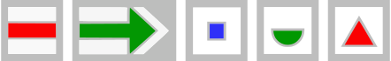
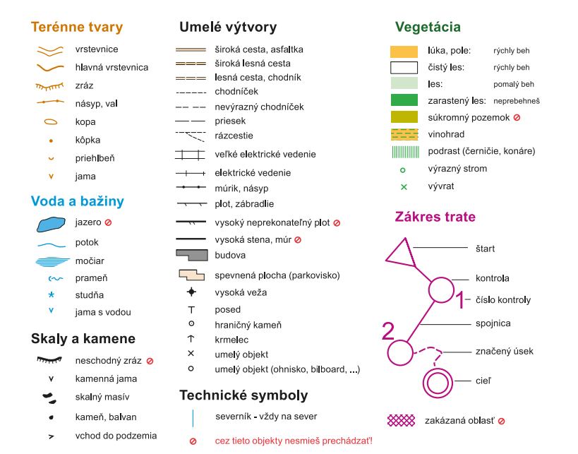

\tableofcontents

\newpage

## Úvod

Témou tohto objavného kola sú mapy. Mapa je niečo, čo pozná každý, nejaký plánik na papieri, v počítači alebo v mobile, kde nájdeme,
čo sa kde nachádza, alebo ktorou cestou sa vydať. Preto by sa nám mohlo zdať, že o mapách vieme všetko a už nás nič neprekvapí.
Dúfame, že ak aj vás šifry objavného kola prekvapili, tento text vám pomôže, nuž, zorientovať sa :D

## Turistické mapy

Keby sme si mali predstaviť mapu, ktorú používame najčastejšie, je dosť možné, že by to bola mapa turistická.
Predsa len sa do nej často pozeráme aj opakovane, aby sme si vyjasnili, ktorou cestou pokračovať.
Hoci dnes už nie je problém sledovať svoju polohu pomocou GPS, omnoho príjemnejšie je pri turistike používať turistické značky,
pamätať si len farbu, po ktorej máme kráčať ďalej a užívať si výhľady na okolie namiesto pohľadu do mobilu.

#### [Turistické značky](https://sk.wikipedia.org/wiki/Turistick%C3%A1_zna%C4%8Dka_na_Slovensku)

tak, ako ich poznáme, sú v podstate unikátom strednej Európy. Na Slovensku čoskoro oslávia 150. výročie existencie.
O ich existenciu a obnovu sa pritom starajú väčšinou dobrovoľníci.

#### [Typické značky](https://www.kst.sk/sk/article/turisticke-znacky)

pre peších turistov pozostávajú z farebného piktogramu na bielom pozadí.
Najčastejšie tento piktogram tvorí horizontálna čiara, ktorá označuje pokračovanie trasy.
Používa sa však aj šípka na označenie náhlej zmeny smeru, bodka (malý štvorec) na označenie začiatku alebo konca trasy,
trojuholník na označenie rozhľadne, polkruh na označenie prameňa, či rôzne ďalšie symboly.
Farba piktogramu je vždy červená, žltá, zelená alebo modrá.

Medzi modernejšie značky patria lyžiarske (bežkárske) značky, cyklistické značky, značky náučných chodníkov a ďalšie,
pravidlá ich používania sú však zložitejšie.

{style="width:27mm}

## Orientačné mapy

Okrem turistických máp existujú aj špeciálne mapy pre orientačné športy. Tieto mapy popisujú terén do väčších detailov,
než obyčajné turistické mapy. Nachádza sa na nich veľa rôznych symbolov pre konkrétne terénne útvary, cesty, budovy,
porast alebo vodu. Medzi najpoužívanejšie značky patria tieto:

{style="width:150mm}

## Urbanizmus

Nemôžeme sa však obmedzovať len na mapy terénu, veď na mapách je možné zobraziť obrovské množstvo rôznych informácií,
ktoré sa viažu na geografickú polohu. Často ich síce ovplyvňuje terén, niektoré však môžu byť závislé výlučne na ľudskej činnosti.
Napríklad v mapách miest a infraštruktúry sa málokedy zmieňuje nadmorská výška či sklon svahu,
častejšie sú dôležité polohy a názvy jednotlivých ulíc, bulvárov a ciest.

Nestratiť sa v týchto názvoch pri cestovaní po svete môže byť zložité. V zahraničí, najmä v USA, sa napríklad rozlišuje
_[street a avenue](https://www.southernliving.com/culture/difference-between-road-street-avenue-boulevard)_,
pričom sa jedná o takmer rovnaké typy ulíc v mestách, ktoré sa však odlišujú smerovaním,
jedny vedú zo severu na juh a druhé z východu na západ -- sú teda na seba kolmé.
Ktoré sú ktoré však nie je jednoznačné a v každom meste to môže byť inak! Spravidla je _avenue_ širšia, než _street_.
Okrem toho existuje aj _boulevard_, teda bulvár, čo je špeciálny typ ulice, väčšinou ešte širší,
s chodníkom alebo stromoradím v strede. Významné široké ulice, ktoré tento stredný úsek nemajú, sa nazývajú _lane_.

Americká pravouhlá cestná sieť je užitočná, keď sa chceme v meste dostať z jedného bodu do druhého,
pretože máme veľa možností, akú trasu zvoliť, a všetky budú podobne dobré.
Medzi mestami sa potom najľahšie dostaneme diaľnicou (_highway_), prípadne lokálnymi cestami (_drive_).

Nie všetky časti miest sú tak ako ulice prístupné pre autá, niektoré sú dostupné len chodcom,
napríklad parky (_park_) alebo pešie zóny (_pedestrian zone_). V častiach miest, ktoré sú postavené na úpätí kopca,
sa často medzi ulicami nachádzajú schodiská (_stairway_), ktoré umožňujú chodcom rýchlo sa dostať vertikálnym smerom.

Ak plánujeme cestovať do nejakého zahraničného mesta, je vhodné sa zamyslieť nad tým,
či sa nám oplatí bývať v hoteli (_hotel_) v centre, alebo nám stačí prenajať si na pár dní izby v dome (_house_) niekde na predmestí,
napríklad cez čoraz populárnejšie internetové služby Airbnb či Booking.

## Mapy Slovenska

Ak namiesto cesty do zahraničia radšej zostaneme na Slovensku, možno nás prekvapí, čo všetko tu nájdeme.
Výlet si bez problémov naplánujeme z domu, pretože dnes už sú všetky mapy dostupné online.
Či už nás zaujímajú historické pamiatky, prírodné krásy alebo vodné diela, na všetko existujú mapy,
v ktorých si vieme zistiť, kde v našej blízkosti sa nachádza to, o čo máme záujem.

[Mapy cestnej siete](https://www.cdb.sk/sk/Vystupy-CDB/Mapy-cestnej-siete-SR/SR.alej)

[Mapa riek a vodných plôch](https://mpt.svp.sk/svp_vmapportal/?basemap=vhm)

[Mapa akvaparkov a kúpalísk](https://www.vodnesvety.sk/mapa)

[Mapa hradov a zámkov](https://www.hrady-zamky.sk/mapa-hradov/)

[Mapa historických regiónov](https://sk.wikipedia.org/wiki/Zoznam_regi%C3%B3nov_Slovenska#/media/S%C3%BAbor:Tourism_regions_of_Slovakia_sk.png)

[Mapa okresov a krajov](https://sk.wikipedia.org/wiki/Zoznam_okresov_na_Slovensku#/media/S%C3%BAbor:Okresy97_Slovakia.svg)

[Mapa chránených území](https://publish.geo.guru/wp-content/grand-media/image/original/201507_Priroda_03.jpg)

[Mapa verejne prístupných jaskýň](http://www.ssj.sk/sk/mapa-jaskyn)

## Súradnice

Aby sme si vedeli údaje z viacerých máp spojiť dohromady, existujú súradnicové systémy. Tie typicky označujú pozície na mape písmenami,
číslicami, či slovami, čím umožňujú ich jednoznačnú identifikáciu.

Najpoužívanejším súradnicovým systémom je dvojica zemepisná šírka a zemepisná dĺžka. Zemepisná šírka označuje uhol medzi zvislicou
z miesta na povrchu Zeme a rovinou rovníka. Podľa toho, na ktorej pologuli sa miesto nachádza, rozlišujeme severnú a južnú zemepisnú šírku.
Miesta s rovnakou zemepisnú šírkou nazývame rovnobežky. Zemepisná dĺžka určuje uhol medzi rovinou základného (Greenwichského) poludníku a rovinou daného miesta.
Tu rozlišujeme východnú a západnú zemepisnú dĺžku. Rovnakú zemepisnú dĺžku majú miesta na rovnakom poludníku.

Iným systémom súradníc je Univerzálny transverzálny Mercatorov systém (UTM).
Ten využíva [Mercatorovu projekciu](https://cs.m.wikipedia.org/wiki/Mercatorovo_zobrazen%C3%AD) Zeme.
UTM rozdeľuje povrch Zeme na 60 poludníkových zón (očíslovaných od 1 po 60) a 20 rovnobežkových zón (označených písmenami C až X).
Keďže Mercatorova projekcia pri póloch priveľmi skresľuje tvar Zeme, je takto rozdelená len plocha medzi 80° južnej a 84° severnej dĺžky.
Na rozdiel od zemepisnej šírky a dĺžky sú tieto súradnice na seba kolmé.

Z trochu iného súdka je orientácia pomocou adries. Tie zabezpečujú, že sa pošta dostane na to správne miesto. To je typicky určené názvom ulice,
číslom domu, názvom obce, PSČ a názvom štátu. Čísla domov poznáme hneď dve rôzne. Súpisné čísla sú prideľované v rámci obce,
orientačné v rámci ulice, či námestia. Takýto systém umožňuje orientáciu v obývaných oblastiach, no na určenie polohy v prírode,
či na inom otvorenom priestranstve, je nepoužiteľný.

Moderné systémy sa väčšinou snažia skĺbiť výhody adries, ako sú jednoduchosť a zapamätateľnosť, s výhodami súradnicových systémov, ktoré fungujú všade.

Medzi takéto systémy patrí napríklad [Geohash](http://geohash.org/site/tips.html). Ten rozdeľuje svet na mriežku a každé políčko v nej
je opäť rozdelené na menšie a menšie políčka. Poloha je potom určená postupnosťou symbolov,
ktorá ukazuje postupne na políčka od najväčšej mriežky po najmenšiu. Takýto systém umožňuje využiť iba časť kódu,
ak je zvyšok jasný z kontextu, napr. ak vieme v ktorej krajine sa dané miesto nachádza.

Ďalším príkladom je [Mapcode](https://www.mapcode.com/). Ten využíva fakt, že ľuďom stačí presnosť niekoľkých metrov a tak kódy obmedzujú v dĺžke.
Zároveň ich kódy nemusia byť rovnako dlhé, takže ich vedia prispôsobiť používanosti. Kratšie kódy, ktoré sa dajú ľahšie zapamätať,
majú miesta s väčšou hustotou zaľudnenia, keďže o tých sa predpokladá, že sa budú využívať viac.

Nakoniec spomeňme ešte [what3words](https://what3words.com/). Tu nemôžeme úplne hovoriť o súradniciach.
Tento systém delí povrch Zeme na bloky 3x3 metre a každý z nich označuje nejakou trojicou anglických slov.
Cieľom je ľahká zapamätateľnosť a vyhnutie sa chybám. Podobné trojice slov tak bežne označujú miesta na opačných koncoch Zeme.
V súčasnosti má systém k dispozícii označenia vo viac ako 40 jazykoch vrátane slovenčiny.

## Mapy vesmíru

Mapy však vôbec nemusíme používať len na navigáciu na Zemi. Samozrejme, ak čítate pútavú fantasy knižku,
často obsahuje mapu vymysleného sveta, ale to tým nemyslíme. Mapy nemusia zobrazovať Zem
a pritom môžu byť úplne reálne -- existujú totiž aj mapy vesmíru!

Z pohľadu máp je vesmír trochu menej zaujímavý, ako Zem, keďže na jeho mapách nájdeme fakticky len hviezdy,
a nie žiadne jazerá, ani mestá, či cesty (ak aj nejaké vo vesmíre sú, zatiaľ ich na mapách vyznačené nemáme :D).
Jednoduchosť vesmírnych máp si však ľudia už od nepamäti kompenzovali tým, že sa do rozloženia hviezd pokúšali vzniesť nejakú štruktúru.
Dnes už pre každú viditeľnú hviezdu (a mnoho oku neviditeľných hviezd) poznáme jej presné súradnice v akomkoľvek zo systémov,
ktorý si vyberieme -- či už rovníkovom, ekliptikálnom, alebo galaktickom.
Omnoho jednoduchšie pre bežného človeka však stále je pamätať si hviezdu pomocou jej umiestnenia v súhvezdí.

Zdokumentovaná história moderných súhvezdí začala v druhom storočí nášho letopočtu, keď 48 z nich popísal a zaviedol grécky matematik Klaudios Ptolemaios.
Odvtedy pribudlo ďalších 40 a obloha sa tak rozdelila na 89 častí (súhvezdie hada má dve časti). Toto delenie používame doteraz.
Mnoho súhvezdí, ktoré poznáme, má pôvod v gréckej mytológií, napríklad Androméda, Kasiopeja, Herkules,
jednoznačne však dominujú súhvezdia pomenované po zvieratách. Tých je až 37:

Baran, Býk, Delfín, Had, Havran, Holubica, Chameleón, Jašterica, Jednorožec, Južná ryba, Koník, Kozorožec, Labuť,
Lev, Lietajúca ryba, Líška, Malý lev, Malý pes, Malý medveď, Mucha, Orol, Páv, Poľovné psy, Rajka, Rak, Ryby, Rys,
Škorpión, Tukan, Veľký pes, Veľká medvedica, Veľryba, Vlk, Vodný had, Zajac, Žeriav, Žirafa

Niektoré z nich sú nám zrejme známejšie ako ostatné. Patria totiž medzi súhvezdia zvieratníka (nazývaného aj zverokruh),
ktorými počas roka prechádza Slnko na pravé poludnie. Áno, aj Slnko sa dá nakresliť do mapy vesmíru, hoci je každý deň na inom mieste.
Tieto miesta tvoria takzvanú ekliptiku, preto sa súhvezdiam zvieratníka vraví aj ekliptikálne. Konkrétne súhvezdia zvieratníka sú:

Vodnár, Ryby, Baran, Býk, Blíženci, Rak, Lev, Panna, Váha, Strelec, Škorpión a  Kozorožec.

V minulosti im ľudia pripisovali (a občas aj v súčasnosti pripisujú) dôležitý vplyv na život človeka, ktorý sa narodil v dátumoch,
kedy sa Slnko nachádzalo v daných súhvezdiach. Moderný astrologický kalendár je však od tejto metriky veľmi vzdialený -- súhvezdia
na oblohe v skutočnosti nezaberajú rovnako dlhé časti ekliptiky. Napríklad taký Škorpión zaberá veľmi malý kúsok
a omnoho väčšiu časť zaberá súhvezdie Hadonos, ktoré sa nachádza nad Škorpiónom -- a pritom ani nie je medzi znameniami zverokruhu! Elipsa,
po ktorej Zem krúži okolo Slnka, sa tiež sama o sebe pomaly pohybuje, takže za tisícky rokov existencie
zverokruhu sa jednotlivé znamenia v kalendári [posunuli takmer o mesiac oproti pôvodnému rozloženiu](https://www.forbes.com/sites/jamiecartereurope/2021/09/03/whats-your-real-star-sign-heres-why-youve-probably-been-reading-the-wrong-horoscope-your-entire-life/?sh=1490048c23f1).

Na prehliadanie mapy vesmíru a súhvezdí je zďaleka najlepšie použiť program [Stellarium](https://stellarium-web.org/).
Môžeme si v ňom nájsť, ako vyzerá obloha práve teraz, ale aj ako vyzerala pred tisíckami rokov či bude o ďalšie tisícky.
Tiež si vieme zobraziť krásne obrázky súhvezdí a pokochať sa mapou oblohy,
a to aj bez pekného počasia a predstavivosti starovekých astronómov.

## Záver

Veríme, že bol pre vás tento text užitočný nielen k riešeniu šifier aktuálneho objavného kola Suši,
ale že vás aj obohatil o rôzne zaujímavé a zmysluplné fakty.

Na najlepších riešiteľov sa tešíme na zimnom sústredení vo februári -- snáď sa budeme riadiť tou správou mapou a spoločne tam potrafíme :D
