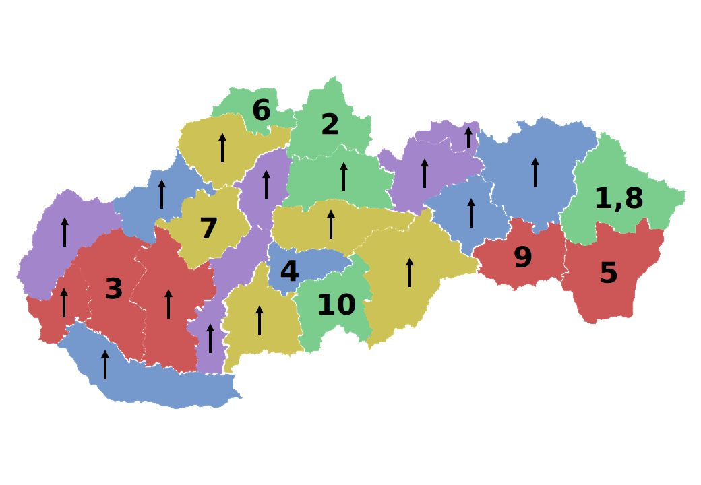

Autor: Štepi

V šifre máme dvadsaťpäť útržkov, po päť z každej z piatich farieb.
Niektoré majú na sebe čísla, pričom jeden útržok môže mať čísel aj viac,
takže najpravdepodobnejšie je, že každému máme priradiť nejaké písmeno a po číslach prečítať heslo.
Keďže je ich dvadsaťpäť, vyzerá to, že máme z abecedy jedno písmenko vynechať a priradiť im zvyšok.
Takže by sme ich chceli nejako zoradiť alebo nájsť možnosť, ako písmená priradiť.

Útržky bez čísel majú šípky, ktoré nám ukazujú, ktorým smerom boli pôvodne otočené.
Možno tiež ukazujú na sever, keďže témou kola sú mapy.
Skúsme teda útržky poskladať do nejakého tvaru.
Keď to spravíme na počítači v rozumnom programe, pôjde to relatívne jednoducho.
Ak si ich rozstriháme a skúsime poskladať fyzicky, šípky nám pomôžu nestratiť sa v tom, ako majú byť otočené.

Počas skladania nám možno niektoré tvary prídu povedomé a postupne si uvedomíme, že **ide o mapu Slovenska**.
Je rozdelená dosť zvláštne, hoci asi nie náhodne, a keď si všimneme, že hranice často kopírujú
pohoria a povodia riek, rýchlo si uvedomíme, že jednotlivé dieliky tvoria **historické regióny**.

Každý región má nejaký názov. Skúsime zobrať prvé písmenká názvov, ale nedostaneme žiadne rozumné heslo.
Ešte sme niečo v šifre nepoužili -- farby.
Zoraďme si ich štandardne podľa dúhy, teda od červenej po fialovú.

Pozrime sa na regióny, ktoré sú červené.
Z východu na západ sú to **Bratislava**, **Dolné Považie**, **Dolná Nitra**, **Abov**, **Dolný Zemplín**.
To je nejako podozrivo veľa *dolných* regiónov.

Čo napríklad oranžové regióny? Tie sú **Horná Nitra**, **Horné Považie**, **Hont**, **Gemer**, **Horehronie**.
Tu je zase veľa *horných*, a okrem toho nejaké začínajúci sa na H a na G.

Tu už možno začíname tušiť, kam nás majú farby nasmerovať.
Ak nie, napíšeme si aj ostatné názvy a potom si určite všimneme, že všetky červené sú v abecede skôr než všetky oranžové a tie zase skôr než žlté, a tak ďalej.
**Zoradíme si teda regióny podľa abecedy**.
Ak si nie sme istí názvami, pomôžu nám práve farby, ktoré nás usmernia, kam región v abecede patrí.

Päť farieb po piatich regiónoch nám ukazuje na Polybiov štvorec (ktorý nájdeme aj v pomôcke),
v ktorom vynechávame z abecedy Q.
V šifre však v skutočnosti nezáleží na tom, či vynecháme Q alebo napríklad W či X,
keďže žiadne písmeno hesla sa nenachádza na neskoršej pozícii než P.

- A - Abov
- B - Bratislava
- C - Dolná Nitra
- D - Dolné Považie
- E - Dolný Zemplín
- F - Gemer
- G - Hont
- H - Horehronie
- I - Horná Nitra
- J - Horné Považie
- K - Horný Zemplín
- L - Kysuce
- M - Liptov
- N - Novohrad
- O - Orava
- P - Podpoľanie
- R - Podunajsko
- S - Spiš
- T - Stredné Považie
- U - Šariš
- V - Tatry
- W - Tekov
- X - Turiec
- Y - Záhorie
- Z - Zamagurie

Podľa čísel na dielikoch teda prečítame **KOD PELIKAN**.

{style="width:90mm}
