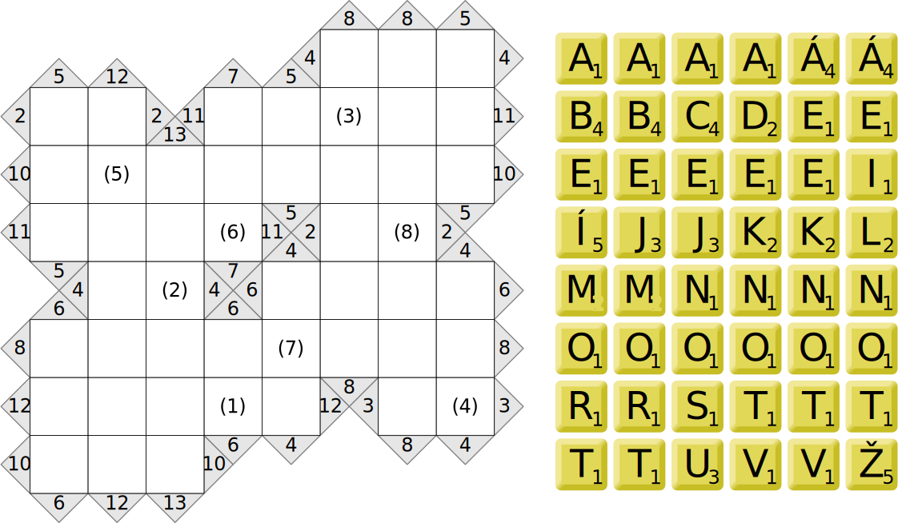
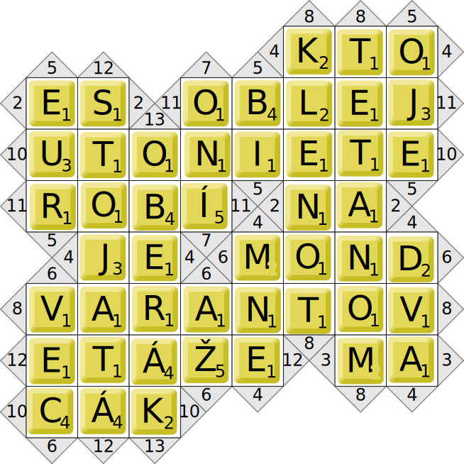

Autori: Janči, Havoš

{style="width:67mm}

Šifra obsahuje nepravideľnú tabuľku s číslami v trojuholníkoch
(podobnú logickej hre Kakuro),
číslami v zátvorkách v niektorých štvorcoch,
sadu písmen s hodnotami ako z hry Scrabble
a nápovedy.

Písmeniek je pritom toľko, čo políčok tabuľky,
a nápovied vodorovne aj zvyslo toľko,
čo rôznych úsekov v riadkoch aj stĺpcoch.
Do každého úseku teda zjavne musíme zodpovedajúcim smerom
doplniť slovo riešiace jednu z nápovied
a dokopy použiť všetky písmenká.
Každý úsek je zároveň označený rovnakým číslom na začiatku a na konci --
to bude hodnota, ktorú musí mať súčet hodnôt písmeniek daného slova.
Preto sa šifra volá skrakuro -- hráme naraz Scrabble a Kakuro.

{style="width:59mm}

Nakoniec použijeme čísla v zátvorkách.
Majú hodnoty od 1 do 8 a každé sa vyskytuje práve raz,
takže postupne zoberieme písmená z daných políčok.

Dostaneme heslo **ŽELATÍNA**.
