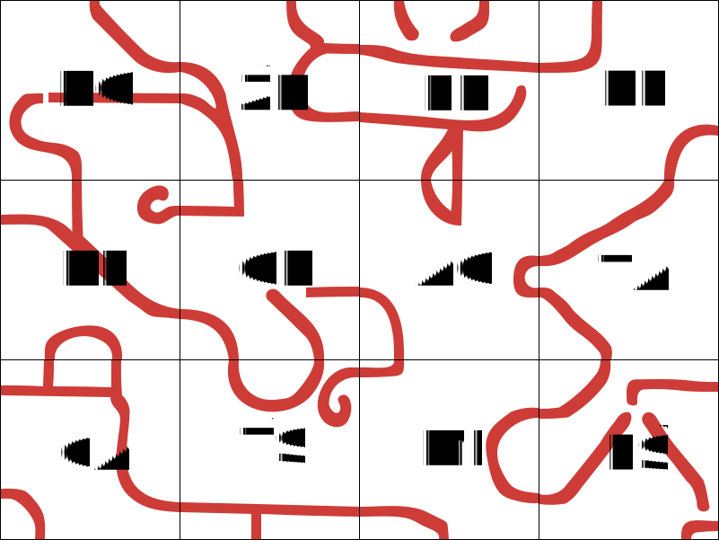
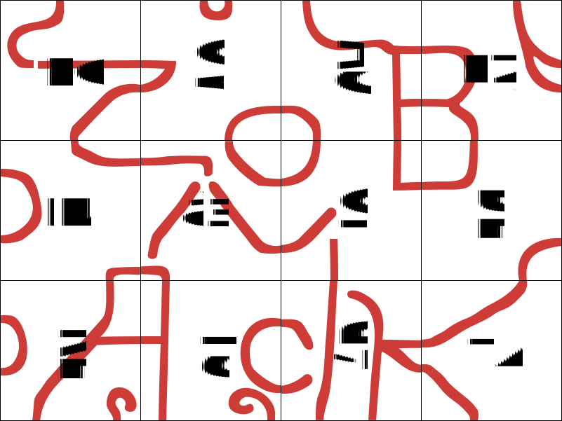

Autori: Michal S., Oliver, Krtko

Šifra sa skladá z $12$ dlaždíc, na každej sú červené krivky (vo farbe Suši) a dve písmená.
Dlaždice sú zoradené do odbĺžnika $3 \times 4$.
Červené krivky na seba medzi susediacimi dlaždicami nenadväzujú, takže by sme mohli skúsiť dlaždice preusporiadať
opäť do obdĺžnika $3 \times 4$, ale tak, aby na seba červené krivky
nadväzovali, dostaneme:

{style="width:76mm}

Čítame *ROŽNÉ PREKLOP A OTÁČAŤ SMIEŠ*.

Štyri rožné dlaždice teda preklopíme
(je jedno, či podľa vodorovnej osi, podľa zvislej osi, alebo otočíme vytlačenú kartičku rubom nahor -- výsledok je rovnaký)
a zložíme obdĺžnik znova.
V tomto prípade už máme povolené (a je potrebné) dlaždice aj otáčať (o násobky $90$ stupňov),
aby sa podarilo obdĺžnik zložiť. Dostaneme

{style="width:76mm}

Z červených kriviek vzniklo heslo **ZOBÁČIK**.
