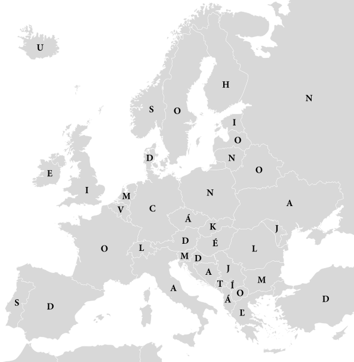

V akej krajine sa nachádza hudobný klub Jammin’ Java?

Z akej krajiny pochádza hostiteľ youtubového kanálu Not Just Bikes?

V akej krajine sa nachádza Rosenbaum House, ktorý navrhol známy architekt Frank Lloyd Wright?

V akej krajine sídli University of Georgia?

V akej krajine sa nachádza múzeum, ktoré vystavuje najväčšiu zbierku španielskych surrealistických obrazov mimo Európy?

V akej krajine sa nachádza MIT, jedna z najznámejších univerzít na svete?

V akej krajine pôsobila skupina obchodných cestujúcich, ktorí sa nazývali *Yankee peddlers*?

Z akej krajiny pochádza liečiteľka drogovej závislosti Gloria Scott, o ktorej zložila pesničku kapela Red Hot Chili Peppers?

{style="width:180mm}
