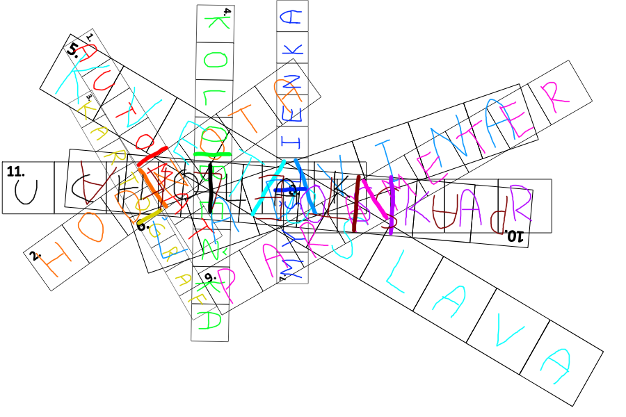

Autori: Štepi, Danko, Mišo M.

Po poriadnom preskúmaní spleti, ktorá sa nachádza v hornej časti šifry, spočítame "riadky" a ich okienka,
a zistíme, že sa tam naozaj nachádzajú všetky od 1 po 11, a poznáme aj ich dĺžky.
Preto sú takto náhodne pohádzané, a nie pekne v riadkoch, necháme ako problém na neskôr, nevyzerá v tom byť systém a možno nám pomôžu vylúštené napovede.
Všetkých 11 z nich opisuje nejakú vec, ktorá má akoby 2 vlastnosti, väčšinou vzťahujúce sa na ďalšie dva predmety.
Vždy je ale jasné, ktorý je ten hlavný (zvyčajne na začiatku). Napríklad 6-ka: orgán(zamrznutá voda, zodpovednosť za čin).
Tu vieme aj rovno pomenovávať opisované vedľajšie objekty, pretože sú celom jednoznačné. Získame orgán(ľad, vina).
Aj pri väčšine ostaných definícií vieme jasne pomenovať aspoň jedno z dvoch vedĺajších slov, 11-ka hmyz(ucho, lak)
premenná(para, ?) alebo 4-ka dopravný prostriedok(?, bežka).
Tu si z niektorých slov potrebujeme všimnúť, že vedľajšie slová sú priamo časťou hlavného.
Npríklad máme lad a vina, ktoré tvoria orgán ľadvinu, ucho a lak spolu je hmyz ucholak...
Teda už vieme, čo budeme vpisovať do políčok, aj keď nám tieto veci významovo príliš nesúvisia.
Pohľadáme teda slová zodpovedajúce definícii, ktoré v sebe môžu obsahovať vedľajšie slová:

1. automat
2. hodnota
3. kartograf
4. kolobežka
5. kvetoslava
6. ľadvina
7. myšlienka
8. oskar
9. pastelka
10. ucholak

Pomôcť nám môže aj fakt, že dve slová, z ktorých skladáme musia mať v súčte dĺžky podľa tajničky.
Keď ich ale vpíšeme, stále nejak potrebujeme vybrať heslo, no samotná tajnička v sebe nemá inú informáciu,
iba že sú zvláštne pootáčané a rozmiestnené.
Toto rozmiestnenie musí byť na to, aby sa graficky niečo vytvorilo.
Ak to nerobia samotné vpísané písmenká, čo by sme si ešte mohli dokresliť do obrázka, ideálne čo nám
napíše heslo alebo ukáže správne písmenká?
Môžeme si oddeliť v každom riadku tie dve slová, z ktorých sa nám výsledné slovo poskladalo.
Ideálne prirodzene zvýraznením čiary medzi susediacimi písmenkami týchto slov.
Vtedy priamo môžeme prečítať heslo **STAN**.

{style="width:90mm}
