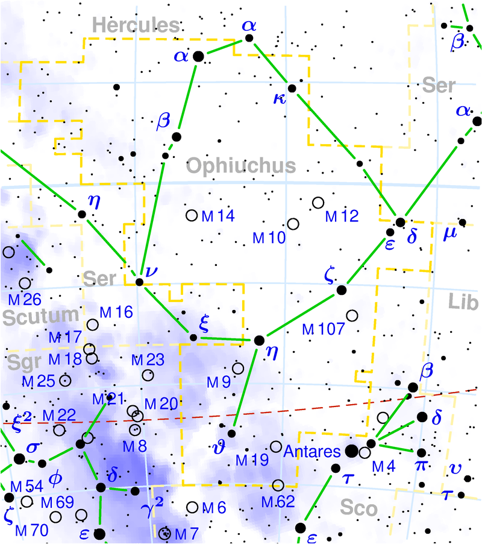
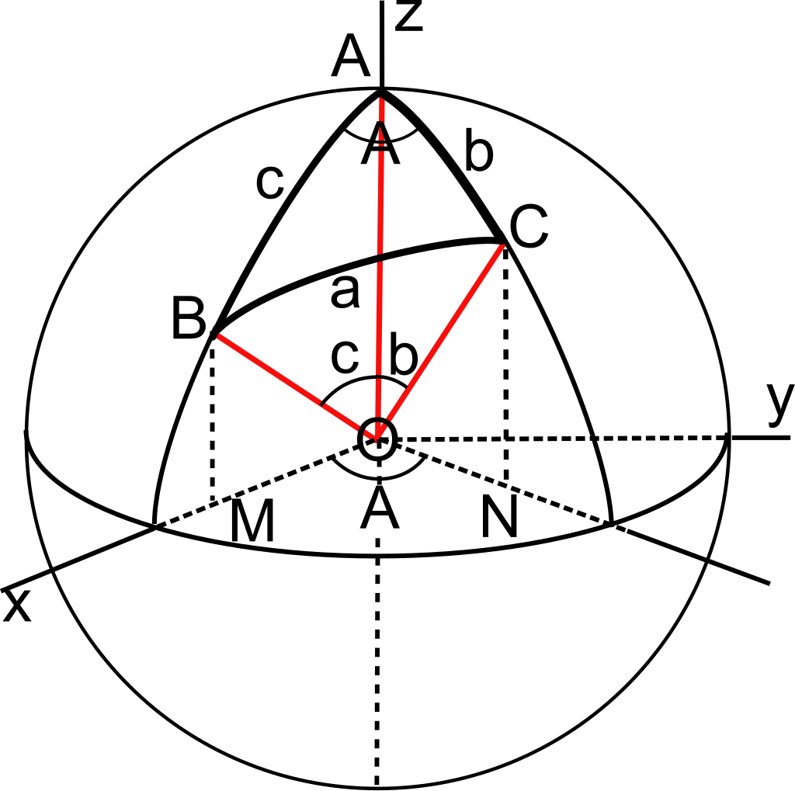
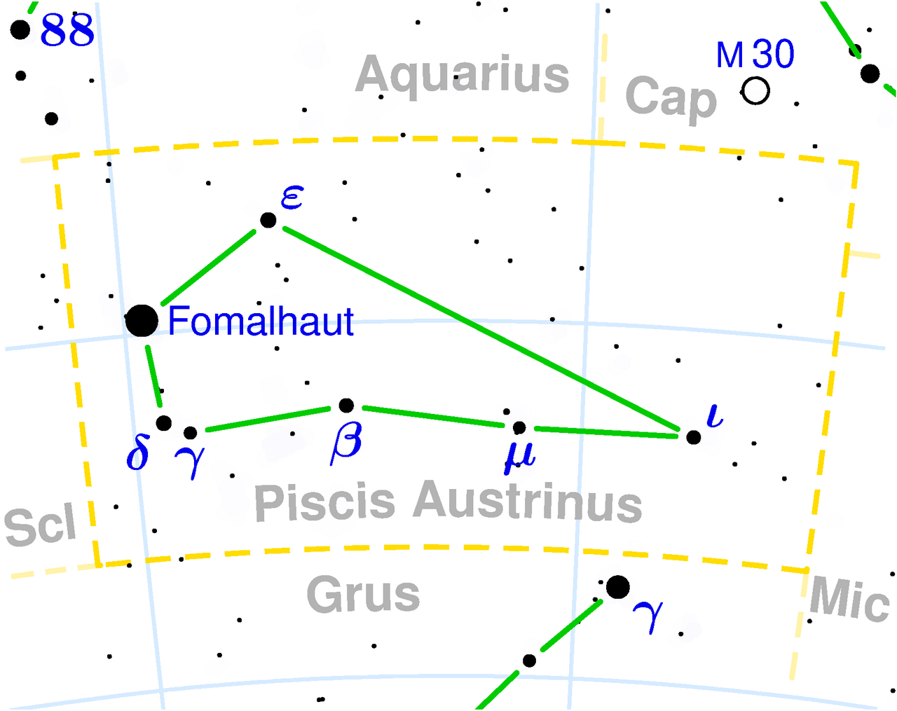
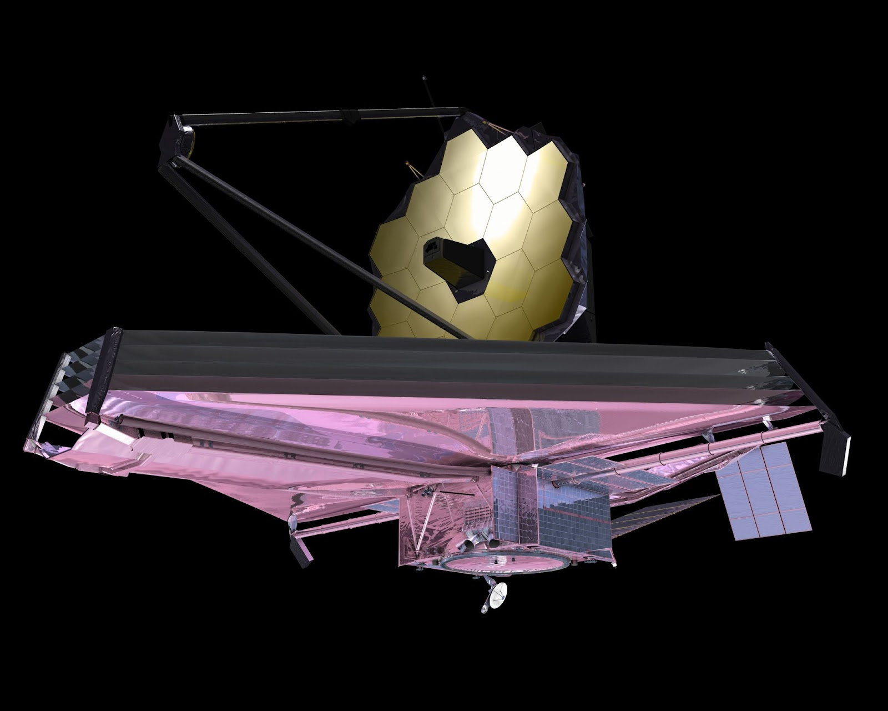
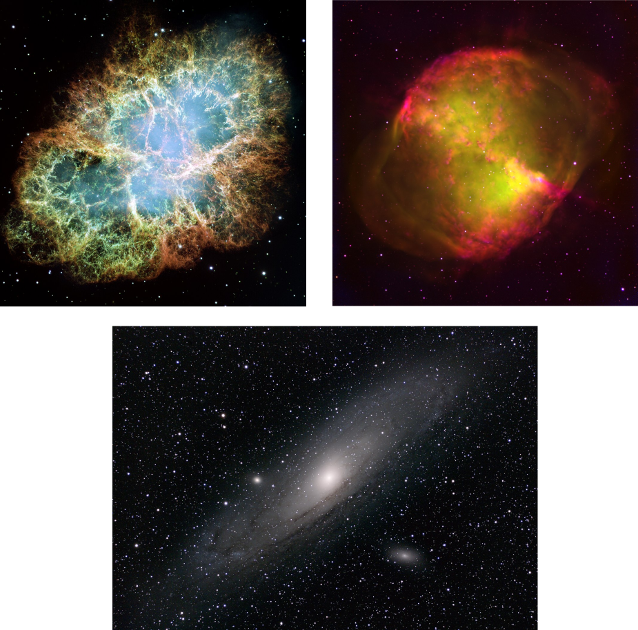
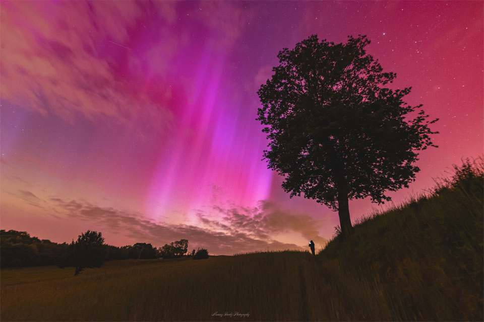

## Úvod

V druhej časti štvrtého ročníka Suši sme si pre vás nachystali objavné kolo na tému Vesmír.
Inšpiráciou nám bolo niekoľko vedúcich, ktorí vyhlasovali,
že si zahmlene spomínajú, ako ich počas zimného sústredenia uniesli ufóni
(ale samozrejme všetci vieme, že to je úplná blbosť, a že celé sústredko
sme strávili príjemným doprovodným programom geografickej olympiády).
Téma Vesmíru by sa mohla zdať naozaj široká – vesmír v sebe predsa
zahŕňa v podstate všetko reálne, čo na svete existuje.
Ako ste ale určite pochopili, rozhodli sme sa poňať ju trochu užšie
a zvoliť najmä tú časť vesmíru, ktorá sa zároveň nenachádza na Zemi.

## Súhvezdia

Jedny z prvých vecí, ktoré uvidíme, keď obrátime svoj zrak mimo našej
domovskej planéty sú Slnko, Mesiac a potom hviezdy na nočnej oblohe.
Už v staroveku si ľudia všimli, že (až na pár zvláštnych, povedzme,
[nepodstatných výnimiek](https://sk.wikipedia.org/wiki/Plan%C3%A9ta))
zostávajú hviezdy vždy na tom istom mieste, kde boli noc predtým.
Skupinky blízkych hviezd im pripomínali rôzne tvary, najčastejšie zvieratá a
mytologické postavy, no postupne začali na na oblohe nachádzať aj rôzne
predmety a pracovné nástroje, geometrické tvary,
povolania či politické osobnosti.

Zmätok v delení oblohy musel byť iste dosť veľký, preto v roku 1928
Medzinárodná astronomická únia pevne stanovila
[88 súhvezdí](https://sk.wikipedia.org/wiki/Zoznam_s%C3%BAhvezd%C3%AD)
a rozdelila celú plochu oblohy medzi ne – na 89 častí
(ak vám to príde podozrivé, máte pravdu, môžu za to súhvezdia Had a Hadonos).
Každé súhvezdie okrem presných hraníc dostalo aj stanovený latinský názov
a skratku. Tieto sa napriek svojmu často starobylému pôvodu používajú dodnes –
ide totiž o veľmi príjemný a jasný spôsob, ako referovať na niektorý
kúsok oblohy a všetko, čo do daného kúsku patrí.

{style="width:185mm}

## Súradnice

Pozíciu každého bodu na oblohe môžeme definovať rektascenziou a deklináciou,
akýmisi súradnicami analogickými k zemepisnej dĺžke a šírke,
ktoré sa však namiesto rovníka vzťahujú na ekliptiku – dráhu,
ktorú prejde Slnko počas roka po oblohe – a počiatok majú v takzvanom
[Jarnom bode](https://sk.wikipedia.org/wiki/Bod_rovnodennosti) –
priesečníku spomínanej ekliptiky s priemetom zemského rovníka na oblohu.
Príde vám to zložité? To ste ešte určite nepočuli o sférickej trigonometrií!

{style="width:60mm}

Tieto súradnice sa však počas rokov pomaly menia
(keďže hviezdy nie sú nehybné, ale celkom rýchlo sa pohybujú priestorom)
a samotná súradnicová sústava tiež nie je stála
(os Zeme sa totiž otáča okolo kolmice na rovinu Slnečnej sústavy s periódou okolo 25 tisíc rokov – Takzvaný Platónsky rok).
Z tohto dôvodu sa musia súradnice definovať aj z hľadiska času,
v ktorom by ich bolo možné namerať – najčastejšie sa používa rok 2000 a tieto súradnice sa označujú ako [J2000,0](https://sk.wikipedia.org/wiki/J2000.0).

## Hviezdy

Keď teda chceme jasne označiť nejak hviezdu, častokrát sú názvy praktickejšie
než súradnice.
Môže sa ale stať, že hviezda má viac názvov, ktoré sa píšu rôzne v rôznych jazykoch,
niektoré sa dokonca navzájom veľmi podobajú.
Označovanie hviezd podľa názvov teda so sebou tiež nesie rôzne problémy.
Riešením je značenie podľa súhvezdí, ktoré používa grécke písmená
pre najvýznamnejšie hviezdy a potom písmená a čísla pre menej viditeľné.
Často je práve najjasnejšia hviezda nejakého súhvezdia označená ako α,
no ani pri tomto značení nie je všetko dokonalé a nie vždy sú hviezdy zoradené
podľa jasnosti, niekedy značenie súvisí s ich polohou v obrazci, ktorý zdanlivo tvoria.
Preto sa vždy zíde overiť si, ktorá hviezda je označená ktorým písmenom.
Najlepšie je na to použiť program [Stellarium](http://stellarium.org/),
ktorý má aj veľmi jednoduchú [online verziu](https://stellarium-web.org/).

{style="width:75mm}

Typickou vlastnosťou hviezd je ich jasnosť, ktorá síce trochu súvisí s ich veľkosťou,
ale omnoho viac s ich vzdialenosťou od Zeme.
Popisuje sa veličinou zvanou
[magnitúda](https://sk.wikipedia.org/wiki/Zdanliv%C3%A1_hviezdna_ve%C4%BEkos%C5%A5),
ktorá je z historických dôvodov definovaná tak,
že z dvoch hviezd tá stokrát jasnejšia hviezda má magnitúdu menšiu o 5.
Nulovú magnitúdu má podľa pôvodnej definície hviezda Vega v súhvezdí Lýra.
Najjasnejšou hviezdou na nočnej oblohe je Sírius s magnitúdou –1,5,
jeho jasnosť však občas prekonajú Mars a Venuša s magnitúdami –2,8 a –4,4,
alebo Mesiac v splne s magnitúdou –12,6.
No a úplne najjasnejšou hviezdou celej oblohy je Slnko s neskutočnou magnitúdou –26,7!
Najmenej jasné hviezdy ešte stále viditeľné voľným okom za dobrých podmienok
majú magnitúdu približne 6.
Nový ďalekohľad Jamesa Webba dokáže vďaka veľkému zloženému zrkadlu
a polohe v otvorenom vesmíre teoreticky rozlíšiť objekty s magnitúdou až 34.

{style="width:75mm}

## Spektrálne typy

Veľkosť hviezdy omnoho viac než jej viditeľnosť
ovplyvňuje jej teplotu a takzvaný spektrálny typ
(hoci pri nich záleží aj na chemickom zložení hviezdy).
Spektrálny typ bol už veľakrát na základe rôznych kritérií
definovaný rôznymi astronómami rôznymi spôsobmi,
no najznámejšia a najpoužívanejšia stupnica je takzvaná
[Harvardská](https://sk.wikipedia.org/wiki/Spektr%C3%A1lna_klasifik%C3%A1cia#Harvardsk%C3%A1_spektr%C3%A1lna_klasifik%C3%A1cia).
Delí hviezdy do 7 kategórií, od najteplejších modrých hviezd triedy O,
cez triedy B, A, F, G, K až po červené studené (no, relatívne) hviezdy triedy M
(pričom studenších hviezd je vo vesmíre typicky výrazne viac, než tých horúcich).
Na zapamätanie si poradia písmen existuje niekoľko pekných mnemotechnických pomôcok,
najznámejšia je asi "Oh, Be A Fine Guy/Girl, Kiss Me!".
V praxi sa každá trieda delí ešte na rôzne podtriedy
a celý systém klasifikácie je pomerne zložitý, no tým sa ako laici trápiť nemusíme.

Chemické zloženie hviezd sa dá zistiť pomocou takzvaných
[spektrálnych čiar](https://sk.wikipedia.org/wiki/Spektr%C3%A1lna_%C4%8Diara) –
rozkladom prichádzajúceho svetla na rôzne vlnové dĺžky a pozorovaním,
ktoré z nich hviezda vyžaruje a ktoré pohlcujú rôzne prvky na jej povrchu.
Takéto určovanie komplikuje fakt, že hviezdy sú málokedy osamotené
a často sa nachádzajú v pároch alebo dokonca väčších skupinách,
ktoré sú navzájom tak blízko, že ich nie je možné voľným okom rozlíšiť.
Potom aj zo svetla prichádzajúceho od takejto dvojhviezdy
môže byť ťažšie určiť zloženie a spektrálny typ jednotlivých hviezd –
našťastie pre nás, jasnejšia hviezda bude výraznejšia aj v spektre,
a to je vlastne všetko, čo nás musí zaujímať.

## Iné pekné vesmírne objekty

Okrem hviezd sa pri pozorovaní oblohy môžeme tešiť aj z pohľadu na rôzne hmloviny a galaxie,
ktoré majú často zaujímavé tvary a farby, ktoré však rozhodne nie je možné
rozlíšiť voľným okom.
Preto sa s ich kategorizáciou začalo poriadne až po vynájdení
dostatočne silných ďalekohľadov v osemnástom storočí,
kedy vznikol zoznam týchto objektov známy ako Messierov katalóg.
Z pôvodných 45 zaznamenaných objektov sa postupne rozrástol na 110.
Najvýraznejšie nehviezdne objekty oblohy tak nesú označenie M1 – M110,
najznámejšie z nich majú aj svoje charakteristické mená,
napríklad hmlovina Činka (M27) či Krabia hmlovina (M1).
Na zozname je aj najbližšia galaxia v Androméde, s označením M31.
Zoznam všetkých objektov aj s obrázkami nájdete napríklad na
[Wikipédií](https://en.wikipedia.org/wiki/Messier_object).

{style="width:130mm}

Na týchto základoch postupne vznikol takzvaný Nový Všeobecný Katalóg
[NGC](https://en.wikipedia.org/wiki/New_General_Catalogue),
ktorý používame dodnes.
Obsahuje už takmer 8000 pozorovaných objektov,
najčastejšie práve hmloviny, galaxie a hviezdokopy.

Pozorovanie oblohy je síce príjemná činnosť, no obmedzení vlastnými očami
prichádzame práve o tieto najkrajšie pohľady, ktoré nám sprostredkujú
rôzne teleskopy ako Hubblov teleskop,
teleskop Jamesa Webba alebo Veľmi veľký teleskop v Čile.
Hoci sú primárne určené na vedecký výskum, vedľajším produktom
sú často práve dychberúce snímky vzdialených kútov vesmíru.
Občas sa však aj amatérom alebo nadšencom podarí odfotografovať zábery,
ktoré nám vyrazia dych – napríklad rôzne bolidy, zatmenia Slnka alebo polárnu žiaru.
Známym príkladom miesta, ktoré takéto zaujímavé obrázky združuje, je stránka
[Astronomy Picture of the Day](https://apod.nasa.gov/apod/)
prevádzkovaná NASA a MTU, kde sa každý deň zverejňuje jeden obrázok,
ktorý je zaujímavý z hľadiska aktuálneho diania v astronomickej komunite
alebo pripomína významné výročie.
Napríklad v nedeľu 12.5.2024 sa obrázok týkal nezvyčajne silnej polárnej žiary viditeľnej aj u nás.

{style="width:115mm}

## Mesiac

Keď už hovoríme o NASA, možno vám neunikli aktuálne plány toho,
že by sa na Mesiac mohli opäť po desiatkach rokov dostať ľudia
(a možno ho aj dlhodobo kolonizovať, hoci to je ešte skôr ďaleká predstava).
[Mesiac](https://sk.wikipedia.org/wiki/Mesiac)
je vskutku fascinujúci – v porovnaní so Zemou je neštandardne veľký
(čo sa snaží vysvetliť napríklad teória o jeho vzniku nárazom telesa veľkosti Marsu do Zeme)
a je k Zemi veľmi blízko.
Preto naň rôzni astronómovia po stáročia upierali zrak
a z jeho zatmení boli schopní vyvodiť rôzne vedecké poznatky, napríklad o tvare Zeme.
Taliansky učenec [Galileo Galilei](https://sk.wikipedia.org/wiki/Galileo_Galilei)
ako jeden z prvých skúmal svojim ďalekohľadom povrch Mesiaca už v roku 1609
a okrem pomenovania "morí" (oblastí tmavých hornín)
identifikoval aj rôzne krátery a vyvýšeniny.
Určite by ho potešilo, keby videl dnešné
[mapy Mesiaca](https://planetarynames.wr.usgs.gov/Page/Moon1to1MAtlas).
Alebo to, že jeden z veľkých mesačných kráterov sa dnes volá po ňom
(a aj pár malých "satelitných" kráterov).

Veru, ľudstvo je schopné pomenovať všetko, čo vidí, najmä keď má po kom.
Či už sú to súhvezdia, hviezdy, planéty, alebo dokonca malé asteroidy
a rôzne pohoria a doliny na iných planétach, stačí, že ich vieme vidieť.
Preto tak, ako na Zemi, aj na Mesiaci má snáď
[každá významnejšia diera](https://en.wikipedia.org/wiki/List_of_craters_on_the_Moon)
meno po nejakej významnej osobnosti (alebo aspoň nejakom mýtickom hrdinovi).
Keď sa budete dobre učiť, možno aj vy spravíte dieru do sveta,
ktorú potom jedného dňa pomenujú po vás.
A vedúci si budú môcť povedať,
"Neskutočné!
Tomuto geniálnemu človeku som kedysi vedúcoval sústredko v Kokave nad Rimavicou!".
Snažte sa, držíme vám palce!
