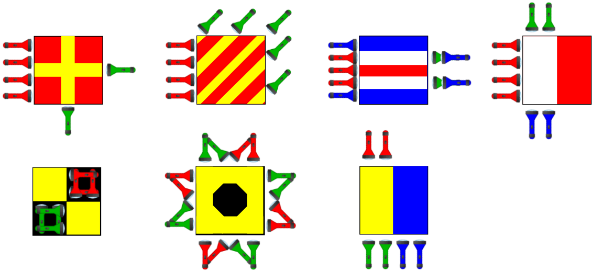

Autori: Mišo M., Oliver

Ako prvé si môžeme v zadaní všimnúť baterky troch rôznych farieb (červenej, zelenej a modrej).
To nás môže naviesť k tomu, že baterky tých farieb budú svietiť a chceme sa pozerať na farby, ktoré vzniknú ich spojením.
Podobne ako to robia obrazovky na moderných monitoroch (RGB).
Napríklad biela je červená, zelená, modrá a čierna vznikne, ak žiadna farba nie je prítomná.
Zvyšné farby vzniknú nejakou kombináciou.
Toto je sčítavanie farieb a vieme ho nájsť na pomôcke.

Poďme sa teda pozrieť na prvý obrázok.
Červené baterky osvietia celý štvorec na červeno a dve zelené baterky vytvoria v tom štvorci žltý kríž.

Druhý obrázok má tiež červené pozadie, teraz ale zelené baterky vytvoria žlté pásiky idúce šikmo dole.

Tieto obrázky môžu vyzerať na prvý pohľad neznámo, ale obsahujú rozoznateľné tvary.
Môžeme sa teda pozrieť do pomôcky.
V nej si môžeme všimnúť, že tieto obrázky sa tam nachádzajú.
Sú súčasťou vlajkovej abecedy a znamenajú písmená **R** a **Y**.
Pokračujme teda ďalej.

Keď vyfarbíme všetky štvorčeky, dostaneme nasledujúce vlajky.

{style="width:70mm}

Teraz môžeme ľahko prečítať riešenie: **RYCHLIK**.
