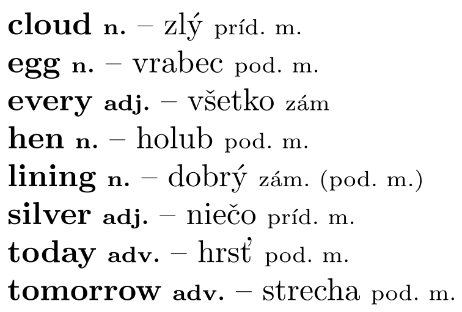

### malý

{style="width:45mm}
Slová v tomto slovníku sa dajú roztriediť na dve skupiny.

### veľký

Slová v zadaní sa dajú roztriediť do viacerých skupín podľa rovnakých kritérií ako v malej nápovede,
aj keď v nich môžu byť rôzne počty slov. Tieto skupiny ti dajú kontext potrebný
na vygooglenie chýbajúcich anglických prekladov.
