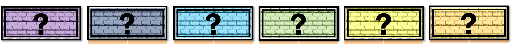

### malý

Niektoré tehly majú zospodu dva kusy malty. Čo by sa dalo z týchto počtov tehál postaviť? Keď nemáme v šifre dosť materiálu, vytvoríme si ďalší.

### veľký

{style="width:15mm}

Pamätajte, že $1 + 1 = 2$.
