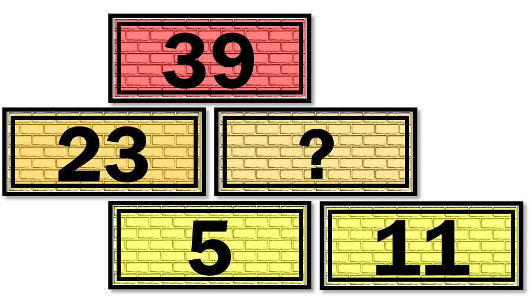
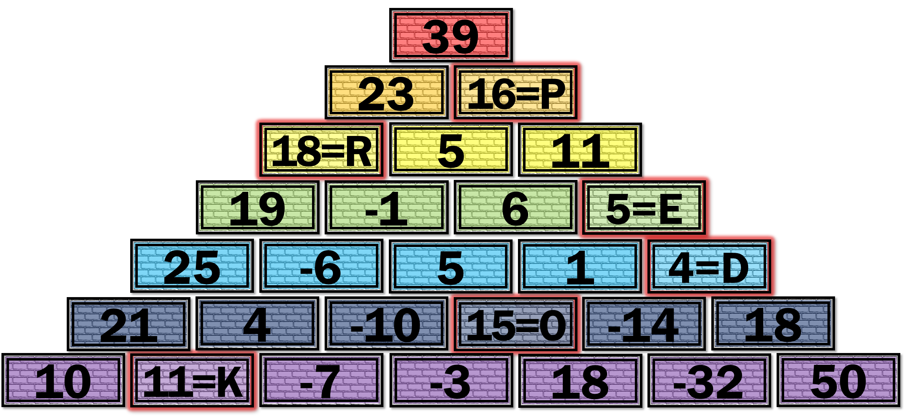

Autor: Janči

V zadaní vidíme množstvo farebných tehál
s rôznymi kladnými a zápornými číslami.
Tehly sú zoradené podľa hodnoty týchto čísel,
takže ich počiatočné poradie zrejme nebude dôležité
a pre vyriešenie šifry ich bude treba preusporiadať.

Tehly majú vždy jednu zo siedmych farieb dúhy,
ktoré obyčajne radíme od červenej po fialovú.
Zároveň vidíme, že tehál niektorých farieb je výrazne viac, než iných.
Spočítame si ich a zistíme takéto počty:

- červená -- 1
- oranžová -- 1
- žltá -- 2
- zelená -- 3
- modrá -- 4
- indigová -- 5
- fialová -- 6

Z týchto počtov vyplýva jednoduché pravidlo --
každá farba má o jednu tehlu viac, než predošlá.
Bohužiaľ toto pravidlo neplatí a má výraznú výnimku --
jednu tehlu červenej farby.

To je škoda, ak by totiž počty fungovali takýmto spôsobom,
mohli by sme z tehál postaviť pyramídu,
kde by každé poschodie malo jednu farbu.
To nám radí aj malta na spodku všetkých tehál
okrem fialových.
Vždy je v strede rozdelená na dva kusy,
teda každá tehla okrem fialových
by mala ležať na dvoch ďalších tehlách.

Mohla by to byť súčtová pyramída, keďže tehly majú na sebe čísla,
a dokonca často tvoria trojice, kde súčet dvoch tehál početnejšej farby
tvorí tehlu farby o jedno pochodie vyššie
(napríklad fialové 50 a -32 tvoria indigovú 18,
modré 25 a -6 tvoria zelenú 19...).
Takýchto pekných trojíc nájdeme ešte veľa,
no pyramídu sa nám postaviť nepodarí, keďže ich nevieme spojiť dohromady,
a najmä stále netušíme, čo by sme spravili s jednou červenou tehlou,
ktorá zostáva.
Sľubný nápad teda nefungoval a zasekli sme sa,
pretože ostatné nápady vôbec neznejú tak dobre ako tento.

V tomto bode môžeme využiť ešte jedno pozorovanie,
alebo skúsiť riešiť šifru od konca.
Najskôr teda pozorovanie:
existujú štvorice tehál, ktoré sa chovajú podobne,
ako tie pekné trojice, ktoré sme našli doteraz --
súčet troch tehál početnejších farieb je rovný hodnote štvrtej,
ktorá by z nich mala byť najvyššie.
Dokonca platí, že jedna zo spodných tehál je o riadok nižšie,
než najvyššia, a dve sú nižšie o dva riadky.
Najvýraznejšia takáto štvorica je napríklad
žltá 5 + žltá 11 + oranžová 23 = červená 39.
Ak by napríklad existovala oranžová tehla 16,
ktorá by sa umiestnila nad žlté tehly 5 a 11,
spolu s oranžovou tehlou 23 by dávala červený súčet 39.
Opäť sa tak vraciame k súčtovej pyramíde.

{style="width:35mm}

Ďalšia úvaha, ktorá nám môže poradiť podobne,
je o vyberaní písmen do hesla.
Najjedoduchšie by bolo, ak by sme dostali nejaké konkrétne čísla
od 1 do 26 na tehlách rôznej farby.
Ktoré tehly zo zadania by to však mali byť
(a na čo by bol zvyšok zadania)?
Čo ak to neboli tehly v zadaní, ale nejaké, ktorých čísla ešte len určíme tak, aby sedeli k ostatným!

Obidve myšlienky nás dovedú k dôvodu,
prečo je v zadaní červená tehla naviac -- totiž v skutočnosti
tam z každej inej farby jedna tehla chýba.
Keď si toto uvedomíme,
s trochou skúšania poskláme jednoznačnú súčtovú pyramídu.
Najjednoduchšie to ide od vrchu (červenej).
Občas (najmä na začiatku)
si budeme musieť vybrať jednu z viacerých možností,
pričom sa môžeme dostať do slepej uličky --
vtedy sa musíme vrátiť a vybrať si inak.
Na vytvorenie pyramídy nakoniec
potrebujeme doplniť tieto tehly:

- oranžová 16 -- P
- žltá 18 -- R
- zelená 5 -- E
- modrá 4 -- D
- indigová 15 -- O
- fialová 11 -- K

Z ich hodnôt premenených na písmená prečítame heslo **PREDOK**.

{style="width:75mm}
