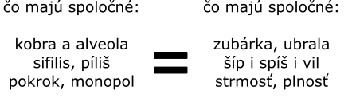
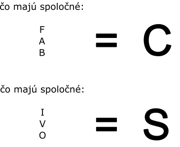

### malý

Každé písmenko je tvorené troma riadkami slov.
Každý riadok je daný nejakou spoločnou vlastnosťou.
Nižšie vidíte to isté písmeno napísané dvoma spôsobmi.

{style="width:30mm}

### veľký

Analyzuj zvlášť vrchné riadky, zvlášť stredné, zvlášť spodné.
Vrchné riadky určia vrchnú tretinu písmen, prostredné prostrednú,
a spodné spodnú. Nad významom slov nerozmýšľaj.

{style="width:60mm}
