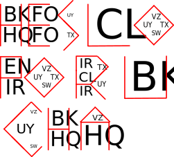

Autor: Janči

V šifre vidíme zhluky dvojíc písmen,
ktoré sa opakujú.
Zamerajme sa najskôr na dvojice samotné:

Prvé písmeno v každej dvojici je vždy skôr v abecede,
ako druhé.
Väčšina dvojíc má rozdiel písmen 9,
až na dvojice SW, TX, UY, VZ,
ktoré majú rozdiel 4,
okrem toho sú aj výrazne menšie
a často sa vyskytujú spolu.

Zároveň sa žiadne písmeno nevyskytuje
vo viac než jednej rozdielnej dvojici.
Dvojice s rozdielom 4
pokrývajú posledných 8 písmen abecedy,
dvojice s rozdielom 9 potom prvých 18
(hoci v šifre nemáme všetky,
dávalo by zmysel, ak by existovali).
Čísla 9 a 4 sú zároveň druhé mocniny,
takže sa takéto dvojice dajú naskladať do štvorcov.

To znie ako spôsob kódovania písmen abecedy,
ktorý by sa určite uživil aj v šifrovacej pomôcke...
Keď prehľadáme pomôcku, naozaj daný princíp nájdeme --
nazýva sa Pigpen,
dvojice v ňom kódujeme podľa obrysov
(a potom rozlišujeme písmená vo dvojici napríklad bodkami,
ale to v tomto prípade zjavne robiť nechceme, keďže máme obe).

Vidíme, že v šifre sú dvojice rôzne veľké
a rôzne pozhlukované, pôjde teda zrejme o grafiku
a bude treba niečo kresliť -- napríklad písmená hesla.
Nakreslíme si teda obrysy z Pigpenu tak,
ako sú v pomôcke vedľa daných dvojíc:

{style="width:95mm}

Prečítame HESLO **PORUCHA**.
