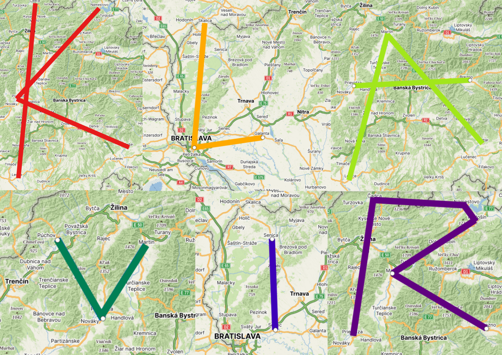

Autor: Jožo B.

V šifre vidíme chemické prvky (ktoré sa opakujú) a vzdialenosti v kilometroch za ich reťazcom.

Chemické prvky môžu mať v šifre rôzny význam.
Využiť sa dajú ich protónové čísla či iné chemické vlastnosti, poloha v periodickej tabuľke alebo ich skratky.
Nakoľko v šifre máme vzdialenosti v kilometroch, tak je veľmi pravdepodobné,
že pôjde o vzdialenosti medzi nejakými objektami na mape.
Ako by sa dali vyjadriť cez chemické prvky?

Skúsme sa pozrieť, aké skratky prvkov sú v šifre použité:

- Ca-Lv (137km); No-Pd-Pt (189km)
- Si-Ba-Ga(121km)
- Lv-Mt-Pt (193km); Pd-Br (75km)
- Pu-Pd-Mt (85km)
- Se-Sc (50km)
- Pd-Ca-No-Ts-Mt-Br (250km)

Vieme si všimnúť dve veci:

1. Všetky prvky majú dvojpísmenkovú skratku;

A to nám pomôže, aby si všimli, že:

2. Ide o skratky okresov pre EČV (do roku 2022).

Tie sme všetci veľakrát videli na autách a vzdialenosti odhadom sedia na vzdialenosti medzi okresmi.
To znie ako krok správnym smerom. Keď si vyhľadáme/spomenieme, aké okresy mali tieto skratky, tak dostaneme:

- Čadca-Levice (137km); Námestovo-Prievidza-Poltár (189km)
- Skalica-Bratislava-Galanta (121km)
- Levice-Martin-Poltár (193km); Prievidza-Brezno (75km)
- Púchov-Prievidza-Martin (85km)
- Senica-Senec (50km)
- Prievidza-Čadca-Námestovo-Tvrdošín-Martin-Brezno (250km)

Ako skúšku správnosti vieme použiť vzdialenosti v reťazci;
zistíme, že kilometre za reťazcom okresov sú vzdialenosti vzdušnou čiarou medzi okresnými mestami.
Ako príklad uvedieme vzdialenosti v prvom riadku; Čadca a Levice sú vzdialené 137km vzdušnou čiarou, Námestovo a Prievidza sú vzdialené 94km, Prievidza a Brezno 95km. Posledné dve vzdialenosti nám dajú spolu vzdialenosť 189km.
Ako z tohto dostaneme písmená hesla?

Vidíme, že naše okresy sú spojené pomlčkami,
ktoré sú oddelené jednak riadkami, a jednak kilometrami.
Mestá spojené pomlčkou spojíme aj na mape. Každý riadok nám tak dá jedno písmeno, tvorené jednou alebo dvoma čiarami.
Keď si to nakreslíme na mapu, tak dostaneme heslo „klavír“:

{style="width:95mm}
