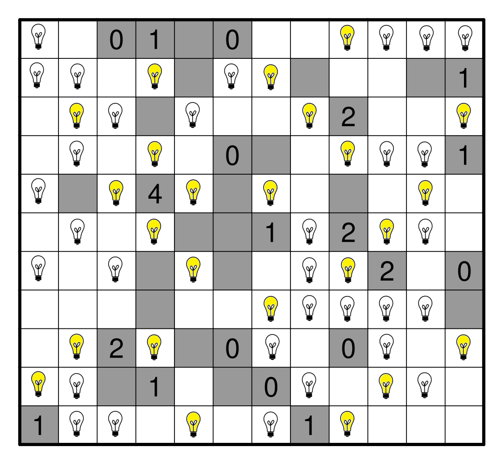

Autor: Danko

Pozeráme sa na mriežku so žiarovkami, ktorá vyzerá ako hlavolam lampy (light-up).
Štandardne však musíme lampy nakresliť my, a to tak, aby každé políčko bolo osvetlené
(lampy svietia rovno do 4 smerov kým nenarazia na okraj alebo sivú stenu),
a aby sa dve lampy neosvetľovali navzájom. Zároveň by každé číslo malo indikovať, koľko žiarovek s danou stenou susedí stranou.
Ak si nie sme istí pravidlami, dajú sa jednoducho googliť, napr. "light bulb puzzle rules".

Môžeme sa pokúsiť vyriešiť úlohu tak, že budeme umiestnené žiarovky ignorovať, a dáme si tam vlastné podľa pravidiel.
Vtedy naozaj dostaneme jediné riešenie.
Pomôže nám, ak nám napadne, že žiarovky už umiestnené máme, len ich všetky nevyužijeme, nezapneme.
Dostávame nasledovné riešenie:

{style="width:115mm}

Tu nám ostáva už len urobiť pozorovanie o rozmiestnení žiaroviek v zadaní.
Nie len že sú medzi nimi všetky, ktoré máme v riešení, ale v každom riadku ich je vždy práve 5.
5 žiaroviek, každá buď je zapnutá alebo nie je, to znie ako znaky v binárke.
Zapnuté sú samozrejme 1 a vypnuté 0. Dostávame tajničku: heslo je **PYRE**.
