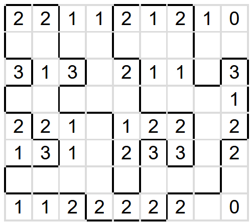

Autor: Michal S.

Témou kola sú logické úlohy. Akú logickú úlohu nám šifra pripomína?
Keď si odmyslíme obrázky a farebné pásy, ktoré sú skôr tou šifrovacou časťou,
tak máme tabuľku s vyznačenými vrcholmi, kde v niektorých políčkach
sú čísla od 0 do 3 -- pôjde teda o Slitherlink.
Ide o hlavolam, kde treba nakresliť uzavretú lomenú čiaru
idúcu po hranách mriežky, ktorá sa nikde sama seba nedotýka a čísla udávajú,
koľko hrán okolo políčka s číslom je súčasťou hľadanej lomenej čiary.

Keď si pomenujeme obrázky, zistíme, že ich zväčša nevieme pomenovať
na toľko písmen, cez koľko políčok prechádzajú.
Vieme ich však pomenovať (ak pripustíme skratky)
na toľko písmen, na koľko častí sú rozdelené prerušovanými čiarami.
Jednotlivé obrázky sú:

- BULL (býk po anglicky)
- CM (centimeter)
- UA (skratka Ukrajiny)
- BULB (žiarovka po anglicky, rozdelená na dve časti BU a LB)
- MA (skratka Maroka)
- WC (piktogram záchoda)

Všetky majú spoločné to, že ich písmená majú po prevedení na čísla iba číslice 1 až 3
(A = 1, B = 2, C = 3, L = 12, M = 13, U = 21, W = 23).
To zodpovedá čísliciam používaným v Slitherlinku,
navyše to sedí s rozdelením obrázkov prerušovanými čiarami
(úseky majú správnu dĺžku 1 alebo 2 políčka).
Čísla teda vpíšeme do mriežky a v tomto momente už vieme vyriešiť logickú úlohu:

{style="width:80mm}

Ostáva nám využiť farebné políčka. Do nich vieme vpísať čísla podľa princípu úlohy,
teda do každého napíšeme počet hrán lomenej čiary, s ktorými susedí.
Farebné pásy políčok sú rozdelené na kúsky dĺžky 1 alebo 2 políčka.
(Dôležité sú oddeľovače príslušnej farby, ktoré sú kolmé na smer čítania.
Zatiaľ čo hranica pásu môže byť prekrytá inou farbou, dôležité oddeľovače prekryté nie sú.)
Máme teda jedno- a dvojciferné čísla, ktoré prevedieme na písmená
presne rovnakým, iba spätným, spôsobom, ako sme to robili na začiatku s obrázkami.
Prečítame písmená, pričom farby zoradíme podľa dúhy. Z každého pásu dostaneme jedno slovo:

AKÚ MALÚ ČAČKU CUMLÚ BÁBÄTKÁ _(Táto veta používa len písmená, ktorých hodnoty pozostávajú iba z číslic 0 až 3.)_

Bábätká cmúľajú **CUMLÍK**, čo je riešenie šifry.
(Dudeľ či dudlík nie sú spisovné a cumeľ to nie je, pretože ide o _malú_ čačku.
Pre lepšiu jednoznačnosť je v zadaní upresnenie, že hľadáme slovo na C na 6 písmen.)
