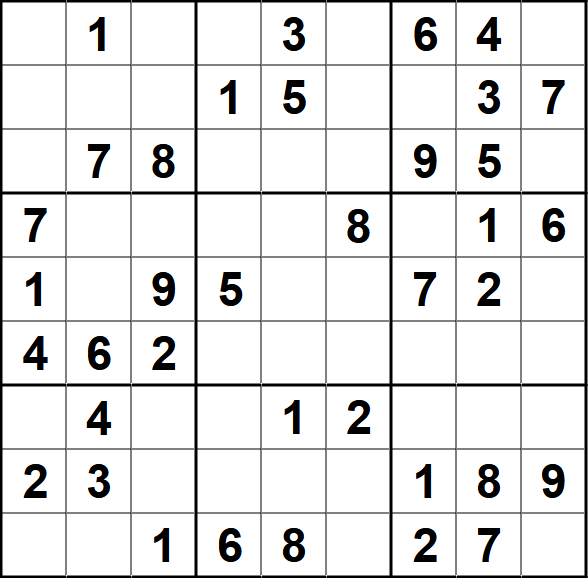
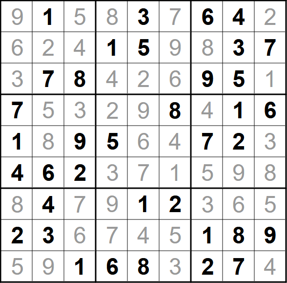

Autori: Danko, Mišo M.

Rýchla analýza zadania odhalí, že ho tvorí $9$ viet, každá v jednom riadku a s deviatimi slovami, z nich jedno je krstné meno.
V texte sa tiež nachádza zopár podozrivých slov, či slovných spojení,
ktoré sú akoby nasilu zakomponované do viet,
napr. šachové políčka, lutherove tézy, Bleskový McQueen, hrudné stavce, atď.

S prvým krokom nám poradí samotné rozostavenie textu.
Ten je zarovnaný tak, aby v každom z deviatich riadkov bolo presne deväť slov.
Vieme ich teda vpísať do tabuľky $9 \times 9$.
Fanúšikovia logických úloh si najmä pri téme tohto kola isto spomenú na sudoku.
Akurát, že v texte máme slová a nie čísla.
Tu prichádzajú na rad tie zvláštne slovné spojenia, ktoré sme si všimli na začiatku.
Ku každému z nich sa viaže nejaké číslo,
či už počet ($64$ šachových políčok),
nejaká miera (jediný slovenský mrakodrap má $168$ metrov),
alebo iné číslo (Blesk McQueen pretekal s číslom $95$).

Zoznam slovných spojení s príslušnými číslami:

- prvá -- $1$
- prasiatka -- $3$ (rozprávka o troch prasiatkach)
- šachové políčka -- $64$
- štvrť hodinu -- $15$ (minút)
- telesná teplota -- $37$ (°C)
- tarotové karty -- $78$
- lutherove tézy -- $95$
- trpaslíci -- $7$ (rozprávka Snehulienka a $7$ trpaslíkov)
- chobotnica -- $8$ (končatín)
- MBTI osobnosti -- $16$ (typov)
- víťazka -- $1$ (víťaz končí na prvom mieste)
- Bleskový McQueen -- $95$ (pretekárske číslo)
- Konfuciovi učeníci -- $72$
- slovenská abeceda -- $46$ (písmen)
- pár -- $2$
- končatiny -- $4$ (ľudské)
- hrudné stavce -- $12$
- páry chromozómov -- $23$
- vek dospelosti -- $18$
- tehotenstvo -- $9$ (mesiacov)
- jediný slovenský mrakodrap -- $168$ (metrov, výška)
- štáty EÚ -- $27$

Ak chceme riešiť sudoku, tak potrebujeme tieto čísla nejak vpísať do tabuľky $9 \times 9$.
Vpisovať však chceme len cifry od $1$ po $9$.
Tu môžeme spraviť ďalšie užitočné pozorovanie.
Každé jedno slovné spojenie má toľko slov, ako má výsledné číslo cifier.
Keď si teda spravíme tabuľku zo slov, vieme každému (z tých, ktoré sú súčasťou niektorého spojenia), priradiť práve jednu cifru.
Dostaneme tak zadanie sudoku, ktoré môžeme vyriešiť.

{style="width:75mm}

{style="width:75mm}

Ako však z tabuľky čísel dostaneme heslo?
Zostáva nám už len jedna zvláštnosť zo zadania, ktorú sme zatiaľ nepoužili -- krstné mená.
Každé z nich sa nachádza v inom riadku a každé z nich má $9$ písmen.
Zároveň mu prislúcha jedno políčko v sudoku, takže aj jedno číslo od $1$ po $9$.
Z mena tak vyberieme príslušné písmeno.
V ľavom hornom rohu máme číslo $9$, z mena Alexandra tak vyberieme deviate písmenko, teda A.
Z mena Ferdinand vyberieme deviate písmeno, teda D, z mena František druhé (R), a tak ďalej.
Dostaneme heslo **ADRENALIN**.
