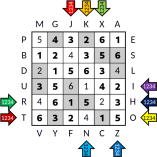

Autor: Janči

Na obrázku vidíme logboj -- logickú úlohu, ktorá obsahuje čísla, bledé a tmavé políčka, písmená abecedy a farebné šípky.

Písmená abecedy po obvode nie sú všetky.
Je ich iba 24, každé okrem Q a W práve raz,
takže chceme pravdepodobne použiť 24-písmenovú abecedu.
Zaujímavé je aj to, že písmená A a Z sú oproti sebe,
podobne ako C a X, ale B a Y nie sú.
S 24 písmenovou abecedou sa často spájajú permutácie z pomôcky.
A naozaj, keď sa pozrieme na kódovanie dvojíc písmen v každom
riadku a stĺpci, zistíme, že im prislúchajú zrkadlové permutácie
(napríklad B je 1243 a S je naopak 3421).

Čísla v logboji pripomínajú sudoku, mohli by sme skúsiť
do každého riadku a stĺpca vpísať každé práve raz.
Rýchlo však zistíme, že nemáme dostatočne veľa informácií,
aby sa nám to podarilo jednoznačne.

Skúsme teda použiť farbu políčok --
dôležité je všimnúť si,
že v každom riadku a stĺpci máme práve 4 biele a 2 tmavé.
Do štyroch bielych políčok vieme zakódovať permutáciu,
ktorú reprezentuje jedno písmeno z obvodu,
zjavne podľa smeru, ktorým sa na riadok alebo stĺpec pozeráme.

Takže pre každý riadok a stĺpec musíme zabezpečiť,
aby v ňom bolo každé číslo od 1 do 6 práve raz
a čísla v bielych políčkach tvorili permutáciu prislúchajúcu
danému písmenu abecedy.
S týmito informáciami už dokážeme logboj celý jednoznačne doplniť:

{style="width:120mm}

*Napríklad prvý stĺpec s písmenom M potrebuje doplniť čísla
1, 3 a 6, permutácia pre M je 3, 1, 2, 4,
takže číslo 6 musí byť naspodku,
aby bolo najväčším číslom spomedzi bielych (inak by to bolo 5).*

No dobre, vyriešili sme logboj, ako z neho získame heslo?
Zatiaľ sme nepoužili farebné šípky na okrajoch.
Na každej sú napísané čísla 1, 2, 3, 4.
Skúsme teda znovu využiť permutácie,
ale tentoraz sa zamerať len na tieto čísla
namiesto čísel v bielych políčkach.
Napríklad z prvej (tmavočervenej) šípky (riadok T)
získame poradie 3, 2, 4, 1, teda písmeno P.

Písmená hesla potom zoradíme štandardne podľa dúhy.
Prečítame heslo **PRIESTUPOK**.
