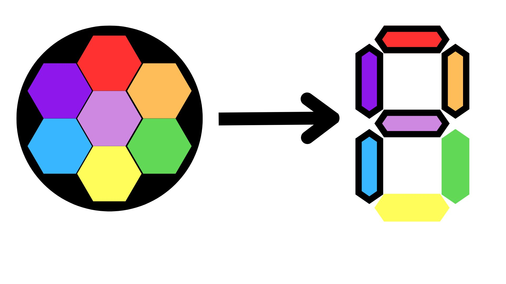

Autor: Veronika

V šifre si môžeme všimnúť hneď dve veci - farby a tvary kvietkov. Najväčší z kvetov v strede má aj dve vodorovné čiarky medzi jednotlivými farbami. Keď sa na to pozrieme bližšie, zistíme, že každý šesťuholník sa skladá zo 7 políčok a každé je vyfarbené inou farbou. S číslom sedem a rozmiestnením šesťuholníkov v kvietku nám môže napadnúť sedemsegmentový displej, na ktorý nás nabádajú aj dve vodorovné čiary v strede. Každý kvietok si môžeme skúsiť predstaviť ako sedemsegmentový displej, kde každý šesťuholník symbolizuje jednu čiarku na displeji.
Presunieme sa ku kvietkom vo vonkajšom kruhu. Už pri prvom vidíme, že niektoré farby sú v porovnaní s najväčším kvietkom v strede poprehadzované. Môžeme skúsiť zobrať najväčší kvietok v strede ako predlohu a pre každý kvietok na obvode si zaznačiť, ktoré políčka sú rovnaké. Po premenení kvietku na sedemsegmentový displej, si môžeme všimnúť, že tie, ktoré sa zhodujú, vytvárajú písmená na sedemsegmentovom displeji. Postupujeme takto pri všetkých kvietkoch na obvode a prečítame POLENO JE HESLO. Ako riešenie zadáme slovo **POLENO**.
{style="width:40mm}
