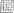

Autor: Danko

Najprv urobme nejaké pozorovania.
Máme 4 rovnaké pyramídy, zaujímavo rozmiestnené.
V niektorých políčkach sú čísla, je tam každé číslo do 13, zopár ich je tam dvakrát, iné sú raz.
Zvláštne je, že kombinácia 2,9 sa nachádza v dvoch políčkach a 2 ani 9 sa inde nenachádzajú.
Čo sa ešte opakuje? Číslo 8, a v oboch prípadoch je nad políčkom s 2,9.
Okrem toho sa opakujú len 7 a 13, a tie sú tiež na krajoch pyramíd a na rovnakej vrstve.
Ak by sme tieto opakovania vynechali, máme každé číslo práve raz.

Z tohto všetkého sa nám už môže črtať vysvetlenie šifry, ktoré by mohlo viesť k heslu.
Nemáme moc odkiaľ inokadiaľ heslo brať, takže by bolo prirodzené, keby malo 13 písmen a každé číslo určovalo jedno z nich.
Možno nie je nikdy jedno číslo na viacerých miestach, ale skôr jedno "miesto" sa nachádza vyobrazené v rôznych pyramídach zo zadania.
Keby sa políčka prekrývali, celkom by to sedelo, aby 2,9 a 8 sedeli. Možno by sme chceli, aby v každom štvorčeku bolo písmeno a ideálne ich teda bolo 26.

Keď si predstavíme, že by sme chceli pyramídy priložiť k sebe tak, aby sa políčka s rovnakými číslami prekrývali, vieme to urobiť v 3D priestore.
Napríklad si 4 kusy vystrihneme z papiera, vrchný bude zadná stena, ľavý ľavá, pravý pravá.
Inak povedané, naše 4 obrázky sú pohľady z rôznych bokov pyramídy, ktorá celá vyzerá takto:

{style="width:100mm}

Naozaj už máme každé číslo raz, musíme len zistiť ktoré písmeno patrí ktorej kocke v novej 3D pyramíde.
Dokopy má pyramída so základom 5x5 kociek až 35 tehál, no my z nich vidíme len 25, ostatné by boli vnútri.
Mohli by sme využiť pohľad zhora, na ktorom vidíme všetky kocky z povrchu pyramídy ako štvorec 5x5.
Alternatívne nám rovno napadne, že 25 je počet písmen v polybiovom štvorci, ktorý máme na pomôcke.
Keď ponecháme otočenie ako bolo v zadaní šifry (nárys je spredu, čo je smer, ktorý je pri pôdoryse dole), a vpíšeme pri pohľade zhora do kociek písmená polybiusa,
teda 13 je A, 2,9 je E atď., postupne z očíslovaných kociek dostaneme: HESLO **PRIEKOPA**
