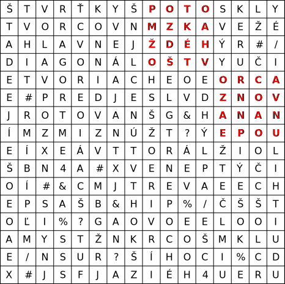
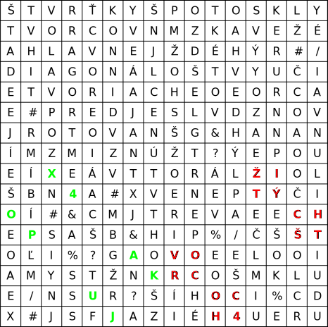
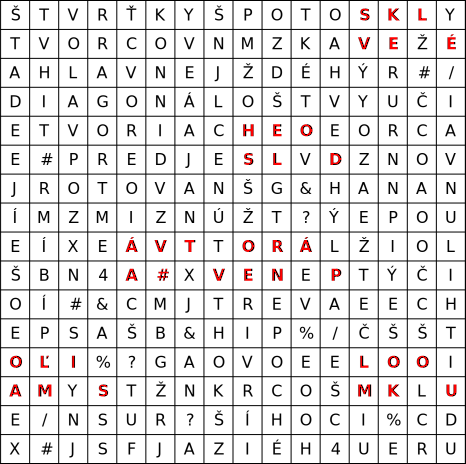
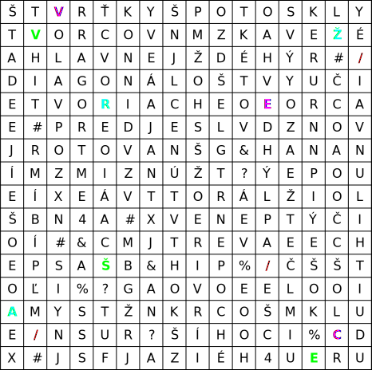

Autori: Michal S., Pajty

Začneme tým, že skúsime nájsť v mriežke nejaké zmysluplné slová alebo časti textu.
Môžeme si všimnúť, že celá ľavá horná štvrtina (8 riadkov krát 8 stĺpcov) nám dáva text:

ŠTVRŤKY ŠTVORCOV NA HLAVNEJ DIAGONÁLE TVORIACE # PRED JEJ ROTOVANÍM ZMIZNÚ

zatiaľ čo zvyšok písmen veľa zmysluplného nedáva.

Text hovorí o mriežke -- ide o šifrovaciu mriežku, princíp, pri ktorom
obvykle máme tabuľku písmen a fóliu s vyznačenými políčkami (mriežkou), ktorých je presne štvrtina z počtu políčok v tabuľke.
Túto fóliu priložíme na tabuľku a prečítame vyznačené písmená po riadkoch zhora nadol.
Potom fóliu (mriežku) otočíme o 90 stupňov v smere hodinových ručičiek, pričom tabuľkou neotáčame ani inak nehýbeme.
Mriežka teda vyznačí iné políčka v tabuľke. Prečítame vyznačené políčka
a celé to zopakujeme ešte dvakrát -- dokopy teda štyri otočenia.
Každé písmeno pritom prečítame v práve jednom zo štyroch otočení mriežky.
Obvykle vyznačené políčka sú rozmiestnené chaoticky,
ale tu sme akoby mali všetky vyznačené políčka v ľavej hornej štvrtine tabuľky (zvyšné sme pri tomto otočení nečítali).

Mohli by sme teraz skúsiť otočiť mriežku,
ale podľa textu nám zmiznú štvrťky na hlavnej diagonále
(teda vľavo hore a vpravo dole), a to PRED otočením.
Následne sa mriežka otáča, teda zostávajúcich $32$ políčok zmení polohu a čítame tieto písmená:

{style="width:70mm}

POTOM Z KAŽDÉHO ŠTVORCA ZNOVA. NA NEPOU... (veta je nedokončená, zatiaľ využijeme iba jej prvú časť; interpunkciu a medzery si treba domyslieť)

Máme teda aplikovať odstránenie štvrtín na hlavnej diagonále na oba vytvorené štvorce. Keď to teda zopakujeme ešte dvakrát, prečítame pokračovanie tajničky

{style="width:70mm}

...ŽITÝCH ŠTVORCOCH 4... (pravá dolná štvrtina tabuľky)

...X 4 OPAKUJ (ľavá dolná štvrtina tabuľky)

Máme teda celý proces zopakovať vnútri štvorcov $4 \times 4$, ktorých sme sa ešte nedotkli.
Ide o niektoré zo $16$ zarovnaných štvorcov (t. j. začínať môžu len v každom štvrtom riadku/stĺpci) v celej tabuľke.
To znamená, že v každom takom štvorci $4 \times 4$ najskôr prečítame ľavú hornú štvrtinu,
potom odoberieme políčka na hlavnej diagonále a otočíme mriežku.
Ďalšie otáčanie sa už urobiť nedá, pretože by sme odoberali štvrtiny zo štvorcov $1 \times 1$.
Dozvieme sa

{style="width:70mm}

SKVELÉ, HESLO DÁVA # TVORENÁ POĽAMI S LOMKOU.

V celej tabuľke sú tri políčka s lomkou /, takže použijeme tieto tri políčka ako šifrovaciu mriežku (nad celou tabuľkou).

Po jednotlivých otočeniach dostávame v poradí zelené, tyrkysové (modré), cyklaménové (fialové) výsledné heslo **VŠEŽRAVEC**.
Podčiarknutie naznačuje, ktoré písmená boli vybrané ktorou lomkou.

{style="width:70mm}
