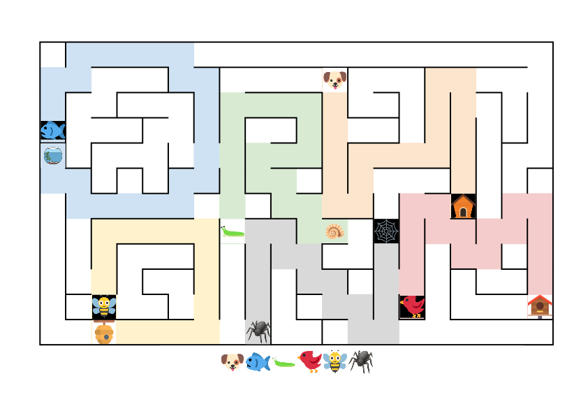

Autor: Mišo M.

V labyrinte si môžeme všimnúť 6 zvieratiek a 6 rozdielnych predmetov.
Zvieratká máme zároveň vymenované pod labyrintom.
Pri bližšom pohľade tiež zistíme, že predmety v zadaní zodpovedajú domčekom pre zvieratká.
Skutočne, pes má v labyrinte búdu, ryba akvárium, slimák ulitu, vták vtáčiu búdku, včela úľ a pavúk pavučinu.
Prvým nápadom tak môže byť spojiť zvieratká s ich príbytkami.

Lenže ako? Ľahko si všimneme, že možností je viac.
Napríklad včela sa môže dostať k úľu sprava, keď prejde štvorcovú trasu, ale aj zľava, ak sa najprv vyberie k akváriu.
Môžeme si však všimnúť, že všetky cesty okrem jednej "odrežú" rybe cestu k akváriu.
Skúsime teda vybrať trasy tak, aby sa zvieratká cestou nestretli.
Aby včela neodrezala cestu k akváriu, musí ísť priamo hore, pri stene zamieri doprava, pri ďalšej stene nadol, a nakoniec doľava rovno k úľu.
Pavúk potom musí začať svoju cestu smerom nahor, potom ísť doprava dole, a aby neobmedzil prístup k vtáčej búdke, priamo nahor k pavučine.
Slimák tak bude musieť ísť nie najkratšou cestou, ale obchádzkou.

Celkovo dostaneme takéto trasy.
{style="width:70mm}

Čo ďalej?
Vďaka zvieratkám a ich domčekom máme nakreslené jednoznačné cesty.
Keď sa na ne pozrieme, zbadáme písmená.
Ryba nakreslila `O`, pes `H`, slimák `R`, pavúk `N`, vták `M` a včela štvorec, ktorý vieme prečítať ako `O`.

Teraz použijeme zoradenie zvierat pod labyrintom.
Keďže písmená už máme, potrebujeme ich len prečítať v správnom poradí.
Začneme psom, potom ryba, slimák, atď, až dostaneme heslo **hormon**.
