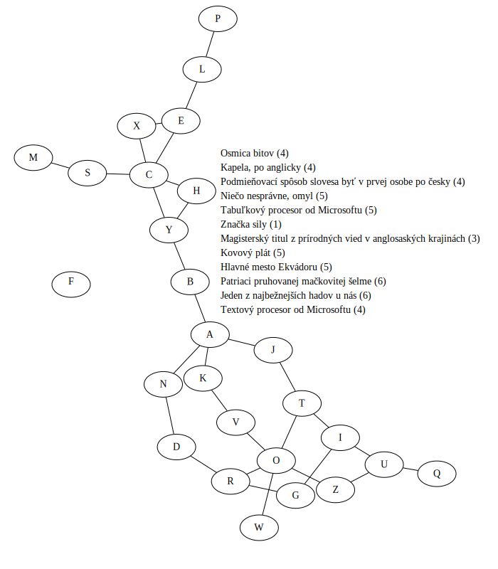

Autori: Michal S., Oliver

Máme k dispozícii niekoľko nápovedí -- ku každej vieme priradiť slovo, ktoré má počet písmen uvedený v zátvorke.
Postupne sú to:
- bajt,
- band,
- bych,
- chyba,
- Excel,
- F,
- MSc,
- plech,
- Quito,
- tigrov,
- užovka,
- Word.

Pri dopĺňaní nám môže pomôcť, že hľadané slová sú zoradené podľa abecedy.
To tiež naznačuje, že nezáleží na poradí týchto slov.

V diagrame sa nachádza $26$ bubliniek -- presne toľko, koľko je písmen (anglickej) abecedy.
Navyše naša skupina slov je špeciálna tým, že každé písmeno sa v nej vyskytuje aspoň raz,
vrátane nezvyčajných písmen ako Q, W a Z.
Mohli by sme teda chcieť do každej bublinky vpísať jedno písmeno, každé práve raz.
Niektoré bublinky sú spojené čiarami, takže dáva zmysel robiť to tak, aby dané slová tvorili súvislý rad bubliniek
(teda pre slovo *bajt* by B-A, A-J a J-T boli spojené).
Zostáva nám vyriešiť logickú úlohu o priradení písmen do krúžkov. Výsledok je takýto:

{style="width:205mm}

Na získanie hesla by sme mohli použiť poslednú nepoužitú časť šifry -- čísla.
Tie sú od $1$ do $7$, každé práve raz. Označujú pozície v hesle, kam treba doplniť písmeno v zodpovedajúcej bublinke.
Dostaneme **SKLADBA**.
